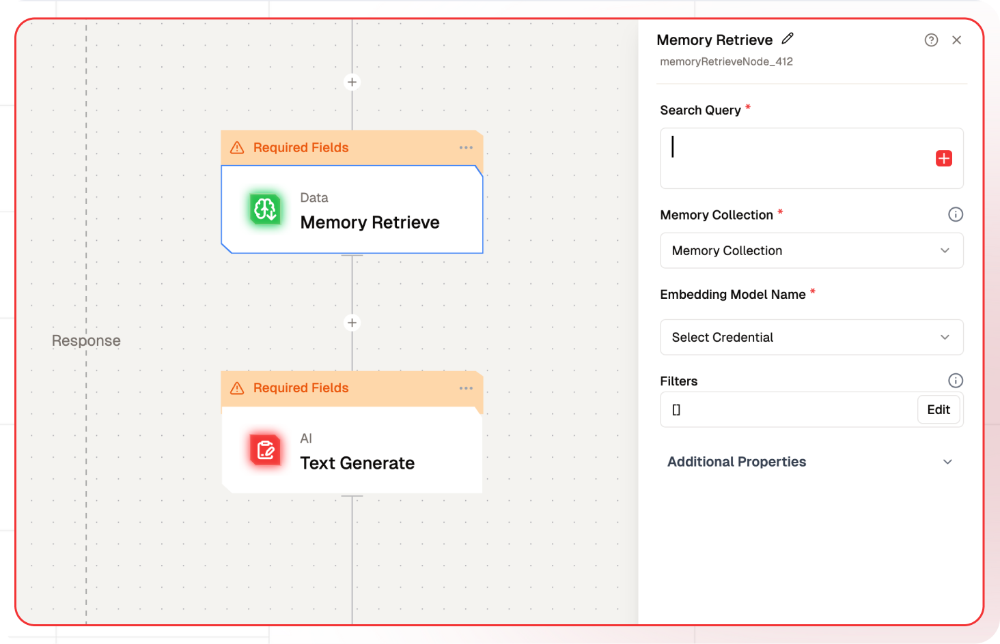
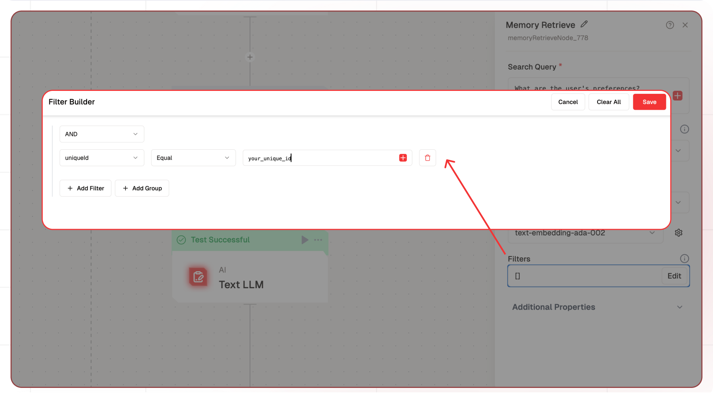
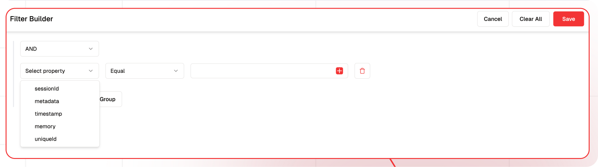
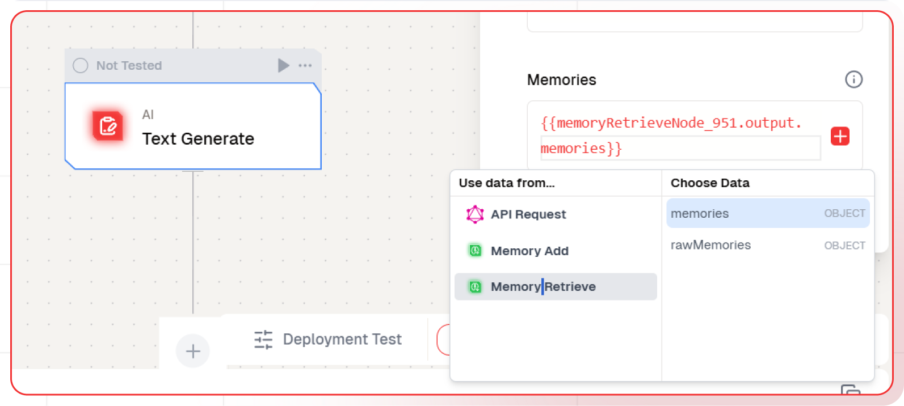

# Memory Retrieve Node Documentation

The Memory Retrieve Node allows users to search and retrieve stored memories from collections using semantic search capabilities. This node is essential for accessing previously stored contextual information and implementing memory-based features in workflows.



## Features

<details>
  <summary>**Key Functionalities**</summary>

1. **Memories Search**: Search memories using natural language queries.

2. **Filtering**: Apply filters to refine search results and restrict them to particular uniqueId and sessionId.

3. **Configurable Results**: Control the number of memories returned.

</details>

<details>
  <summary>**Benefits**</summary>
  1. **Contextual Retrieval:** Access relevant memories based on similarity.

2. **Precision:** Fine-tune results using filters.

3. **Flexibility:** Support for both raw and processed memory formats, allowing the retrieved memory to be passed directly to any AI Node.

</details>

## What can I build?

1. AI Nodes that can reference past memories for context-aware responses.

2. Knowledge bases with natual language querying capabilities.

3. Personalized recommendation systems based on user's memories.

## Setup

### Configure the Memory Retrieve Node

1. Select the Memory Retrieve Node in your workflow.
2. Define your search query.
3. Choose the memory collection to search.
4. Configure the embedding model.
5. Set optional filters and result limits.
6. Deploy the project.

## Configuration Reference

| **Parameter**            | **Description**                                   | **Example Value**                        |
| ------------------------ | ------------------------------------------------- | ---------------------------------------- |
| **Search Query**         | The natural language query to search memories     | `What are the user's preferences?`       |
| **Memory Store**         | The collection to search for memories             | `MemoryStore`                            |
| **Embedding Model Name** | Model used for converting search query to vectors | `text-embedding-ada-002`                 |
| **Limit**                | Maximum number of memories to return              | `3`                                      |
| **Filters**              | JSON-based filters to refine search results       | 'Set them up using UI condition builder' |

## Filter Memory Retrieval



To Apply the Filter in Memory Retrieve Node, Click on the Filters

1. Here you can apply condition on
1. Session Id
1. Meta Data
1. Timestamp
1. Memory
1. Unique Id
   

## Outputs

The node provides two output formats:


1. **Memories**: Processed memory objects ready for use in any AI Node
2. **Raw Memories**: Unprocessed memory data including metadata and embeddings

## Low-Code Example

```json
- nodeId: memoryRetrieveNode_951
    nodeType: memoryRetrieveNode
    nodeName: Memory Retrieve
    values:
      limit: '3'
      filters: |-
        {
          "operator": "And",
          "operands": [
            {
              "path": [
                "uniqueId"
              ],
              "operator": "Equal",
              "valueText": "{{triggerNode_1.output.userId}}"
            }
          ]
        }
      searchQuery: User likes what
      memoryCollection: NewMemory
      embeddingModelName:
        type: embedder/text
        model_name: default
        credentialId: some id
        provider_name: openai
        credential_name: NEW PROVIDER
    needs:
      - memoryNode_858
```

## Example Output

```json
{
    "rawMemories": [],
    "memories": []
}
```

## Using Retrieved Memory in AI Nodes

In the respective AI Node, add memories under Memories inside Additional Properties by clicking the Plus icon.


## Common Issues and Debugging

1. **Memory Not Being Retrieved**

   - Verify you're using the same Unique Id used during storage
   - Check if the Session Id matches (if using session-specific storage)
   - Ensure the Memory Collection name is consistent between add and retrieve nodes
   - Validate that the embedding model dimensions match between storage and retrieval

2. **Incorrect Results**
   - Verify the search query is properly formatted
   - Check if filters are correctly configured
   - Ensure the limit parameter is set appropriately
   - Test with simpler queries first to isolate issues

### Troubleshooting Steps

1. **Check Node Configuration**

   - Verify all required fields are filled
   - Ensure model names are spelled correctly
   - Validate JSON format in metadata field

2. **Monitor Workflow Logs**

   - Look for error messages in the execution logs
   - Check for timeout or rate limit errors
   - Verify successful model API calls

3. **Test Memory Operations**

   - Use the workflow testing feature to verify storage
   - Confirm immediate retrieval after storage
   - Test with simple data before complex implementations
