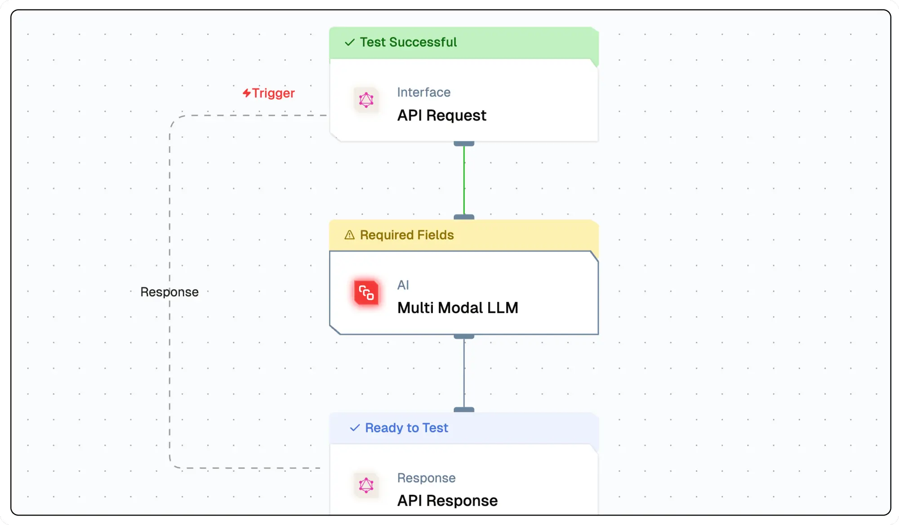

import { NodeOverview } from "@/components/NodeOverview"

# Multimodel Text Node

<NodeOverview slug="multimodel-text-node"/>

## Overview

The Multimodal Node returns textual output from selected large language models (LLMs). It supports both text and image inputs. This node is particularly useful for applications that require a seamless integration of textual and visual data processing, such as image captioning where the text is generated based on the content of an image.



## Features

<details>
  <summary>**Key Functionalities**</summary>
  1. **Textual and Visual Input Support**: Accepts both text and image inputs, enabling
  seamless integration of multimodal data for processing. 
  
  2. **Text Generation**:
  Produces textual outputs from selected large language models (LLMs) based on the
  provided input. 
  
  3. **Image-Based Text Generation**: Generates captions and descriptive
  text based on the content of images, making it suitable for applications like image
  captioning. 
  
  4. **LLM Integration**: Supports integration with multiple large language
  models, offering flexibility to choose the best-suited model for specific use cases.
  
  5. **Context-Aware Processing**: Combines textual and visual data inputs to enhance
  the accuracy and relevance of the generated output.
</details>

<details>
  <summary>**Benefits**</summary>
  1. **Versatility**: Enables applications in various domains, such as image captioning,
  multimodal analysis, and AI-driven content generation. 
  
  2. **Enhanced User Experience**:
  Provides seamless handling of both text and image inputs, improving workflow efficiency.
  
  3. **Scalability**: Adapts easily to a wide range of use cases, from simple text
  generation to complex multimodal data analysis. 
  
  4. **Efficiency**: Consolidates
  textual and visual processing into a single node, reducing the need for separate
  tools and streamlining flow. 
  
  5. **Advanced AI Integration**: Leverages the
  capabilities of modern LLMs to deliver accurate and contextually rich outputs.
</details>

## What can I build?

1. Develop applications that seamlessly integrate text and image data processing for tasks like image captioning.
1. Create tools for automatic generation of descriptive content for visual data, enhancing accessibility.
1. Build interactive applications where user actions on images are analyzed to generate contextual feedback.
1. Design systems that maintain consistent tone and style across generated content based on previous interactions.

## Setup

### Select the Multimodal Text Node

1. Fill in the required parameters.
1. Build the desired flow
1. Deploy the Project
1. Click Setup on the workflow editor to get the automatically generated instruction and add it in your application.

## Configuration Reference

| **Parameter**             | **Description**                                                                                                | **Example Value**                |
| ------------------------- | -------------------------------------------------------------------------------------------------------------- | -------------------------------- |
| **Generative Model Name** | Select the model to generate text based on the prompt.                                                         | Gemini Model                     |
| **Prompt Template**       | Define the instructions for generating the text output.Define the instructions for generating the text output. | Tell me something about Bali     |
| **Attachments**           | Select the attachments to be used for the multi modal LLM.                                                     | `{{triggerNode_1.output.topic}}` |
| **System Prompt**         | System prompt to guide the LLM                                                                                 | You are Travel Planner           |

## Low-Code Example

```yaml
nodes:
  - nodeId: multiModalLLMNode_924
    nodeType: multiModalLLMNode
    nodeName: Multi Modal
    values:
      promptTemplate: Tell me something about ${{triggerNode_1.output.topic}}
      attachments: '{{triggerNode_1.output.topic}}'
      systemPrompt: You are an AI Assistant
      messages: '[]'
      generativeModelName:
        provider_name: mistral
        type: generator/text
        credential_name: Mistral API
        credentialId: 32bf5e3b-a8fc-4697-b95a-b1af3dcf7498
        model_name: mistral/mistral-large-2402
    needs:
      - triggerNode_1
  - nodeId: plus-node-addNode_704346
    nodeType: addNode
    nodeName: ''
    values: {}
    needs:
      - multiModalLLMNode_924
```
## Output 

#### `_meta`
- A nested object containing metadata about the processing of the text generation request.

  - **`prompt_tokens`**: The number of tokens in the input prompt provided to the model.
  - **`completion_tokens`**: The number of tokens in the generated output.
  - **`total_tokens`**: The sum of `prompt_tokens` and `completion_tokens`.

  - **`prompt_tokens_details`**: Breakdown of token usage in the prompt.
    - **`cached_tokens`**: The number of tokens reused from a cache.
    - **`audio_tokens`**: The number of tokens associated with audio input (if applicable).

  - **`completion_tokens_details`**: Breakdown of token usage in the generated output.
    - **`reasoning_tokens`**: The number of tokens used for reasoning processes (if applicable).
    - **`audio_tokens`**: The number of tokens associated with audio output (if applicable).
    - **`accepted_prediction_tokens`**: The number of tokens from accepted predictions (if applicable).
    - **`rejected_prediction_tokens`**: The number of tokens from rejected predictions (if applicable).

  - **`model_name`**: The name of the AI model used for text generation.
  - **`model_provider`**
### Example Output

```json
{
    "_meta": {
      "prompt_tokens": 276,
      "completion_tokens": 130,
      "total_tokens": 406,
      "prompt_tokens_details": {
        "cached_tokens": 0,
        "audio_tokens": 0
      },
      "completion_tokens_details": {
        "reasoning_tokens": 0,
        "audio_tokens": 0,
        "accepted_prediction_tokens": 0,
        "rejected_prediction_tokens": 0
      },
      "model_name": "gpt-4-turbo",
      "model_provider": "openai"
    },
    "generatedResponse": "Response"
  }
```

## Troubleshooting

### Common Issues

| **Problem**                    | **Solution**                                                 |
| ------------------------------ | ------------------------------------------------------------ |
| **Invalid API Key**            | Ensure the API key is correct and has not expired.           |
| **Dynamic Content Not Loaded** | Increase the `Wait for Page Load` time in the configuration. |

### Debugging

1. Check Lamatic Flow logs for error details.
1. Verify API Key.
