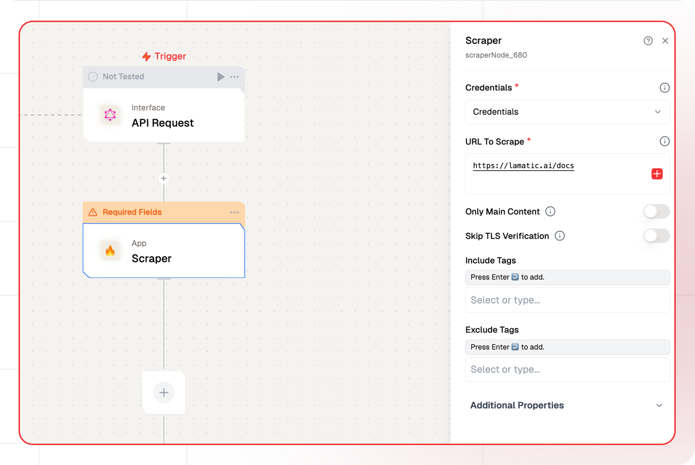

# Scraper Node Documentation

Scraper Node is a web scraping tool designed to transform entire websites into structured, LLM-compatible data using Firecrawl. It Extract targeted content from specific web pages using customizable rules.



## Features

<details>
  <summary>**Key Functionalities**</summary> 

    
    1. **Customizable URL Scraping**: Allows users to specify the exact URL to scrape, ensuring targeted data extraction. 
    
    1. **Selective Content Scraping**: Features options to scrape only the main content or include/exclude specific tags, providing control over the scraped data. 
    
    1. **TLS Verification**: Includes an option to skip TLS verification, enabling compatibility with a wider range of websites. 
    
    1. **Device Emulation**: Offers the ability to emulate mobile devices, ensuring accurate scraping of mobile-optimized pages. 
    
    1. **Adjustable Load Timing**: Allows users to set a custom wait time (in milliseconds) for pages to load, accommodating different website performance speeds.
</details> 

<details>
  <summary>**Benefits**</summary>

  
  1. **Precision:** Enables targeted scraping by including or excluding specific tags and controlling the scraping scope. 
  
  1. **Flexibility:** Supports mobile device emulation and TLS verification bypass for greater adaptability across websites. 
  
  1. **Efficiency:** The adjustable wait time ensures optimal scraping speed without missing dynamic content. 
  
  1. **Ease of Use:** A user-friendly interface with clear options makes it accessible for both technical and non-technical users.
</details>

## Prerequisites

Before using Crawler Node, ensure the following:

1. A valid [Firecrawl API Key](https://www.firecrawl.dev/).
1. Access to the Firecrawl service host URL.
1. Properly configured credentials for Firecrawl.
1. A webhook endpoint for receiving notifications (required for the crawler).

## Installation

### Step 1: Obtain API Credentials

1. Register on [Firecrawl](https://www.firecrawl.dev/).
2. Generate an API key from your account dashboard.
3. Note the **Host URL** and **Webhook Endpoint**.

### Step 2: Configure Firecrawl Credentials

Use the following format to set up your credentials:

| **Key Name**          | **Description**                                     | **Example Value**           |
| --------------------- | --------------------------------------------------- | --------------------------- |
| **Credential Name**   | Name to identify this set of credentials            | `my-firecrawl-creds`        |
| **Firecrawl API Key** | Authentication key for accessing Firecrawl services | `fc_api_xxxxxxxxxxxxx`      |
| **Host**              | Base URL where Firecrawl service is hosted          | `https://api.firecrawl.dev` |


## Configuration Reference

| **Parameter**           | **Description**                                                                     | **Example Value**             |
|--------------------------|-------------------------------------------------------------------------------------|--------------------------------|
| **Credential Name**      | Select previously saved credentials                                                | `my-firecrawl-creds`           |
| **URL**                  | Target URL to scrape                                                               | `https://example.com/page`     |
| **Main Content**         | Extract only the main content of the page, excluding headers, navs, footers, etc.  | `true`                         |
| **Skip TLS Verification**| Bypass SSL certificate validation                                                  | `false`                        |
| **Include Tags**         | HTML tags to include in extraction                                                 | `p, h1, h2, article`           |
| **Exclude Tags**         | HTML tags to exclude from extraction                                               | `nav, footer, aside`           |
| **Emulate Mobile Device**| Simulate mobile browser access                                                     | `true`                         |
| **Wait for Page Load**   | Time to wait for dynamic content (ms)                                              | `123`                          |                          |

## Low-Code Example

```yaml
nodes:
  - nodeId: scraperNode_680
    nodeType: scraperNode
    nodeName: Scraper
    values:
      credentials: ''
      url: https://lamatic.ai/docs
      onlyMainContent: false
      skipTLsVerification: false
      mobile: false
      waitFor: 123
      includeTags: []
      excludeTags: []
    needs:
      - triggerNode_1
```

## Output

- `markdown`: A string containing the scraped content formatted as Markdown, if available.
- `language`: A string indicating the detected language of the scraped content.
- `referrer`: A string representing the referrer URL or source that led to the scraped page, if applicable.
- `title`: A string containing the title of the scraped page or resource.
- `scrapeId`: A string serving as a unique identifier for the scrape operation.
- `sourceURL`: A string specifying the original URL from which the content was scraped.
- `url`: A string indicating the URL of the scraped resource, potentially processed or resolved.
- `statusCode`: An integer reflecting the HTTP status code returned during the scrape operation.


### Example output

```json
{
"markdown": "",
"language": "",
"referrer": "",
"title": "",
"scrapeId": "",
"sourceURL": "",
"url": "",
"statusCode":
}
```

## Troubleshooting

### Common Issues

| **Problem**                    | **Solution**                                                      |
| ------------------------------ | ----------------------------------------------------------------- |
| **Invalid API Key**            | Ensure the API key is correct and has not expired.                |
| **Connection Issues**          | Verify that the host URL is correct and reachable.                |
| **Webhook Errors**             | Check if the webhook endpoint is active and correctly configured. |
| **Crawling Errors**            | Review the inclusion/exclusion paths for accuracy.                |
| **Dynamic Content Not Loaded** | Increase the `Wait for Page Load` time in the configuration.      |

### Debugging

- Check Firecrawl logs for detailed error information.
- Test the webhook endpoint to confirm it is receiving updates.