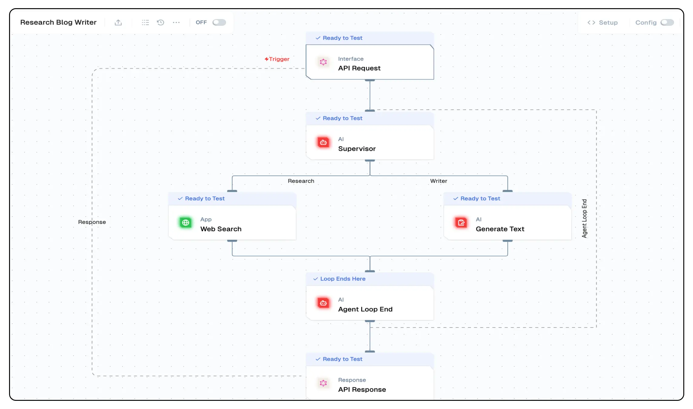

# **Supervisor Node**

The **Supervisor Node** is a central agent that orchestrates multi-agent flow. It collects input, maintains structured memory, and coordinates with sub-agents based on predefined logic. This node ensures a seamless iterative process for dynamic AI-powered applications, including structured decision-making systems and task automation.



## **Features**

<details>
<summary>**Key Functionalities**</summary>
  1. **Multi-Agent Coordination**: Manages multiple agent paths dynamically, ensuring structured workflow execution.
  2. **Memory Retention**: Stores and recalls context from prior messages, enabling an ongoing conversation-like experience.
  3. **Agent Path Definition**: Supports multiple agent branches, allowing customized execution flows.
  4. **Loop Control**: Manages iterative agent execution with stopping conditions for efficient process completion.

</details>

<details>
<summary>**Benefits**</summary>
  1. **Scalability**: Supports multiple agents within a single node, enabling scalable AI flow.
  2. **Efficient Context Handling**: Reduces redundant data collection by recalling user-provided information.
  3. **Adaptive Execution**: Allows for flexible branching based on AI-generated responses.
  4. **User-Centric Design**: Provides a visual representation of multi-agent execution paths.

</details>


## **What Can I Build?**

- AI-powered personal assistants that dynamically route tasks across sub-agents.
- Multi-step flow for data collection, processing, and decision-making.
- Automated AI systems that require iterative questioning to refine responses.
- Intelligent customer support agents that engage in structured dialogues.


## **Setup**

### **Configuring the Supervisor Node**
1. Define the **Agent Paths** to specify branching logic.
2. Set up the **Prompt Template** to control AI responses.
3. Assign an **LLM Model** for text generation.
4. Configure **Stop Words** and **Iteration Limits** for loop control.

### **Deployment**
1. Integrate the Supervisor Node into the workflow.
2. Connect relevant agent nodes for branching execution.
3. Deploy the project and trigger workflow execution.

---

## **Configuration Reference**

| **Parameter**        | **Description**                                              | **Example Value** |
|---------------------|--------------------------------------------------------------|------------------|
| **Prompts**          | Add prompts for system,users and assistants                  | `System Prompt, User Prompt` |
| **Agent Paths**      | Defines execution paths for multiple agents.                 | `Agent 1, Agent 2` |
| **Memory Retention** | Retains context across iterations.                           | `Enabled` |
| **Max Iterations**   | Sets the maximum loops before termination.                   | `5` |
| **Stop Word**        | Terminates execution when a condition is met.                | `end` |
| **LLM Model**        | Selects the AI model for text generation.                    | `GPT-4 Turbo` |

---

## **Low-Code Example**

```yaml
nodes:
  - nodeId: agentNode_960
    nodeType: agentNode
    nodeName: Supervisor
    values:
      tools: []
      agents:
        - name: Research
          schema: {}
          description: Agent 1 description
        - name: Writer
          schema: {}
          description: Agent 2 description
      prompts:
        - id: 9ed337ec-a4c0-4885-9066-f2853347d20b
          role: system
          content: >-
            Research on the topic {{triggerNode_1.output.topic}} and pass on
            your search to the writer to give the ideal text.
      messages: '[]'
      stopWord: ''
      connectedTo: agentLoopEndNode_242
      maxIterations: 5
      generativeModelName:
        type: generator/text
        model_name: gpt-4o-mini-2024-07-18
        credentialId: f6930a0d-9947-472c-b64b-2244a131cad0
        provider_name: openai
        credential_name: OPEN_AI_KEY
    needs:
      - triggerNode_1
      - agentLoopEndNode_242
    connections:
      - condition: Research
        value: webSearchNode_852
        type: conditionEdge
        invisible: false
      - condition: Writer
        value: LLMNode_238
        type: conditionEdge
        invisible: false
      - condition: Agent Loop End
        value: agentLoopEndNode_242
        type: agentLoopEdge
        invisible: true
```

## Output

#### output
- A nested object containing the output generated by the Supervisor Node. This depends and modfies based on the 
paths and agents defined in the configuration.

### Example Output

```json
{
  “output”: {}
}
```

## Troubleshooting

### Common Issues

| **Problem**                    | **Solution**                                                      |
| ------------------------------ | ----------------------------------------------------------------- |
| **Invalid API Key**            | Ensure the API key is correct and has not expired.                |
| **Dynamic Content Not Loaded** | Increase the `Wait for Page Load` time in the configuration.      |

### Debugging
1. Check Lamatic Flow logs for error details.
1. Verify API Key.