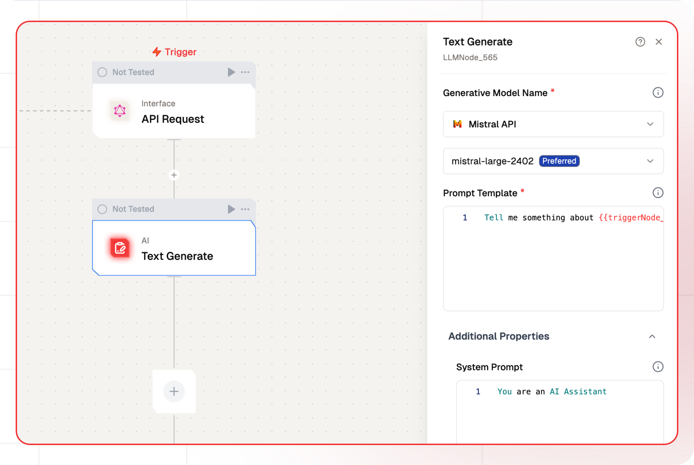

# Text LLM Node Documentation

The Text LLM node allows users to programmatically generate text outputs by submitting prompts to selected LLMs. These text outputs can be further processed within each flow. This node is particularly useful for applications requiring dynamic text creation, such as chatbots, content creation, and automated report generation.



## Features

<details>
  <summary>**Key Functionalities**</summary>

  
  1. **Generative Model Selection**: Allows users to select credentials for their preferred generative model, ensuring flexibility and compatibility with various LLMs. 
  
  1. **Customizable Prompts**: Features a field for creating prompt templates, enabling tailored input for specific use cases.
  
  1. **System Prompt Definition**: Includes an option to define a system-level prompt to guide the AI’s behavior, ensuring context-aware and role-specific responses.
  
  1. **Additional Properties Management**: Offers expandable sections for configuring advanced properties to fine-tune AI-generated outputs.
</details> <details>
  <summary>**Benefits**</summary>

  
  1. **Flexibility**: Supports integration with multiple LLMs, allowing users to utilize different models based on their specific needs and use cases. 
  
  1. **User-Centric Design**: Provides intuitive interfaces for prompt customization and system prompt definition, making it accessible to both beginners and advanced users. 
  
  1. **Enhanced Control**: Enables precise control over the AI’s behavior and output quality through customizable prompts and system configurations.
  
  1. **Scalability**: Facilitates the creation of reusable prompt templates for diverse workflows, ensuring consistency across projects.
</details>

## What can I build?

1. Automated content creation workflows for blogs and social media posts.
1. Intelligent chatbots capable of generating dynamic and personalized responses.
1. Automated report generation systems for business intelligence and data analysis.
1. Customizable email and message drafting tools for improved communication efficiency.

## Setup

### Select the Text LLM Node

1. Fill in the required parameters.
1. Build the desired flow
1. Deploy the Project
1. Click Setup on the workflow editor to get the automatically generated instruction and add it in your application.

## Configuration Reference

| **Parameter**             | **Description**                                                                                                | **Example Value**              |
| ------------------------- | -------------------------------------------------------------------------------------------------------------- | ------------------------------ |
| **Generative Model Name** | Select the model to generate text based on the prompt.                                                         | Gemini Model                   |
| **Prompt Template**       | Define the instructions for generating the text output.Define the instructions for generating the text output. | Tell me something about Bali |
| **System Prompt**         | System prompt to guide the LLM                                                                                 | You are Travel Planner         |

## Low-Code Example

```yaml
nodes:
  - nodeId: LLMNode_565
    nodeType: LLMNode
    nodeName: Text Generate
    values:
      promptTemplate: Tell me something about Bali
      systemPrompt: You are an AI Assistant
      messages: '[]'
      generativeModelName:
        provider_name: openai
        type: generator/text
        credential_name: Test OpenAI
        credentialId: aeeb2922-a7d3-431a-a376-77e01e725c51
        model_name: gpt-4-turbo
    needs:
      - triggerNode_1
```

## Sample Output

```json
{
    "_meta": {
      "prompt_tokens": 19,
      "completion_tokens": 212,
      "total_tokens": 231,
      "prompt_tokens_details": {
        "cached_tokens": 0,
        "audio_tokens": 0
      },
      "completion_tokens_details": {
        "reasoning_tokens": 0,
        "audio_tokens": 0,
        "accepted_prediction_tokens": 0,
        "rejected_prediction_tokens": 0
      },
      "model_name": "gpt-4-turbo",
      "model_provider": "openai"
    },
    "generatedResponse": "The term \"rag\" can have several meanings depending on the context:\n\n1. **Textile Usage**: Traditionally, a \"rag\" refers to a scrap or small piece of cloth used for cleaning or dusting. People often use old clothing or linen as rags once they are too worn out for their original purpose.\n\n2. **Informal Music Reference**: In music, particularly in jazz and early 20th-century American music, \"rag\" refers to a ragtime composition, a musical genre characterized by its syncopated, or \"ragged,\" rhythm.\n\n3. **Slang**: In some contexts, \"rag\" can be a derogatory slang term. For instance, it might be used to refer to a newspaper or magazine that is considered to be of low quality or integrity.\n\n4. **Other Uses**: In various professional or regional dialects, \"rag\" might have specific meanings related to the field or area. \n\nCan you specify in which context you are inquiring about \"rag\" to provide a more targeted explanation?"
  }
```

## Troubleshooting

### Common Issues

| **Problem**                    | **Solution**                                                      |
| ------------------------------ | ----------------------------------------------------------------- |
| **Invalid API Key**            | Ensure the API key is correct and has not expired.                |
| **Dynamic Content Not Loaded** | Increase the `Wait for Page Load` time in the configuration.      |

### Debugging
1. Check Lamatic Flow logs for error details.
1. Verify API Key.