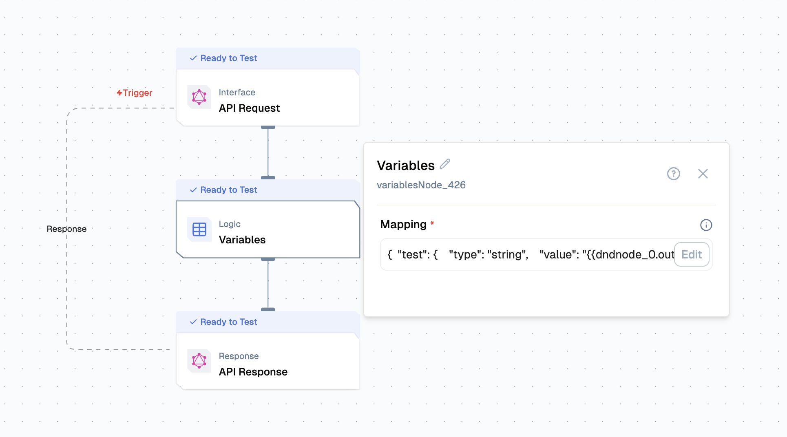

import { NodeOverview } from "@/components/NodeOverview"

# Variable Node

<NodeOverview slug="variable-node"/>

## Overview

The Variable Node in Lamatic allows you to define and map variables that can be reused throughout your flow. This is useful for setting static values, referencing outputs from previous nodes, or making your flows more dynamic and maintainable.



You can map variables in the Variable Node using a simple interface. Each variable can be assigned a type (e.g., string, number) and a value, which can be a static value or a reference to another node's output.

## Features

<details>
  <summary>**Key Functionalities**</summary>

1. **Variable Mapping:** Easily define and map variables with static values or dynamic references from other nodes.

2. **Reusability:** Use mapped variables throughout your flow, reducing redundancy and improving maintainability.

3. **Dynamic Referencing:** Reference outputs from previous nodes to make your flows adaptable and data-driven.

4. **Centralized Management:** Manage all your flow variables in one place for better organization and clarity.

5. **Seamless Integration:** Integrate mapped variables with any node that supports variable input, enabling flexible and powerful automation.

</details>

<details>
  <summary>**Benefits**</summary>

1. **Enhanced Flow Customization:** Tailor flows to meet specific business or operational needs.

1. **Streamlined Automation:** Minimize manual intervention with robust, automated processes.

1. **Improved Efficiency:** Optimize flow by integrating complex operations directly into your flows.

1. **Reduced Development Overhead:** Empower developers to build and deploy custom logic without external systems.

1. **Scalable Design:** Create reusable logic components that adapt to various use cases and scale with your needs.

</details>

## What Can You Build?

1. **Centralized Variable Management:** Store and manage all key values in one place for use across your entire flow.
2. **Dynamic Data Passing:** Pass outputs from one node as variables to multiple downstream nodes, enabling flexible and dynamic workflows.
3. **Parameterization:** Easily update values (like API keys, thresholds, or user settings) in one node and have changes reflected throughout your flow.
4. **Template Flows:** Create reusable flow templates by defining variables that can be quickly remapped for different use cases or environments.
5. **Conditional Logic Support:** Use mapped variables as conditions or parameters in logic, filter, or branching nodes.

## Variable Mapping and Usage

The Variable Node in Lamatic lets you define variables and assign them values, which can be static or dynamically referenced from other nodes. These mapped variables can then be used in subsequent nodes throughout your flow.

## How to Map Variables

1. **Add a Variable Node to your flow.**
2. **Define variables:** For each variable, specify a name, type (e.g., string, number), and value. The value can be a static value or a reference to another node's output (e.g., `{{nodeId.output.field}}`).
3. **Save the configuration.**

**Example UI Mapping:**

- Variable `a` (type: string) mapped to `{{dndnode_0.output.sampleInput1}}`
- Variable `b` (type: string) mapped to `{{dndnode_0.output.sampleInput2}}`

**Equivalent JSON:**

```json
{
  "a": {
    "type": "string",
    "value": "{{dndnode_0.output.sampleInput}}"
  },
  "b": {
    "type": "string",
    "value": "{{dndnode_0.output.sampleInput}}"
  }
}
```

## Configuration

1. **Add a Variable Node:** Drag and drop a Variable Node into your flow.
2. **Define Variables:** For each variable, specify a name, type (e.g., string, number, boolean), and value. The value can be static or reference another node's output (e.g., `{{nodeId.output.field}}`).
3. **Save the Node:** Confirm your variable mappings and save the configuration.
4. **Use Variables in Other Nodes:** Reference the mapped variables in any compatible node by their names (e.g., `variables.a`).
5. **Update as Needed:** Edit the Variable Node to update values, which will automatically propagate to all nodes using those variables.

## Low-Code Example

```yaml
nodes:
  - nodeId: variablesNode_426
    nodeType: variablesNode
    nodeName: Variables
    values:
      mapping: |-
        {
          "test": {
            "type": "string",
            "value": "{{dndnode_0.output.sampleInput}}"
          }
        }
    modes: {}
    needs:
      - dndnode_0
```

## Output

- The result produced after execution.

## Troubleshooting

### Common Issues

| **Problem**                | **Solution**                                                                                 |
|---------------------------|---------------------------------------------------------------------------------------------|
| **Incorrect Variable Value** | Double-check the value mapping and ensure references (e.g., `{{nodeId.output.field}}`) are correct. |
| **Variable Not Found**     | Make sure the variable name is spelled correctly and is defined in the Variable Node.        |
| **Downstream Node Errors** | Ensure all required variables are mapped and available before they are used in other nodes.  |
| **Stale Values**           | If you update a variable, verify that all dependent nodes are using the latest mapping.      |
| **Type Mismatch**          | Confirm that the variable type (string, number, boolean) matches the expected input type.    |

### Debugging Tips

- Use clear and descriptive variable names to avoid confusion.
- Check the variable mapping panel for typos or incorrect references.
- Use the platform's preview or test features to inspect variable values at runtime.
- If a node fails, review its input configuration to ensure all variables are correctly mapped.
- Trace the flow to see where a variable might not be set or is being overwritten.
- When referencing outputs from other nodes, always use the correct syntax: `{{nodeId.output.field}}`.
- Update and save the Variable Node whenever you make changes to ensure updates propagate through the flow.

By leveraging the Lamatic.ai Variable Node, you can create highly customized, efficient, and scalable flow tailored to your specific needs.


