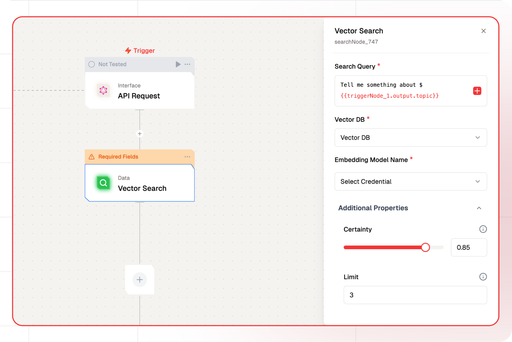

# Vector Search Node Documentation

Vector search Node provides the ability to retrie of information retrieval where documents and queries are represented as vectors instead of plain text.



## Features

<details>

<summary>**Key Functionalities**</summary>{" "}

1. **Dynamic Search Query Input**: Allows for customizable search queries using dynamic placeholders like `{{triggerNode_1.output.topic}}`.

1. **Vector Database Selection**: Provides an option to select a specific vector database for efficient retrieval of information.

1. **Embedding Model Integration**: Supports the integration of embedding models by selecting predefined credentials.

1. **Certainty Threshold Adjustment**: Enables users to set a certainty threshold for search results using an adjustable slider.

1. **Result Limitation**: Allows limiting the number of search results returned with a configurable limit.

</details>

<details>

<summary>**Benefits**</summary>{" "}

1. **Customizability**: The dynamic query capability ensures that search inputs are adaptable to various scenarios and workflows.

1. **Precision**: The certainty threshold ensures high relevance of retrieved results by filtering based on confidence levels.

1. **Scalability**: Supports integration with vector databases and embedding models, making it suitable for complex and large-scale applications.

1. **Efficiency**: Configurable result limits optimize the retrieval process, saving time and resources.

</details>

## What can I build?

1. Create a dynamic search interface within your application to query a vector database.
1. Develop a personalized recommendation system using text and vector based search results.
1. Integrate real-time search capabilities to enhance user experience in your app.

## Setup

### Select the Vector Search Node

1. Fill in the required parameters.
1. Build the desired flow
1. Deploy the Project
1. Click Setup on the workflow editor to get the automatically generated instruction and add it in your application.

## Configuration Reference

| **Parameter**            | **Description**                                                                                                                                                                                                                                                                                          | **Example Value**            |
| ------------------------ | -------------------------------------------------------------------------------------------------------------------------------------------------------------------------------------------------------------------------------------------------------------------------------------------------------- | ---------------------------- |
| **Search Query**         | Input the query to search the vector database.                                                                                                                                                                                                                                                           | Tell me something about Bali |
| **Vector DB**            | Select the vector database to be queried.                                                                                                                                                                                                                                                                | Database                     |
| **Embedding Model Name** | This field allows the user to select the embedding model used to embed the query into vector space. It loads available embedding models through the listModels method.                                                                                                                                   | Embedding Model Name         |
| **Boost Properties**     | Specific properties can be boosted by a factor specified as a number                                                                                                                                                                                                                                     | True/False                   |
| **Certainty**            | Its the distance score into a value between `0 <= certainty <= 1`, where 1 would represent identical vectors and 0 would represent opposite vectors.Its the distance score into a value between `0 <= certainty <= 1`, where 1 would represent identical vectors and 0 would represent opposite vectors. | 0.7                          |
| **Limit**                | Number of results to return                                                                                                                                                                                                                                                                              | 3                            |
| **Filters**              | Apply JSON-based filters to refine search results.                                                                                                                                                                                                                                                       | []                           |

## Low-Code Example

```yaml
nodes:
  - nodeId: searchNode_747
    nodeType: searchNode
    nodeName: Vector Search
    values:
      searchQuery: Tell me something about ${{triggerNode_1.output.topic}}
      vectorDB: ""
      certainty: "0.85"
      limit: "3"
      filters: "[]"
    needs:
      - triggerNode_1
  - nodeId: plus-node-addNode_670114
    nodeType: addNode
    nodeName: ""
    values: {}
    needs:
      - searchNode_747
```

## Troubleshooting

### Common Issues

| **Problem**                    | **Solution**                                                 |
| ------------------------------ | ------------------------------------------------------------ |
| **Invalid API Key**            | Ensure the API key is correct and has not expired.           |
| **Dynamic Content Not Loaded** | Increase the `Wait for Page Load` time in the configuration. |

### Debugging

1. Check Lamatic Flow logs for error details.
1. Verify API Key.
