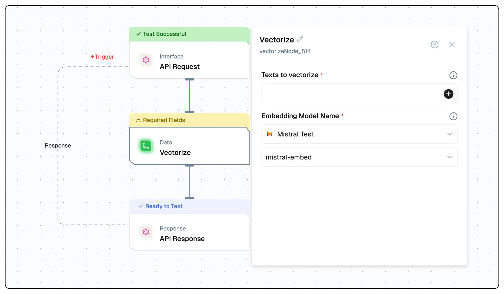

# Vectorize Node Documentation

The vectorize node transforms data chunks into numeric vector representations using an embedding model. This process is crucial for applications that require semantic retrieval, as it enables the conversion of text data into a format that can be easily analyzed and compared. The node's flexibility allows users to select specific embedding models and configure their parameters to suit their needs.



## Features

<details>
  <summary>**Key Functionalities**</summary>

1. **Custom Embedding Model Selection:** Choose from a variety of embedding models to fit your application's needs.

1. **Parameter Configuration:** Fine-tune embedding parameters for optimal performance and relevance.

1. **Efficient Vectorization:** Quickly convert large volumes of text data into numeric vector representations.

1. **Semantic Retrieval Compatibility:** Enable advanced search and comparison functionalities using semantic understanding.

1. **Scalable Processing:** Handle massive datasets effectively, ensuring seamless vectorization at scale.

</details>

<details>
  <summary>**Benefits**</summary>

1. **Enhanced Data Analysis:** Leverage semantic vectors to improve search and analysis capabilities.

1. **Streamlined Integration:** Easily incorporate vectorized data into downstream applications and workflows.

1. **Improved Accuracy:** Benefit from state-of-the-art embedding models for precise semantic representation.

1. **Operational Flexibility:** Configure and adapt vectorization settings to meet evolving requirements.

1. **Future-Proof Design:** Stay compatible with the latest embedding technologies and methodologies.

</details>

## What Can You Build?

1. Build advanced search engines that can understand and retrieve information based on semantic meaning rather than keywords.
1. Create recommendation systems that provide more accurate suggestions by understanding the context and meaning of user preferences.
1. Develop chatbots and virtual assistants that can comprehend and respond to user queries with greater relevance and understanding.
1. Implement content categorization and organization systems that can automatically classify and sort large volumes of text data.

## Setup

### Select the Vectorize Node

1. Fill in the required parameters.
1. Build the desired flow
1. Deploy the Project
1. Click Setup on the workflow editor to get the automatically generated instruction and add it in your application.

## Configuration Reference

| **Parameter**            | **Description**                                                    | **Required** | **Example Value**        |
| ------------------------ | ------------------------------------------------------------------ | ------------ | ------------------------ |
| **Texts to vectorize**   | Enter the texts to be transformed into vectors.                    | Yes          | `${{data}}`              |
| **Embedding Model Name** | Select the model to convert the texts into vector representations. | Yes          | `text-embedding-3-large` |

## Low-Code Example

```yaml
- nodeId: vectorizeNode_448
  nodeType: vectorizeNode
  nodeName: Get Vectors
  values:
    inputText: "{{codeNode_234.output}}"
    embeddingModelName: {}
    generativeModelName:
      type: embedder/text
      nodeId: vectorizeNode
      model_name: text-embedding-ada-002
      provider_name: openai
```


## Output

- `vectors`: An array of arrays, each containing numerical values representing the vectorized form of the input data.

### Example Output

```json
{
    "vectors": [
      [
        -0.010908611,
        -0.013849079,
        -0.0080731595,
        -0.03575819,
        -0.004489464,

      ]
    ]
}
```

## Troubleshooting

### Common Issues

| **Problem**                    | **Solution**                                                 |
| ------------------------------ | ------------------------------------------------------------ |
| **Invalid API Key**            | Ensure the API key is correct and has not expired.           |
| **Dynamic Content Not Loaded** | Increase the `Wait for Page Load` time in the configuration. |

### Debugging

1. Check Lamatic Flow logs for error details.
1. Verify API Key.
