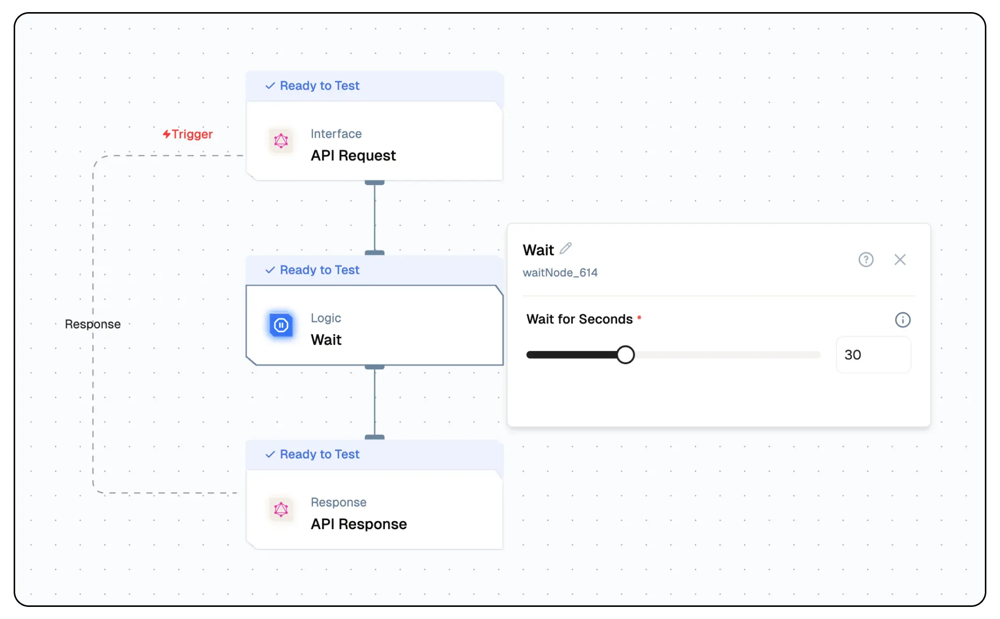

# Wait Node Documentation

The Lamatic.ai Wait Node allows you to introduce a controlled wait during your flow execution for a duration between 1 and 90 seconds. This is ideal for handling rate limits, sequencing actions, or waiting between dependent steps.



## Features

<details>
  <summary>**Key Functionalities**</summary>
1. **Execution Wait:** Wait for a specified time during the flow.
3. **Step Synchronization:** Add wait time between dependent steps in your flow.
4. **Sequential Flow Control:** Ensure proper timing across nodes.
5. **Simple Configuration:** Define wait time with a single value.

</details>

<details>
  <summary>**Benefits**</summary>
1. **Improved Flow Stability:** Reduces errors caused by premature executions.
2. **Controlled Execution:** Enables better coordination between systems or APIs.
3. **Reduced Failure Rates:** Avoids overloading external systems by spacing out actions.
4. **Flexible Timing:** Wait duration can be set per use case.
5. **No Extra Scripting Required:** Add timing logic directly within your flow visually.

</details>

## What Can You Build?

1. **Throttled API Calls:** Wait between API calls to respect third-party rate limits.
2. **Retry Gaps:** Wait before retrying failed operations or requests.
3. **Staggered Alerts:** Wait before sending time-based notifications.
4. **Process Timing Flows:** Add waits to align with expected processing time of external systems.

## Setup

### Select the Wait Node

1. Select the Wait Node into your Lamatic flow.
2. Set the **Wait Time (in seconds)** between 1 and 90.
3. Connect it before the next step that needs to wait.
4. Deploy your flow and test to validate the wait duration.

## Configuration Reference

| **Parameter**       | **Description**                                       | **Required** | **Example Value** |
| ------------------- | ----------------------------------------------------- | ------------ | ----------------- |
| **Wait Time (sec)** | Time in seconds to wait before proceeding (1–90 sec). | Yes          | 10                |

## Low-Code Example

```yaml
nodes:
  - nodeId: waitNode_614
    nodeType: waitNode
    nodeName: Wait
    values:
      seconds: 30
    modes: {}
    needs:
      - triggerNode_1
responseNode:
  nodeId: responseNode_triggerNode_1
  nodeType: graphqlResponseNode
  nodeName: API Response
  values:
    outputMapping: "{}"
  needs:
    - waitNode_614
```

## Output

The Wait Node return status (true/false). It simply waits for the configured duration before triggering the next node.

```json
{
  "output": {
    "success": true
  },
  "input": {
    "nodeName": "Wait",
    "seconds": 30
  },
  "logs": null,
  "status": "success"
}
```

## Troubleshooting

### Common Issues

| **Problem**               | **Solution**                                               |
| ------------------------- | ---------------------------------------------------------- |
| **Flow Not Continuing**   | Ensure the wait time is a number between 1 and 90 seconds. |
| **Unexpected Wait Time ** | Check for additional waits or slow nodes in the flow.      |

### Debugging

1. Check Lamatic Flow logs for error details.
1. Use Lamatic flow logs to verify wait duration execution.
1. Check surrounding nodes to rule out additional delays.
