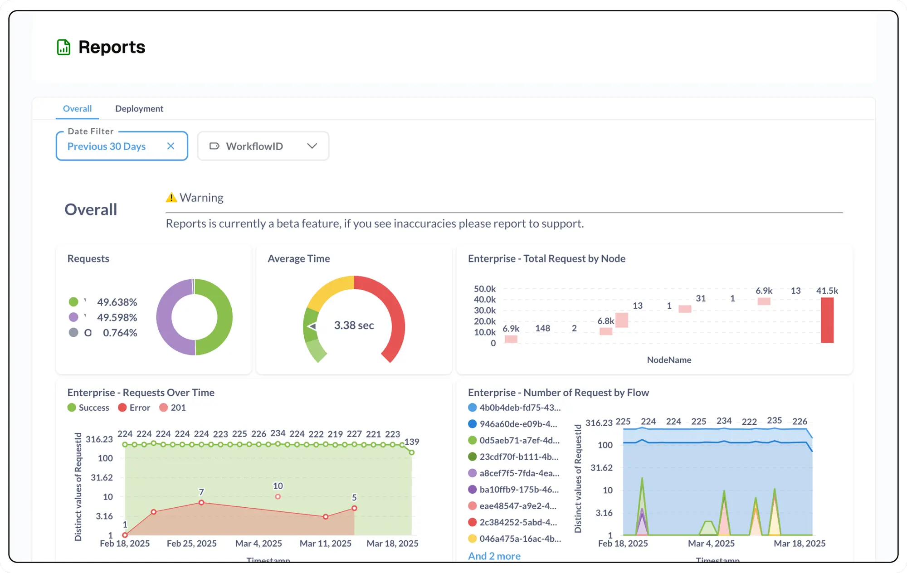

# **Centralized Reporting System for Project Insights**

<Callout type="warning" emoji="🧪">
    **Reports are in alpha**  
    Reports is currently an alpha feature, and not publicly available. If you see inaccuracies please report to support.

</Callout>

Gain comprehensive insights into your project's performance with our centralized reporting system. Access critical project metrics and analytics all in one convenient location, enabling you to make data-driven decisions efficiently.

---

## **Report Categories**

---

### **Request Analytics**

Provides a detailed overview of request-related analytics, offering insights into various flows and responses across your project. This comprehensive report allows you to track and analyze the performance of different request types and their corresponding outcomes.

📊 **Key Metrics**:

- **Performance**: Detailed analysis of request processing speed and efficiency.
- **Throughput**: Measurement of system capacity and request handling capabilities.
- **Success Rate**: Evaluation of successful request completions and error occurrences.

---

### **Artificial Intelligence Metrics**

Delivers in-depth AI-related analytics, focusing on crucial aspects of your AI systems:

🤖 **Key Metrics**:

- **Performance Metrics**: Comprehensive breakdown of request time, including latency analysis and response time distributions.
- **Token Consumption Analysis**: Detailed examination of token usage by model, flow, and request type to optimize resource allocation.
- **Throughput Assessment**: Evaluation of request processing capabilities, identifying peak performance and bottlenecks.

---

### **Context Utilization**

Presents a comprehensive snapshot of context consumption patterns within vectorDB and memory systems, enabling efficient resource management and optimization of context-aware processes.

💡 **Pro Tip**: Use this report to optimize your system's context-aware processes for better resource efficiency.

---

### **Deployment Statistics**

Offers a detailed overview of deployment-related metrics:

🚀 **Deployment Insights**:

- **Total Deployments**: Track the number of deployments.
- **Average Deployment Time**: Monitor how long deployments take.
- **Success Rates**: Keep an eye on successful vs failed deployments.

---

### **Job Performance Analytics**

Provides comprehensive insights into job-related metrics:

⚙️ **Job Metrics**:

- **Total Jobs Processed**: View the total number of jobs completed.
- **Record Counts**: Analyze the total number of records processed.
- **Execution Time**: Get detailed execution time breakdowns.
- **Success Rates**: Monitor job success rates to identify potential issues in flows.