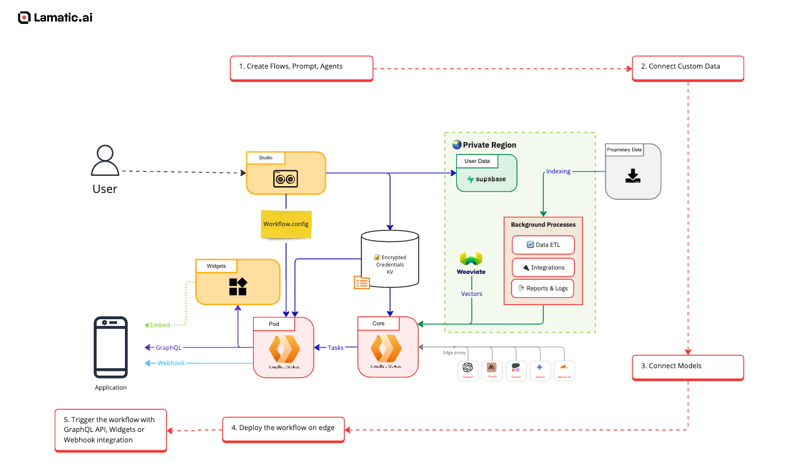

# Security
Lamatic.ai, we prioritize the security and privacy of our clients' data. A comprehensive security framework is designed to protect your information through robust measures and best practices.

## Security Architecture
Our security architecture is built on a foundation of industry-leading practices to ensure the integrity, confidentiality, and availability of your data. Key components include:
1. Network Security: We employ firewalls, intrusion detection systems, and continuous monitoring to safeguard our network from unauthorized access and potential threats.
1. Application Security: Our development process integrates security at every stage, including regular code reviews, vulnerability assessments, and adherence to secure coding standards.
1. Access Control: We implement the principle of least privilege, ensuring that access to systems and data is granted only to authorized personnel based on their roles and responsibilities.
 
At Lamatic.ai, our security policies are founded on the following core principles:
1. Access Control: We limit access strictly to individuals with a legitimate business need, adhering to the principle of least privilege.
1. Layered Security: We implement and layer security controls following the defense-in-depth principle to ensure comprehensive protection.
1. Consistency: Our security controls are applied uniformly across all areas of the enterprise to maintain a consistent security posture.
1. Continuous Improvement: We iteratively enhance our controls, focusing on improved effectiveness, increased auditability, and reduced friction.

## Data Protection
Protecting your data is paramount. Our data protection strategies encompass:
1. Encryption: All data, both at re and in transit, is encrypted using advanced encryption standards to prevent unauthorized access.
1. Data Segmentation: We separate and isolate to ensure that each client's information remains distinct and secure.
1. Regular Backups: automated backups are performed regularly to ensure data integrity and availability in case of unforeseen events.

## Product Security
Products are designed with security as a core component:
1. Secure Development Life: Security assessments are integrated throughout our development process to identify and mitigate potential vulnerabilities early.

1. Third-Party Assessments: engage independent security experts to conduct regular audits and penetration tests, ensuring our products meet the highest security standards.

## Enterprise Security
For our enterprise clients, we offer tailored security solutions:
1. Compliance Alignment: Our security practices are aligned with industry standards and regulations, including SOC 2 and GDPR efforts are underway, to meet your compliance requirements.

1. Custom Security Configurations: We provide customizable security settings to align with your organization's specific policies and risk profiles.

## Data Privacy
We are committed to maintaining the privacy of ur data:
1. Transparent Data Practices: We clearly communicate how data is collected, used and stored, ensuring transparency and trust.

1. User Control: Clients have control over the data, including options for data access, modification, and deletion, in accordance with applicable laws and regulations.

## Bug Bounty Program
To continuously enhance our security posture, we have established a Bug Bounty Program:
1. Community Engagement: We invite security research to identify and report vulnerabilities, offering rewards for valid findings.

1. Responsible Disclosure: Our program encourages responsible reporting and ensures timely remediation of identified issues.

## Anonymous Reporting Policy
We maintain an Anonymous Repping Policy to uphold ethical standards:
1. Safe Reporting Channels: Individuals can report unethical behavior or security concerns anonymously without fear of retaliation.

1. Prompt Action: All reports are investigated thoroughly, and appropriate actions are to address any validated concerns.

## Compliance Initiatives
We are actively pursuing compliance with industry standards:
1. SOC Compliance: Our SOC 2 compliance efforts are underway, focusing on security, availability and confidentiality principles.

1. GDPR Compliance: We are aligning our data practices with GDPR required to ensure the protection of personal data for clients within the European Union.

At Lamatic.ai, we are dedicated to maintaining a secure environment for our cloud data and continuously improving our security measures to adapt to evolving threats.
