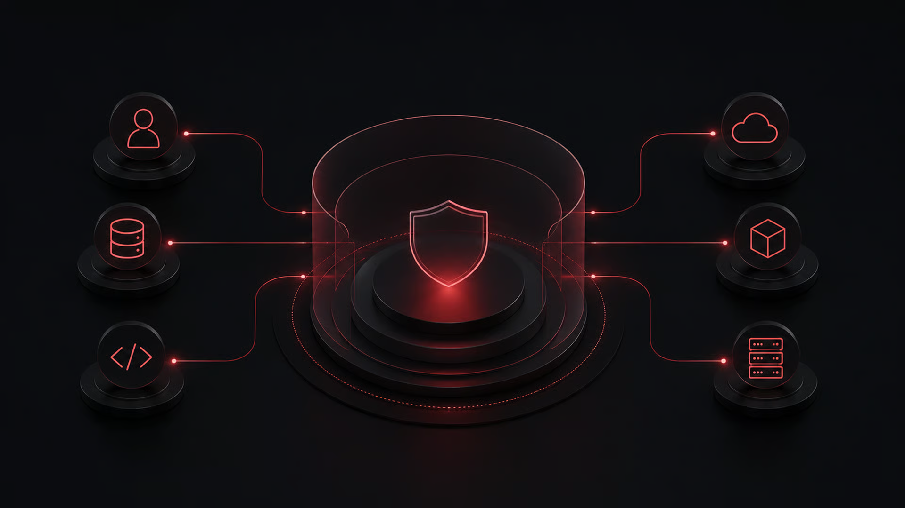
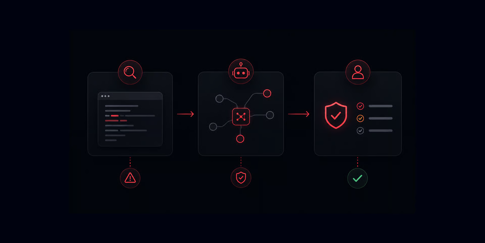
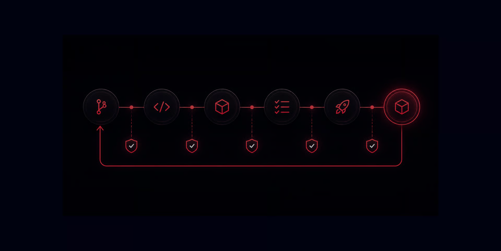
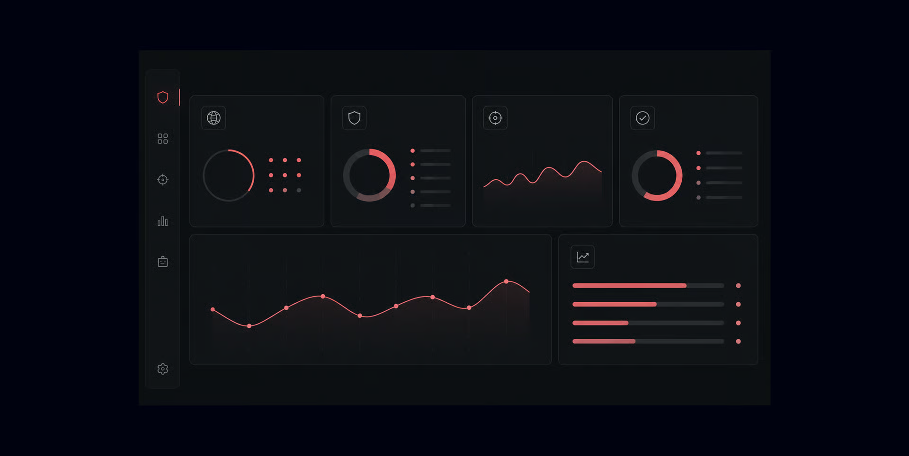
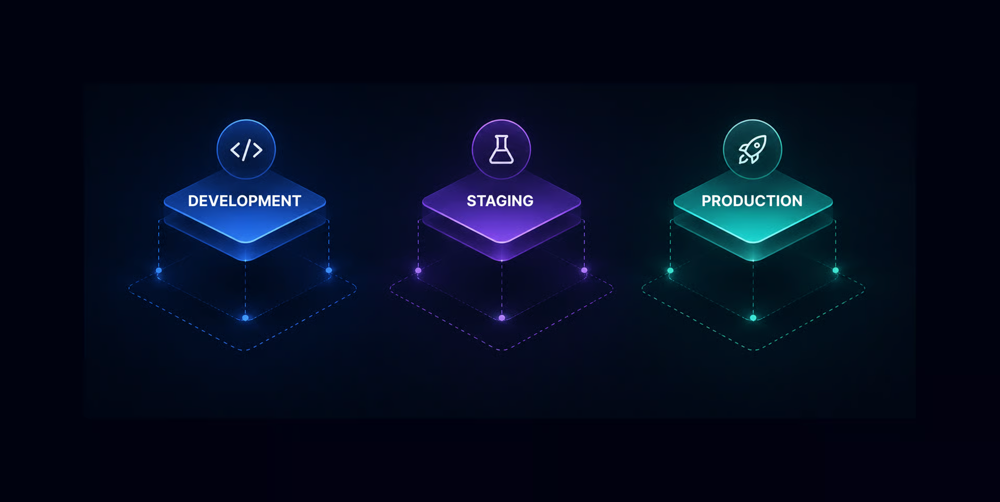
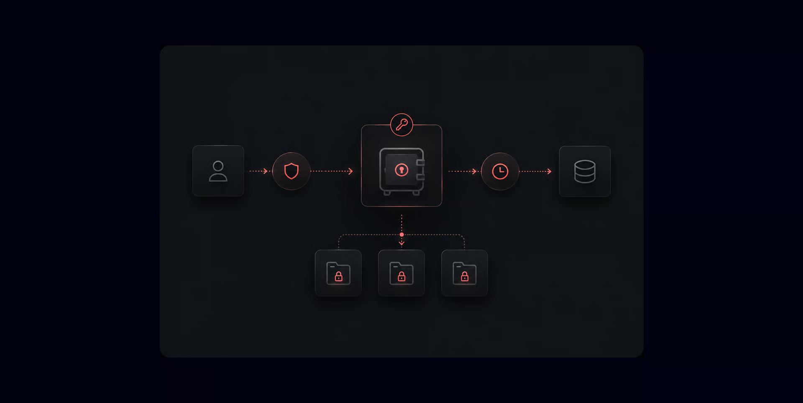
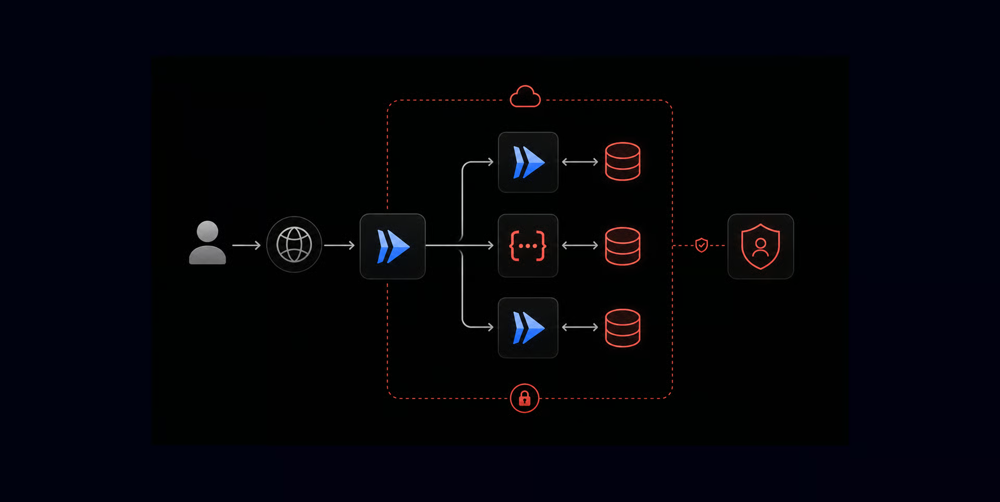
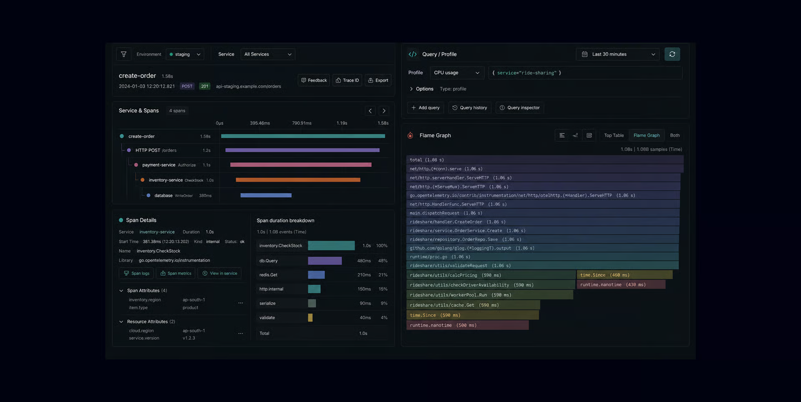
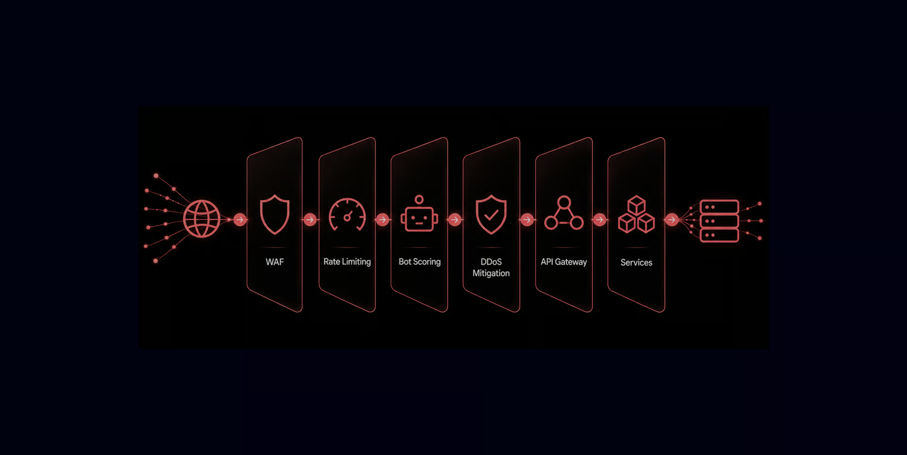

# Security Architecture

## Why traditional security falls short

For decades, most security programs have followed the same rhythm: conduct an annual penetration test, run periodic audits, patch vulnerabilities after they are reported, and add controls around a network perimeter.

That approach is no longer enough for modern AI infrastructure. Applications change daily. Dependencies change constantly. APIs, models, tools, and agent workflows introduce new paths through which data can be accessed or actions can be performed.

At the same time, attackers can use AI agents to scan systems faster, automate reconnaissance, test many attack paths at once, and adapt their techniques as environments change. A security program that only evaluates risk periodically cannot keep pace with an attack surface that evolves continuously.

The future of security is not simply more automation. It is agentic: continuous, contextual, adaptive, and built into every layer of the platform.

<Callout>
At Lamatic.ai, we build agentic infrastructure that is secure in two directions:

**Secure from agents**: our platform is designed to resist malicious autonomous behavior, unauthorized tool use, data exposure, prompt injection, and automated exploitation.

**Secure for agents**: legitimate agents operate with clear identity, narrowly scoped access, isolated execution environments, observable actions, and enforceable policy boundaries.
</Callout>

---

## Secure development lifecycle

Security should not be something added before release. It needs to be part of how software is planned, written, reviewed, tested, deployed, and monitored.

### Agent-assisted code review

Every code change can introduce security consequences. A new endpoint may expose information, an authorization check may be missed, a dependency may introduce a known vulnerability, or a small configuration change may accidentally broaden access.

Lamatic uses automated and agent-assisted review to examine code changes continuously. These agents look beyond simple keyword matching: they evaluate patterns, data flows, permissions, and the security implications of a change in context.

AI review does not replace engineering judgment. Instead, it acts as an always-on additional reviewer that can flag risky patterns early, before code reaches production. Engineers remain accountable for reviewing findings, validating their relevance, and making the final design decisions.

Agent-assisted review focuses on:

- Authentication and authorization changes
- Input validation and unsafe data handling
- Secret exposure and insecure configuration
- Dependency changes and known vulnerabilities
- Data-flow paths that could expose customer information
- Business-logic gaps that conventional scanners may miss

### Security gates in CI/CD

A secure development process needs enforceable checkpoints. Security gates prevent code from being promoted when it fails critical security requirements.

At Lamatic, automated checks run throughout the CI/CD pipeline. A developer receives feedback while the change is still small and easy to fix, rather than discovering a problem after it has been deployed to production.

Our security gates include:

- **Static application security testing (SAST)**: reviews source code for common insecure patterns such as injection risks, unsafe deserialization, weak cryptography, and missing validation
- **Software composition analysis (SCA)**: checks open-source dependencies for known vulnerabilities, license issues, and outdated packages
- **Secrets detection**: blocks commits that include credentials, private keys, tokens, or connection strings
- **Infrastructure-as-code scanning**: reviews Terraform, Kubernetes manifests, Dockerfiles, and cloud configuration for insecure defaults or over-permissive access
- **Container image scanning**: identifies vulnerable libraries, operating-system packages, and misconfigurations before an image is deployed
- **Dynamic and API security testing**: tests running staging environments for weaknesses that only appear when services interact
- **Release-risk review**: applies deeper analysis and agentic pentesting to material changes or major releases

<Callout>
Production is not the first place where security checks happen. It is the last place a validated change is allowed to go.
</Callout>

### Continuous agentic pentesting

A traditional penetration test is a snapshot. It is valuable, but it cannot represent the security state of a fast-moving platform for an entire year or quarter.

Agentic pentesting makes offensive testing continuous. Autonomous agents can map authorized attack surfaces, replay relevant tests after a deployment, look for new exposure caused by configuration changes, and test newly disclosed vulnerabilities against the current environment.

Every automated finding still needs prioritization. We combine continuous machine-scale testing with human validation to ensure security teams focus on vulnerabilities that are practical, impactful, and relevant to customers.

| Area | Traditional pentest | Continuous agentic pentesting |
| --- | --- | --- |
| Timing | Scheduled periodically | Runs continuously and after meaningful changes |
| Scope | Defined before the engagement | Evolves with the approved attack surface |
| Detection speed | Often weeks after a release | Can identify issues shortly after change |
| Validation | Primarily manual | Autonomous testing plus human validation |
| Retesting | Usually a separate engagement | Automated after remediation or deployment |

Continuous testing helps us:

- Detect exposures introduced by new releases or configuration changes
- Validate whether newly published vulnerabilities affect our environment
- Test APIs, web applications, cloud services, and integration boundaries together
- Verify fixes by retesting the original attack path
- Give engineering teams actionable evidence instead of abstract alerts

### Static analysis plus agentic reasoning

Static analysis is fast and reliable for detecting known insecure patterns. It is an essential part of secure software delivery, but it does not always understand why a feature exists or whether a sequence of valid actions creates a business-logic vulnerability.

Agentic analysis adds contextual reasoning. It can evaluate how data moves through an application, how identity and permission checks are used across services, and whether a user could perform an action that their role should not permit.

| Security layer | What it does best |
| --- | --- |
| Static analysis | Finds known patterns such as injection, weak cryptography, exposed secrets, and unsafe functions |
| Dependency analysis | Finds vulnerable or outdated third-party packages |
| Agentic reasoning | Investigates data flow, authorization paths, business logic, and multi-step attack scenarios |
| Human review | Validates product intent, threat model assumptions, and risk trade-offs |

{/* image: static analysis, agentic reasoning, and human review compared */}

---

## Data security and zero trust

Customer data is the most sensitive part of an AI infrastructure platform. Our approach assumes that no request, service, identity, or environment should receive more access than it needs.

This is the foundation of zero trust: verify explicitly, use least privilege, and limit the duration and scope of access.

### Separate environments

We separate development, staging, and production environments so that experimentation and testing do not expose production systems or customer data.

- **Development**: used for engineering work with isolated services and non-production data
- **Staging**: mirrors production architecture as closely as possible while using synthetic, masked, or otherwise non-sensitive data
- **Production**: hosts customer workloads and is isolated from lower environments through separate identities, resources, networks, and access controls

Environment separation limits blast radius. A mistake in development should not provide a path to production data or infrastructure.

### Authentication and access control

Identity is the starting point for security. Before a person, service, or agent can access a resource, Lamatic verifies who or what is making the request and whether that identity has a legitimate reason to perform the action.

Our access-control model includes:

- **2FA/MFA**: multi-factor authentication is required for user and administrative access, reducing the risk that a stolen password alone can compromise an account
- **OAuth 2.0 and OIDC**: federated identity standards enable scoped, revocable, and short-lived authorization rather than persistent shared credentials
- **RBAC (Role-Based Access Control)**: permissions are granted according to defined roles, so users and services receive only the capabilities required for their responsibilities
- **RLS (Row-Level Security)**: database policies restrict which records a requester can access, creating another enforcement layer even if application logic fails
- **Service identities**: services and agents use distinct identities with narrowly scoped permissions rather than sharing broad administrator credentials

### Encryption in depth

Encryption protects data while it is moving, while it is stored, and while it is accessed. We use multiple layers because no single control should be responsible for protecting sensitive information.

| Layer | How it protects data |
| --- | --- |
| Encryption in transit | TLS protects data moving between users, services, APIs, and infrastructure endpoints from interception or tampering |
| Encryption at rest | AES-256 protects stored databases, backups, files, and persistent infrastructure resources |
| Per-project keys | Each project or tenant receives unique encryption key material, limiting the impact of any individual key exposure |
| Key separation | Encryption keys and salts are stored separately from the encrypted data they protect |
| Just-in-time decryption | Data is decrypted only for the authorized operation, for the minimum necessary time, and then re-encrypted |
| Key rotation | Key material is rotated according to policy and operational requirements to reduce long-term exposure |

<Callout>
Just-in-time decryption is especially important for agentic systems. An agent should not receive a permanent decrypted dataset simply because it has a valid task. It should receive only the data and access required for the specific approved action.
</Callout>

### Data lifecycle management

Security includes what happens to data after it has been created. We define how information is stored, retained, recovered, accessed, and deleted.

- **Point-in-Time Recovery (PITR)**: continuous backup capabilities allow data to be restored to a precise moment, reducing the impact of accidental deletion, corruption, or operational failure
- **Data retention policies**: data is retained only for an approved business, legal, operational, or customer-defined purpose; when the retention period ends, deletion is automated and documented
- **Immutable audit logs**: security-relevant actions are recorded in tamper-evident storage, supporting investigations, compliance evidence, and accountability
- **Controlled backups**: backups are encrypted, access-controlled, and subject to retention and deletion requirements

### Tenant and resource isolation

Multi-tenant platforms must be designed so that one customer cannot access, affect, or infer information about another customer. Lamatic applies isolation at multiple layers, including database policies, storage boundaries, compute resources, network segmentation, identity controls, and encryption keys. Where a workload requires stronger separation, dedicated tenant infrastructure can provide an additional boundary.

See [Tenant Security & Isolation](/docs/security/tenant-isolation) for the full architecture, network diagram, and subprocessor inventory.

{/* image: multi-tenant isolation diagram with separate databases, storage, compute, keys, and network boundaries */}

---

## Infrastructure and runtime security

Secure AI infrastructure requires more than secure code. The platform must also protect the way services run, communicate, store data, and respond to malicious traffic.

### Serverless microservices architecture

Lamatic uses serverless microservices, including Cloudflare Workers and Digital Ocean Cloud Functions, to separate responsibilities into smaller services with explicit interfaces and limited permissions.

This architecture can reduce operational risk when implemented carefully. Services can scale automatically, execution is often short-lived, and each component can be assigned a dedicated identity with only the permissions it needs. A compromise in one service should not automatically become unrestricted access across the environment.

Core principles:

- Least-privilege IAM for every workload
- Separate service identities rather than shared credentials
- Explicit APIs and network paths between services
- Short-lived, ephemeral execution where appropriate
- Controlled deployment through validated CI/CD pipelines

### Dedicated tenant-isolated infrastructure

For sensitive workloads, infrastructure isolation may need to go beyond logical access controls. Dedicated tenant-isolated infrastructure can provide separate compute, storage, network, database, and encryption boundaries for a customer or workload. This option helps reduce shared-resource exposure, simplify customer security reviews, and support strict data-separation requirements, particularly for organizations operating in regulated environments or handling highly sensitive data.

### Full OpenTelemetry tracing

Security cannot be effective if critical actions are invisible. Lamatic instruments services with OpenTelemetry (OTEL) to provide end-to-end traces across distributed systems.

Observability helps us understand how a request moved through services, where an authorization decision occurred, which tool an agent invoked, and what data-access operation was attempted. These signals support reliability engineering, security monitoring, incident response, and auditability.

Security-relevant telemetry includes:

- Authentication events and failed login attempts
- Authorization decisions, including denied requests
- Privileged administrative actions
- Agent tool calls and runtime behavior
- Data-access events and sensitive configuration changes
- API errors, abuse patterns, and anomalous traffic

### Edge protection: WAF, rate limiting, bots, and DDoS

Public-facing applications need protection at the edge, before malicious traffic reaches internal services. We use layered controls because attacks range from simple credential-stuffing attempts to sophisticated application-layer DDoS campaigns.

- **Web Application Firewall (WAF)**: filters common malicious request patterns, enforces custom rules, and helps protect against common web vulnerabilities
- **Rate limiting**: limits how frequently a client can call a sensitive endpoint, reducing brute force, scraping, abuse, and resource exhaustion
- **Bot detection and mitigation**: identifies suspicious automated traffic while minimizing impact on legitimate users and integrations
- **DDoS mitigation**: absorbs or blocks volumetric and application-layer attacks so legitimate customers can continue to use the platform

### Audit logs and intrusion detection

Audit logs establish accountability. They record who performed an action, what action occurred, where it originated, and when it happened. These records support investigations, customer assurance, and detection of unusual patterns.

Intrusion detection adds another layer by analyzing network, host, application, and identity signals for behavior that may indicate compromise. Alerts are routed through defined severity and escalation paths so the right people can investigate quickly.

### Zero Data Retention options

Some customers need stronger control over how long data remains available. For eligible workloads, Lamatic can provide Zero Data Retention (ZDR) options that minimize or eliminate persistence beyond the active session or approved processing window. Depending on the configuration, ZDR can include ephemeral processing, reduced logging, no storage of prompts or outputs, and destruction of session-specific encryption material after use. Exact behavior is defined by the product configuration and customer agreement.

### Agent container sandboxing

AI agents can take actions, use tools, process inputs, and interact with external systems. That makes the agent runtime a critical security boundary.

Lamatic runs agents in isolated container sandboxes with explicit constraints. A sandbox limits what an agent can access and what it can do even if its instructions, tool inputs, or dependencies behave unexpectedly.

Sandbox controls include:

- CPU, memory, execution-time, and process limits
- Read-only or ephemeral filesystems where possible
- Restricted system calls through security profiles
- Explicit ingress and egress network policies
- Scoped secrets and short-lived credentials
- Per-agent identity and logging of tool actions
- Isolation between customer workloads and agent sessions

<Callout>
The goal is to ensure that an agent can perform its intended task without receiving unrestricted access to the host, network, data plane, or other tenants.
</Callout>

{/* image: agent sandbox diagram with resource limits, read-only filesystem, restricted egress, scoped tools, and audit logging */}

---

## What makes security agentic

Traditional security is often reactive and periodic. Agentic security is designed for a world where software, infrastructure, agents, and threats all change continuously.

| Characteristic | Traditional security | Agentic security at Lamatic |
| --- | --- | --- |
| Monitoring | Periodic reviews and alerting | Continuous signals across code, identity, runtime, and infrastructure |
| Testing | Scheduled scans and annual assessments | Continuous validation triggered by changes and emerging threats |
| Analysis | Rules and manual investigation | Rules, AI-assisted context analysis, and human judgment |
| Response | Often ticket-driven and delayed | Prioritized workflows, rapid triage, and repeatable remediation |
| Agent controls | Generic application permissions | Scoped identity, sandboxing, policy enforcement, and observable tool use |
| Data protection | Broad encryption and access policies | Per-tenant isolation, key separation, just-in-time decryption, and least privilege |

Agentic security does not mean handing security decisions entirely to AI. It means using agents responsibly to make security continuous, scalable, and context-aware, while keeping humans accountable for high-impact decisions.

<Callout type="info">
**Secure from agents. Secure for agents. Built for what comes next.**
</Callout>

## Related

<Cards>
  <Cards.Card title="Tenant Security & Isolation" href="/docs/security/tenant-isolation" arrow />
  <Cards.Card title="Security Service-Level Objectives" href="/docs/security/sla" arrow />
  <Cards.Card title="Security Programs" href="/docs/security/programs" arrow />
  <Cards.Card title="Security Partners" href="/docs/security/partners" arrow />
</Cards>
