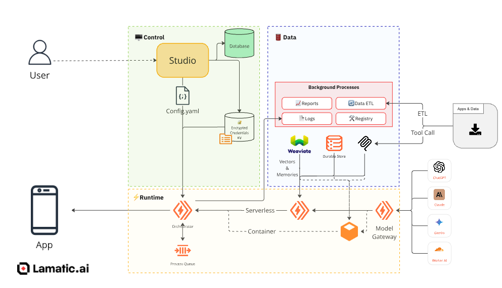

import Image from "next/image";
import tenantNetworkDiagram from "./img/tenant-network-diagram.png";

# Tenant Security & Isolation

<Callout type="info">
This page is written for security reviewers, IT/procurement teams, and enterprise buyers evaluating Lamatic for multi-tenant or regulated deployments.
</Callout>

Lamatic enforces tenant boundaries across runtime, data, access, and operations. Every request and background job carries an explicit tenant context, and every service enforces it before reading or writing data, or performing administrative operations.

### What this enables

- Strong separation between tenants
- Tenant-scoped authentication context and authorization
- Tenant-scoped logs and administrative actions

### How it works, in brief

- Tenant-aware routing for requests and jobs
- Enforced tenant context at every service boundary
- Layered isolation across access, application, data, operations, and observability

---

## Architecture overview

At a high level, the platform is split into three planes:

- **Runtime plane**: tenant-facing application traffic, authentication, storage access, worker execution, and artifacts (stateless)
- **Control plane**: shared control services, provisioning workflows, secrets management, ingestion, and supporting infrastructure
- **Data plane**: tenant data storage with logical separation from other customer data

<Callout>
**Key principle: explicit tenant context everywhere.** Every request and background job carries an explicit tenant context, and every service enforces it before reading/writing data or performing administrative operations.
</Callout>

### Tenant provisioning & lifecycle

Each tenant is onboarded through an automated provisioning flow that configures tenant resources and service integrations. This includes isolated tenant setup for Supabase and Studio, along with tenant-scoped configuration for ClickHouse, the secret store, vector database infrastructure, and Airbyte.

### Tenant-aware execution

Runtime requests are resolved with tenant-aware routing so application requests, worker jobs, storage operations, and artifacts stay within the tenant boundary. Platform services enforce tenant context throughout execution to prevent cross-tenant reads, writes, and operational access.

---

## Network layers & isolation controls

  <Image
    src={tenantNetworkDiagram}
    alt="Tenant private network diagram"
    style={{ width: "100%", maxWidth: 420, height: "auto" }}
  />

The architecture uses layered isolation to reduce the risk of customer data exposure:

- **Access layer isolation**: tenant-scoped identities, authentication, and authorization
- **Application layer isolation**: tenant-aware runtime requests and worker execution paths
- **Data layer isolation**: tenant separation across relational storage, analytics systems, vector infrastructure, secrets, and synchronization services
- **Operational layer isolation**: controlled internal interfaces for administrative access, provisioning actions, and support workflows
- **Logging & observability isolation**: tenant-safe monitoring, audit trails, redaction controls, and optional restrictions such as disabling request body logging

<Callout type="warning">
**Regulated environments.** Where required, the architecture can support stricter deployment and network boundary controls to reduce or prevent customer PII from leaving approved environments (e.g., bank-network or regulator-driven requirements).
</Callout>

---

## Security guarantees

### Guaranteed by design

- Tenant-scoped access: tenant-aware authN/authZ tied to tenant-scoped identities and roles
- Tenant-safe data access: reads/writes constrained to tenant-specific namespaces and partitions
- Tenant-safe operations: provisioning and admin actions gated via controlled internal interfaces with tenant context
- No training on customer data: controls prevent customer data from being used for model training, fine-tuning, or cross-customer prompt sharing

### Configurable per customer

- Log retention and "no request-body logging" modes
- Data retention and deletion policies (where applicable)
- Optional opt-outs for certain shared systems (where supported)

We continuously extend audit, redaction, and dedicated-deployment capabilities for regulated customers — [reach out](/docs/slack) to discuss your specific compliance requirements.

---

## Customer controls & admin operations

External stakeholders often ask how isolation interacts with day-to-day operations:

- **Tenant onboarding**: automated provisioning creates tenant-scoped configuration and service boundaries
- **Access management**: role-based access control for tenant and operator actions
- **Support & break-glass**: tightly controlled internal access paths; access is tenant-scoped and auditable
- **Offboarding**: tenant lifecycle processes support retention controls, deletion requests, and data export as required by contract

---

## Data systems (subprocessor inventory)

| System | Vendor | Use | Configuration | Compliance |
| --- | --- | --- | --- | --- |
| Studio | Vercel | Control plane | No retention | [Trust Centre](https://security.vercel.com) · [SOC 2](https://vercel.com/kb/guide/is-vercel-soc-2-compliant) · [ISO 27001](https://vercel.com/kb/guide/is-vercel-iso-27001-certified) |
| Studio DB | Supabase | Project configuration, flows & prompts, admin & user accounts | Shared, encrypted sensitive information | [Trust Centre](https://trust.supabase.io) · [SOC 2](https://supabase.com/security) · [ISO 27001](https://supabase.com/blog/supabase-is-now-iso-27001-certified) |
| Runtime worker, proxy | Cloudflare Worker + Containers | Agent execution runtime | Stateless | [Trust Centre](https://www.cloudflare.com/trust-hub/) · [SOC 2](https://www.cloudflare.com/trust-hub/compliance-resources/soc-2/) · [ISO 27001](https://www.cloudflare.com/trust-hub/compliance-resources/iso-certifications/) |
| Secrets | Cloudflare KV | Secrets, webhooks | Isolated, kill switch | [Trust Centre](https://www.cloudflare.com/trust-hub/) · [SOC 2](https://www.cloudflare.com/trust-hub/compliance-resources/soc-2/) · [ISO 27001](https://www.cloudflare.com/trust-hub/compliance-resources/iso-certifications/) |
| Tables | Cloudflare D1 | Durable data storage | Isolated, kill switch | [Trust Centre](https://www.cloudflare.com/trust-hub/) · [SOC 2](https://www.cloudflare.com/trust-hub/compliance-resources/soc-2/) · [ISO 27001](https://www.cloudflare.com/trust-hub/compliance-resources/iso-certifications/) |
| Files | Cloudflare Storage | Durable file storage | Isolated, kill switch | [Trust Centre](https://www.cloudflare.com/trust-hub/) · [SOC 2](https://www.cloudflare.com/trust-hub/compliance-resources/soc-2/) · [ISO 27001](https://www.cloudflare.com/trust-hub/compliance-resources/iso-certifications/) |
| VectorDB | Qdrant | Vectors, memories | Isolated, kill switch | [Trust Centre](https://qdrant.tech/documentation/cloud-security/) · [SOC 2 Type II](https://qdrant.tech/blog/qdrant-soc2-type2-audit/) · ISO 27001 in progress |
| ETL | Digital Ocean Postgres | Data ETL | Isolated, kill switch | [Trust Centre](https://www.digitalocean.com/trust) · [SOC 2 & ISO 27001 reports](https://www.digitalocean.com/trust/certification-reports) |
| ETL | Digital Ocean Droplet | Data ETL | Isolated | [Trust Centre](https://www.digitalocean.com/trust) · [SOC 2 & ISO 27001 reports](https://www.digitalocean.com/trust/certification-reports) |
| ETL, webhooks | Digital Ocean Kafka | Data ETL, webhooks | Shared, stateless | [Trust Centre](https://www.digitalocean.com/trust) · [SOC 2 & ISO 27001 reports](https://www.digitalocean.com/trust/certification-reports) |
| Integrations | Composio | Integrations, MCP | Shared, opt-out | [Trust Centre](https://trust.composio.dev) · [SOC 2 & ISO 27001](https://composio.dev/enterprise) |
| Logs, reports | ClickHouse | Logs | Isolated, opt-out (global or per flow), clear-all | [Trust Centre](https://trust.clickhouse.com) · [SOC 2 & ISO 27001](https://clickhouse.com/docs/cloud/security/compliance-overview) |
| Internal | Grafana | System observability | Shared, opt-out | [Trust Centre](https://trust.grafana.com) · [SOC 2 & ISO 27001](https://grafana.com/legal/security-compliance/) |

---

## Compliance & assurance

The architecture is designed to support compliance and security requirements commonly requested by enterprise and regulated customers:

- TLS 1.2 minimum, with a preference for TLS 1.3, for data in transit
- Encryption at rest for systems storing tenant or customer data
- Role-based access control for tenant and operator actions
- Isolation controls preventing customer-level analytics exposure or filterable bank-level visibility
- Zero data retention controls where required
- Controls preventing customer data from being used for model training, fine-tuning, or cross-customer prompt sharing

<Callout>
**Common evidence requests.** SOC 2 Type 2, recent penetration testing, vulnerability management documentation, information security policies, business continuity / disaster recovery plans, incident response plans, cyber insurance evidence, third-party risk management documentation, and data retention policies.
</Callout>

---

## Additional topics

### Threat model (high level)

- Prevent cross-tenant data access (primary objective)
- Reduce blast radius of credential compromise via tenant-scoped permissions
- Limit sensitive data exposure through logging controls and redaction, where applicable

### Data residency & customer requirements

Requirements can vary by customer and regulator. For deployments with strict residency needs, controls may include environment restrictions, region constraints, and customer-specific retention/logging policies.

### Incident response & customer communications

Enterprise readiness includes incident response procedures, defined escalation paths, and customer notification commitments aligned to contractual obligations.

### Third-party risk & subprocessors

See the [data systems inventory](#data-systems-subprocessor-inventory) above for vendor and subprocessor review and security questionnaires.

---

## Related

<Cards>
  <Cards.Card title="Architecture" href="/docs/architecture" arrow />
  <Cards.Card title="Vulnerability Disclosure" href="/company/vulnerability-disclosure" arrow />
  <Cards.Card title="Privacy Policy" href="/docs/legal/privacy-policy" arrow />
</Cards>
