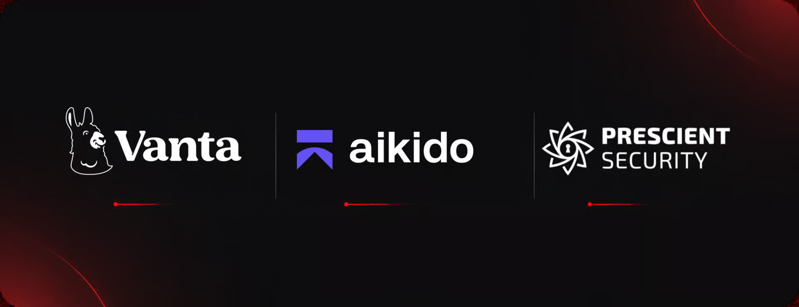
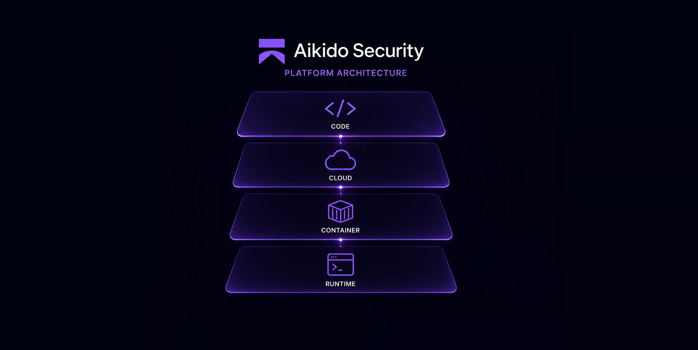
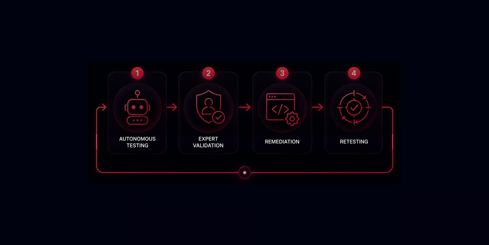

# Security Partners

Strong security requires depth. Rather than relying on a single tool or a once-a-year assessment, Lamatic combines specialist security, compliance, and testing partners with controls built into our own engineering workflows.

## Vanta: continuous trust and compliance

Vanta helps automate the operational work behind compliance programs such as SOC 2, ISO 27001, HIPAA, and GDPR. Instead of manually collecting screenshots and evidence before an audit, we use continuous monitoring to identify controls that drift out of compliance before they become audit or customer issues.

For Lamatic, compliance automation supports security rather than replacing it. It gives the team an ongoing view of device posture, access-control coverage, policy acknowledgement, vendor reviews, and evidence collection. This helps turn compliance from a periodic documentation exercise into a continuously measured operating practice.

What this enables:

- Continuous monitoring of security controls and compliance evidence
- Faster identification of missing controls, stale access, or configuration drift
- A centralized source of truth for policies, risk management, and audit readiness
- More time for engineering teams to focus on risk reduction instead of manual evidence collection

<Callout>
**Lamatic.ai Trust Center.** Trust Centers are the fastest and most transparent way to demonstrate a company's commitment to security. Visit [trust.lamatic.ai](https://trust.lamatic.ai).
</Callout>

## Aikido Security: security built into development

Aikido provides application-security coverage across the software development lifecycle. It helps identify issues in source code, third-party dependencies, infrastructure-as-code, containers, cloud configuration, and running applications.

This matters because a vulnerability can enter a system in many ways, through a code change, a vulnerable open-source package, an exposed cloud service, a misconfigured Terraform resource, or a container image. A unified platform helps us see these risks in context and prioritize the issues that are actually relevant to the services we operate.

What we use this layer to detect:

- Vulnerable dependencies and supply-chain risks
- Hardcoded secrets, API keys, and exposed credentials
- Insecure application patterns in source code
- Risky cloud and infrastructure configurations
- Vulnerabilities in container images and running services

## Prescient Assurance: independent validation

Independent assurance is important because internal teams can become accustomed to their own assumptions and operating patterns. Prescient Assurance supports independent security and compliance validation, helping verify that our controls are designed, documented, and operating as intended.

External review adds rigor to our security program. It challenges our evidence, tests our processes, and provides customers with greater confidence that Lamatic's security posture is evaluated beyond internal claims.

## HackerOne: continuous human-validated offensive security

Traditional penetration tests are useful, but they are point-in-time assessments. The moment the application changes, the scope of the test can become outdated.

HackerOne's agentic pentesting model brings together autonomous testing capacity and human security expertise. AI agents can continuously explore known attack paths and changes in the environment, while experienced security researchers validate the impact of significant findings and help distinguish real risk from noise.

This provides a stronger offensive-security loop:

- Continuous testing as applications, APIs, and infrastructure change
- Broader attack-surface coverage than a manual-only test can provide
- Human validation for high-impact or complex vulnerabilities
- Actionable findings that engineering teams can reproduce and remediate

## Related

<Cards>
  <Cards.Card title="Security Architecture" href="/docs/security/architecture" arrow />
  <Cards.Card title="Security Programs" href="/docs/security/programs" arrow />
  <Cards.Card title="Vulnerability Disclosure Program" href="/docs/security/vulnerability-disclosure" arrow />
</Cards>
