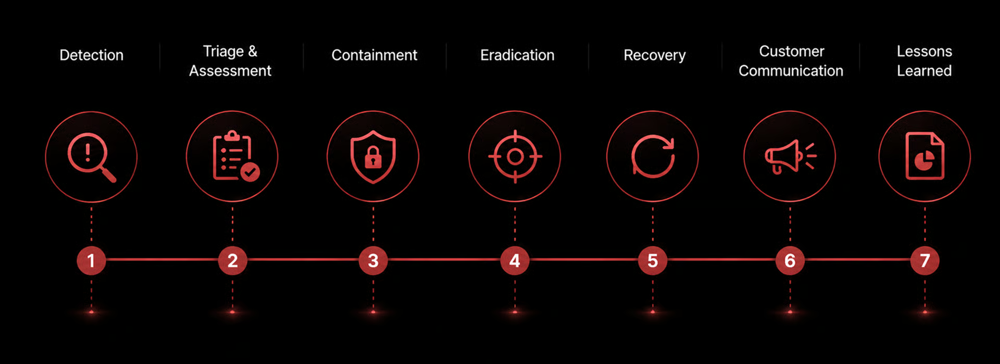

# Security Programs

Technology alone does not create a secure organization. Security also depends on how people make decisions, how quickly teams respond, and whether responsibilities are clear.

## Annual security training

Every employee completes annual security awareness training. The goal is practical behavior, not checkbox compliance.

Training covers phishing and social engineering, secure handling of customer information, password and device hygiene, incident reporting, secure development expectations, and privacy obligations. We reinforce that security concerns should be reported early, even when the impact is uncertain.

## Quarterly disaster recovery and incident response exercises

A plan that has never been tested is only a document. Lamatic runs quarterly disaster recovery and incident response exercises to validate people, tooling, escalation paths, communications, and recovery procedures.

Exercises may simulate data-exfiltration attempts, ransomware, a cloud-provider outage, compromised credentials, DDoS events, or service failures. Each exercise produces lessons, follow-up actions, and owners so that our response capabilities improve over time.

## Vulnerability Disclosure Program

Security researchers play an important role in improving the security of the broader ecosystem. Our Vulnerability Disclosure Program provides a responsible path for researchers to report potential issues. We aim to acknowledge reports quickly, triage them transparently, and provide clear remediation expectations based on severity.

<Cards>
  <Cards.Card title="Vulnerability Disclosure Program" href="/docs/security/vulnerability-disclosure" arrow />
</Cards>

## Managed device security

Corporate devices are part of the security perimeter. A compromised laptop can bypass otherwise strong cloud controls through stolen sessions, source code access, or credential theft.

All corporate endpoints are enrolled in Mobile Device Management (MDM). This supports consistent requirements for full-disk encryption, supported operating-system versions, screen-lock policies, remote wipe, approved software, and jailbreak or root detection.

## Automated and human review

Automation gives us speed and consistency. Human review adds context, accountability, and judgment.

Automated controls continuously monitor identity, code, dependencies, infrastructure, runtime signals, and compliance posture. Human reviews assess architecture, high-severity findings, exceptions, vendor risk, incident learnings, and changes with meaningful business impact.

<Callout>
The combination is intentional: agents detect and analyze at machine speed, while people decide, prioritize, and remain accountable for outcomes.
</Callout>

{/* image: security operations dashboard with automated alerts, investigation queue, and human review workflow */}

## Compliance programs

- SOC 2 Type II
- ISO 27001
- GDPR

## Related

<Cards>
  <Cards.Card title="Security Partners" href="/docs/security/partners" arrow />
  <Cards.Card title="Security Service-Level Objectives" href="/docs/security/sla" arrow />
  <Cards.Card title="Anonymous Reporting" href="/docs/security/anonymous-reporting" arrow />
</Cards>
