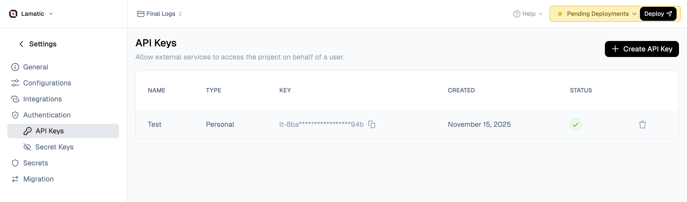

# Authentication with API Keys

To ensure secure access to our platform, Lamatic.ai employs API keys for authentication. When triggering flows via GraphQL, you'll need to include your API key in the request headers. This key serves as a unique identifier, granting you authorized access to our services while maintaining the integrity and confidentiality of your data.



## How to Get the API Key
1. Navigate to Studio > Settings
1. Select API Keys, and click the Create a New API Key button.


<br/>
Here's an example of how you can include the API key in your GraphQL request headers:

```js
Authorization: Bearer your_api_key
```

By including the API key in the `Authorization` header, our platform can verify your identity and grant you access to trigger the desired flow.


<Callout type="warning">
After recreating the API key, the project must be redeployed.
</Callout>


## Triggering Flows with GraphQL

Lamatic.ai's GraphQL integration allows you to trigger your GenAI flows seamlessly using GraphQL queries. This approach provides a standardized and efficient way to interact with our platform, enabling you to execute your GenAI flows on-demand or as part of larger application flows.

Here's an example GraphQL query that demonstrates how you can trigger a flow:

<Tabs items={['JavaScript', 'Python', 'cURL']}>
  <Tabs.Tab>
    ```javascript
const axios = require('axios');
     
// Export your Lamatic API key as an environment variable
const lamatic_api_key = process.env.LAMATIC_API_KEY;

const query = `
query ExecuteWorkflow(
  $workflowId: String!
    $url: String        
) {
  executeWorkflow(
  workflowId: $workflowId
  payload: {
    url: $url

  }
  ) {
      status
      result
  }
}`;
      
const variables = {
  "workflowId": "YOUR_WORKFLOW_ID",
  "url": "url"
};

const options = {
  method: 'POST',
  url: 'YOUR_PROJECT_URL',
  headers: {
    Authorization: `Bearer ${lamatic_api_key}`,
    'Content-Type': 'application/json',
    'x-project-id': 'YOUR_PROJECT_ID',
  },
  data: { query, variables }
};
  
axios(options)
  .then(response => console.log(response.data))
  .catch(error => console.error(error));
    ```
  </Tabs.Tab>
  <Tabs.Tab>
    ```python
import os
import requests
      
gqlQuery = """
query ExecuteWorkflow(
  $workflowId: String!
    $url: String        
) {
  executeWorkflow(
  workflowId: $workflowId
  payload: {
    url: $url

  }
  ) {
      status
      result
  }
}"""
      
variables = {"workflowId":"YOUR_WORKFLOW_ID","url":"url"}

data = {"query": gqlQuery, "variables": variables}

# Export your Lamatic API key as an environment variable
lamatic_api_key = os.getenv('LAMATIC_API_KEY')

headers = {
  "Authorization": f"Bearer {lamatic_api_key}",
  "Content-Type": "application/json",
  "x-project-id": "YOUR_PROJECT_ID"
}

url = "YOUR_PROJECT_URL"

response = requests.post(url, headers=headers, json=data)

if response.status_code == 200:
    print(response.json())
else:
    print(f"Error: {response.status_code}")
    print(response.text)
    ```
  </Tabs.Tab>
  <Tabs.Tab>
    ```bash
curl -X POST \
    YOUR_PROJECT_URL \
    -H "Authorization: Bearer ${LAMATIC_API_KEY}" \
    -H 'Content-Type: application/json' \
    -H 'x-project-id: YOUR_PROJECT_ID' \
    -d '{ "query": " query ExecuteWorkflow(   $workflowId: String!     $url: String         ) {   executeWorkflow(   workflowId: $workflowId   payload: {     url: $url    }   ) {       status       result   } }", "variables": {
  "workflowId": "YOUR_WORKFLOW_ID",
  "url": "url"
} }'
    ```
  </Tabs.Tab>
</Tabs>


#### Output
The structure output can be configured in the Schema of the GraphQL Response node. The expected output will be as follows:
```
{
  // Expected Output as set up in the Schema
}
```

In this example, the `ExecuteWorkflow` query is used to initiate a workflow execution. You'll need to provide the `workflowId` of the desired workflow and any required `payload`(Input Data) as part of the query variables.

