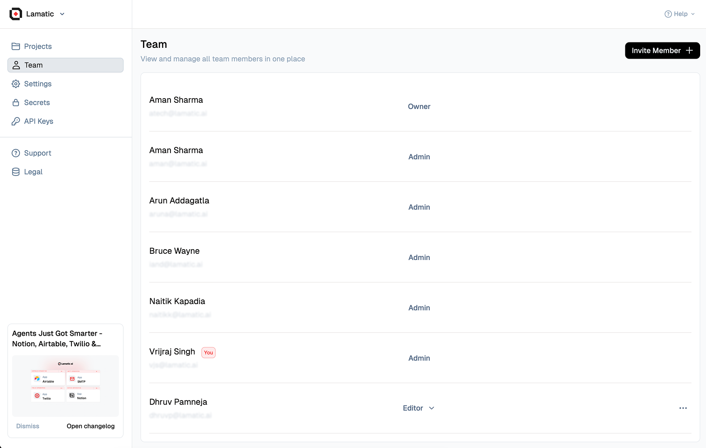

# **Studio: Command and Control for Lamatic Projects**

Studio is your comprehensive platform for managing, building, and deploying all your **GenAI** projects. This powerful tool allows seamless collaboration, enabling you to invite team members and work together efficiently throughout the project lifecycle.

> 💡 **Tip**: Ready to unlock the full potential of Studio? Head over to: [studio.lamatic.ai](https://studio.lamatic.ai)

---

## Navigation

### Project and Organization Management
- **Switch Organization, Profile, Theme, and Logout**: Change organizations, manage profile/theme, or sign out.
- **Switch Project**: Quickly jump between projects in the current organization.

### Flow Workspace
- **Create New Flow/Prompt**: Start a new flow or author a new prompt.
- **Flow Directory**: Browse all flows in the project.
- **Prompt Directory**: Browse and manage prompts.
- **Flow Tags**: Tag flows to organize and filter them.
- **Templates**: Open the template library from the bottom toolbar.

### Data and Context
- **Data/Database**: Store vector embeddings and long‑term memory for your applications.

### Integrations and Interfaces
- **Models**: Configure LLMs and other AI models.
- **MCP/Tools & Integrations**: Connect external tools and MCP servers.
- **Interface (Chat/Search Widget)**: Configure AI-powered chat and search widgets.
- **Connect GitHub**: Link a GitHub repository to your project.

### Monitoring and Deployment
- **Editor / Logs / Reports**: Switch the canvas mode to build, inspect logs, or view reports.
- **Logs**: Inspect request and run logs for monitoring and debugging.
- **Deployments**: Track and manage deployment history.
- **Reports**: Generate and review analytics reports.

### Testing and Automation
- **Trigger**: The entry node that starts a flow run.
- **Testing**: Create and run test cases for validation.
- **Scheduled Jobs**: Manage and track automated jobs and batch processes.

### Project Settings
- **Settings**: Manage project-specific configuration and preferences.

---

Each menu item provides specialized functionalities to manage, deploy, and monitor project components efficiently.

## **Projects**

Studio allows you to create flexible **Projects** tailored to your organization’s structure. These Projects provide:

- **Multi-team collaboration**: Members can join multiple Projects and switch between them as needed.
- **Custom roles**: Assign specific permissions through **Member Roles** to control access and responsibilities.
- **Transparency**: All members within a Projects have full access to all projects within it.

> ⚙️ **Pro Tip**: Customize your Projects to fit your organization’s flow, enhancing both collaboration and security.

---

### **Inviting Members to Your Projects**

Expanding your Projects is easy:

1. **Invite Members**: Go to **Organization Settings** and invite new members.
2. **Onboarding**: If your invitee isn’t registered with Lamatic.ai, they will receive an email guiding them through the signup process.
3. **Manage Membership**: Add or remove members as needed to keep your team up to date.

> 🚀 **Quick Start**: Inviting new collaborators is seamless, ensuring smooth onboarding for team growth.

---

### **Billing Management**

Studio simplifies billing by offering a centralized dashboard for viewing and managing all financial details:

- **Centralized Billing**: Access all billing info in one place.
- **Flexible Plans**: Different projects in the same Projects can run on separate plans, but billing is consolidated for simplicity.
- **Clear Overview**: Get a comprehensive picture of your overall investment across projects.

> 💼 **Pro Tip**: Take advantage of Studio’s flexible billing model to customize financial plans for each project while keeping the process streamlined.