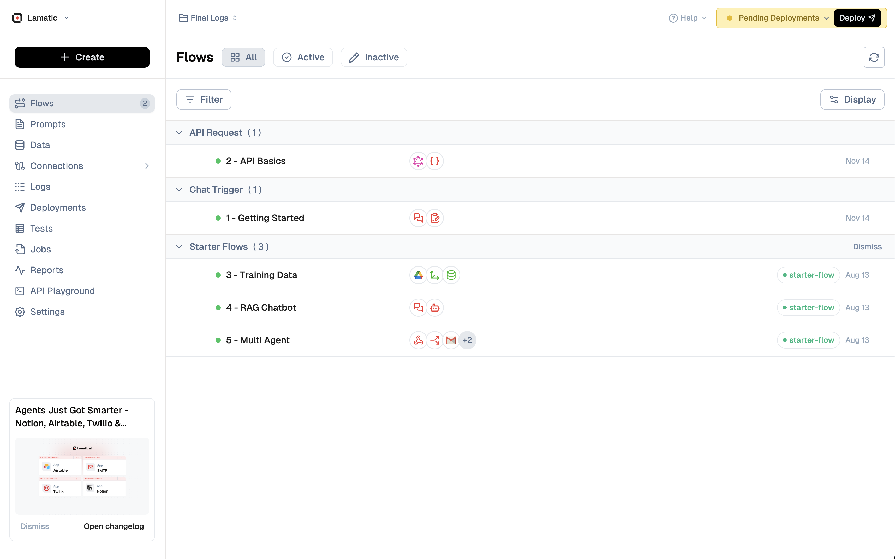

# Tags

Tags are a powerful organizational feature in Lamatic Studio that help you categorize, organize, and filter your flows for better accessibility and management. By applying tags to your flows, you can quickly locate specific flows, group related flows together, and streamline your development process.

## What are Tags?

Tags are customizable labels that you can assign to flows to categorize them based on various criteria such as:
- **Project type** (e.g., "API", "Chatbot", "Automation")
- **Status** (e.g., "Production", "Staging", "Development")
- **Team or department** (e.g., "Marketing", "Engineering", "Support")
- **Functionality** (e.g., "Data Processing", "Content Generation", "Integration")
- **Any custom category** that fits your workflow

## Benefits of Using Tags

### 1. **Improved Organization**
Tags help you organize flows logically, making it easier to understand the purpose and status of each workflow at a glance.

### 2. **Enhanced Filtering**
Quickly filter flows by tags to find exactly what you're looking for, especially useful when working with multiple flows in a project.

### 3. **Better Accessibility**
Tags make flows more discoverable and accessible, allowing team members to quickly locate relevant workflows without scrolling through long lists.

### 4. **Team Collaboration**
Standardized tags across your organization ensure consistent categorization, making it easier for team members to understand and navigate flows.

## How to Add Tags to a Flow

1. **Open your flow** in the Studio editor.
2. **Locate the "+ Tags" button** next to the flow title in the top bar of the canvas.
3. **Click "+ Tags"** to open the tag management interface.
4. **Add tags** by typing tag names and pressing Enter, or select from existing tags.
5. **Save** your changes.

> 💡 **Tip**: Use consistent naming conventions for tags across your project to maximize their effectiveness for filtering and organization.

## Filtering Flows by Tags

Once you've tagged your flows, you can filter them in the Flow Directory:

1. **Navigate to the Flow Directory** in the left sidebar.
2. **Use the tag filter** to select one or more tags.
3. **View filtered results** showing only flows matching your selected tags.

This filtering capability is especially valuable when:
- Working on a specific feature or project
- Reviewing flows by status (e.g., all production flows)
- Finding flows related to a particular integration or functionality

## Best Practices

### Tag Naming
- **Use clear, descriptive names**: Choose tag names that are immediately understandable (e.g., "API Integration" instead of "API").
- **Maintain consistency**: Establish a tagging convention and stick to it across your organization.
- **Avoid duplicates**: Use similar tags consistently rather than creating variations (e.g., use "Production" consistently, not "Prod", "production", and "PROD").

### Tag Categories
Consider organizing tags into categories:
- **Environment**: `production`, `staging`, `development`
- **Type**: `api`, `chatbot`, `automation`, `data-processing`
- **Status**: `active`, `deprecated`, `testing`
- **Team**: `backend`, `frontend`, `marketing`

### Tag Management
- **Review regularly**: Periodically review and clean up unused or redundant tags.
- **Limit tag count**: Avoid over-tagging flows; 2-5 relevant tags per flow is usually sufficient.
- **Document conventions**: Share your tagging conventions with your team to ensure consistency.

> 🚀 **Quick Start**: Start tagging your flows today! Even a simple tagging system with 3-5 common tags can significantly improve your workflow management and accessibility.