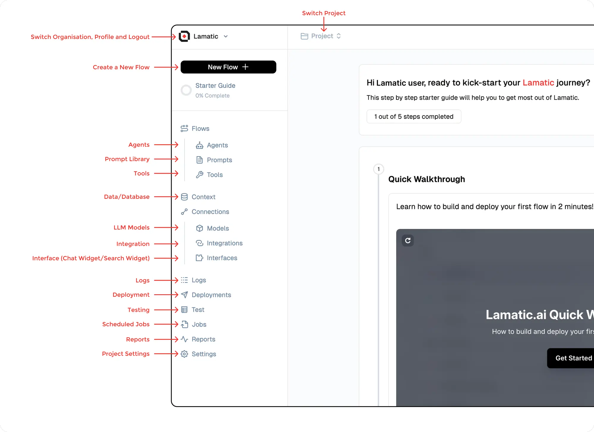
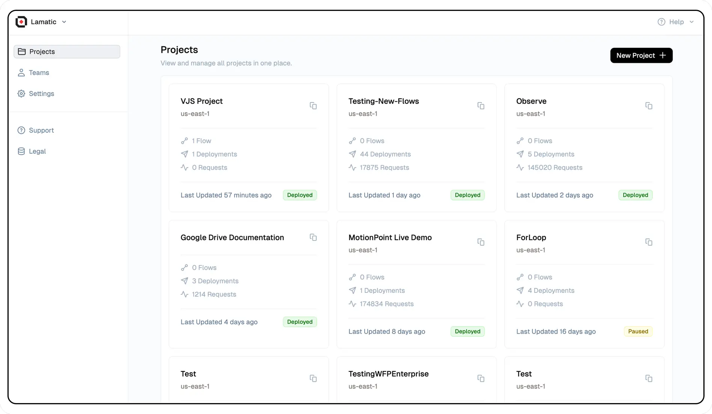
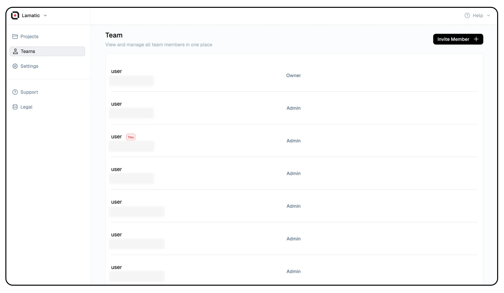

# **Studio: Command and Control for Lamatic Projects**

Studio is your comprehensive platform for managing, building, and deploying all your **GenAI** projects. This powerful tool allows seamless collaboration, enabling you to invite team members and work together efficiently throughout the project lifecycle.

> 💡 **Tip**: Ready to unlock the full potential of Studio? Head over to: [studio.lamatic.ai](https://studio.lamatic.ai)

---

## Navigation

### Project and Organization Management
- **Switch Organization, Profile, and Logout**: Change organizations, manage your profile, or log out.
- **Switch Project**: Move to a different project within the selected organization.

### Flow Management
- **Create a New Flow**: Start a new flow for automation or AI-driven processes.
- **Flows**: Manage and access different flows within the project.
- **Agents**: Configure AI agents to handle specific tasks.
- **Prompt Library**: Store and manage reusable AI prompts.
- **Tools**: Access and manage various tools for AI development.

### Data and Context Management
- **Data/Database (Context)**: Organize and manage data resources tied to the project.

### Connection Management
- **LLM Models**: Access and add AI or machine learning models to the project.
- **Integrations**: Set up and manage external integrations.
- **Interface (Chat Widget/Search Widget)**: Configure AI-powered chat and search widgets.

### Monitoring and Deployment
- **Logs**: Access request logs for monitoring and debugging.
- **Deployments**: View deployment history and manage deployments.

### Testing and Scheduled Jobs
- **Testing**: Create and manage test cases for validation.
- **Scheduled Jobs**: Manage and track automated jobs and batch processes.

### Analytics and Reports
- **Reports**: Generate and view performance reports.

### Project Settings
- **Settings**: Manage project-specific configurations.

---

Each menu item provides specialized functionalities to manage, deploy, and monitor project components efficiently.

## **Workspaces**

Studio allows you to create flexible **Workspaces** tailored to your organization’s structure. These workspaces provide:

- **Multi-team collaboration**: Members can join multiple workspaces and switch between them as needed.
- **Custom roles**: Assign specific permissions through **Member Roles** to control access and responsibilities.
- **Transparency**: All members within a workspace have full access to all projects within it.

> ⚙️ **Pro Tip**: Customize your workspace to fit your organization’s flow, enhancing both collaboration and security.

---

### **Inviting Members to Your Workspace**

Expanding your workspace is easy:

1. **Invite Members**: Go to **Organization Settings** and invite new members.
2. **Onboarding**: If your invitee isn’t registered with Lamatic.ai, they will receive an email guiding them through the signup process.
3. **Manage Membership**: Add or remove members as needed to keep your team up to date.

> 🚀 **Quick Start**: Inviting new collaborators is seamless, ensuring smooth onboarding for team growth.

---

### **Billing Management**

Studio simplifies billing by offering a centralized dashboard for viewing and managing all financial details:

- **Centralized Billing**: Access all billing info in one place.
- **Flexible Plans**: Different projects in the same workspace can run on separate plans, but billing is consolidated for simplicity.
- **Clear Overview**: Get a comprehensive picture of your overall investment across projects.

> 💼 **Pro Tip**: Take advantage of Studio’s flexible billing model to customize financial plans for each project while keeping the process streamlined.