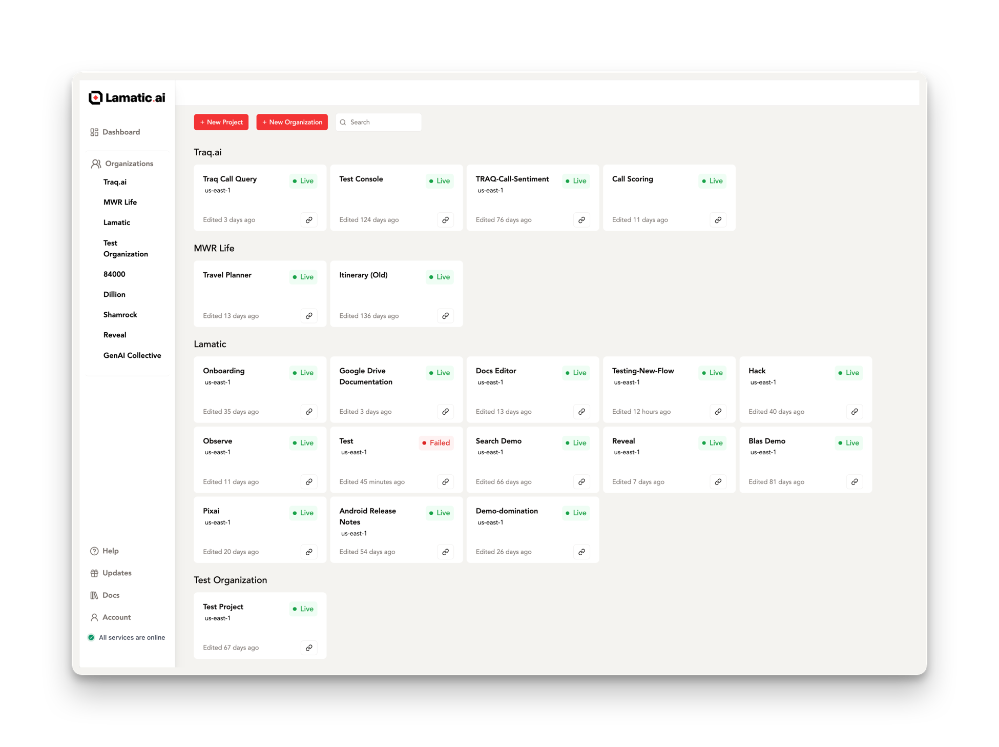
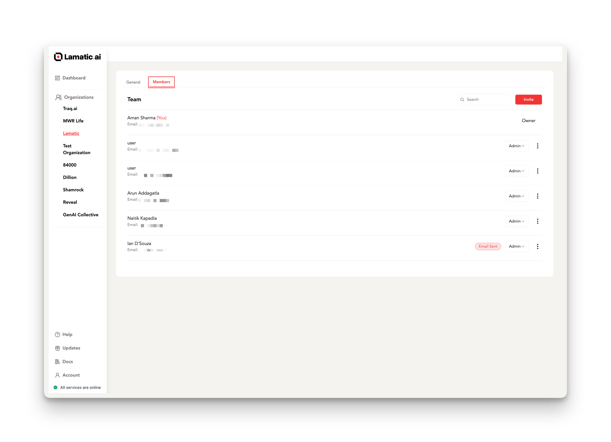

# **Studio: Command and Control for Lamatic Projects**

Studio is your comprehensive platform for managing, building, and deploying all your **GenAI** projects. This powerful tool allows seamless collaboration, enabling you to invite team members and work together efficiently throughout the project lifecycle.

> 💡 **Tip**: Ready to unlock the full potential of Studio? Head over to: [studio.lamatic.ai](https://studio.lamatic.ai)

---

## **Workspaces**

Studio allows you to create flexible **Workspaces** tailored to your organization’s structure. These workspaces provide:

- **Multi-team collaboration**: Members can join multiple workspaces and switch between them as needed.
- **Custom roles**: Assign specific permissions through **Member Roles** to control access and responsibilities.
- **Transparency**: All members within a workspace have full access to all projects within it.

> ⚙️ **Pro Tip**: Customize your workspace to fit your organization’s Flow, enhancing both collaboration and security.

---

### **Inviting Members to Your Workspace**

Expanding your workspace is easy:

1. **Invite Members**: Go to **Organization Settings** and invite new members.
2. **Onboarding**: If your invitee isn’t registered with Lamatic.ai, they will receive an email guiding them through the signup process.
3. **Manage Membership**: Add or remove members as needed to keep your team up to date.

> 🚀 **Quick Start**: Inviting new collaborators is seamless, ensuring smooth onboarding for team growth.

---

### **Billing Management**

Studio simplifies billing by offering a centralized dashboard for viewing and managing all financial details:

- **Centralized Billing**: Access all billing info in one place.
- **Flexible Plans**: Different projects in the same workspace can run on separate plans, but billing is consolidated for simplicity.
- **Clear Overview**: Get a comprehensive picture of your overall investment across projects.

> 💼 **Pro Tip**: Take advantage of Studio’s flexible billing model to customize financial plans for each project while keeping the process streamlined.