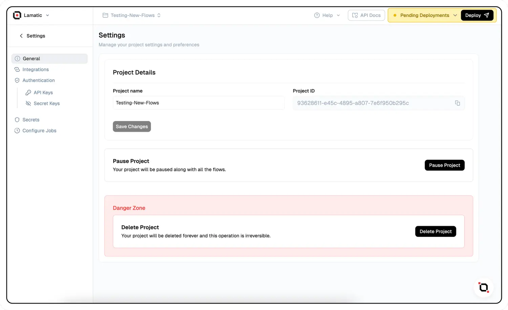

# **Projects**

In the context of Studio, a project represents an individual **GenAI** application you're developing. The workspace structure allows for multiple projects to coexist, each representing a unique GenAI application with its own set of requirements and functionalities. Studio ensures that each project maintains its independence by providing dedicated resources and endpoint controls. This separation is crucial for maintaining the integrity and security of your applications. Even within the same workspace, projects are designed to operate without interference, and they do not share credentials, ensuring that each project remains a self-contained unit with its own secure environment.

---

### **Home View**

<video controls loop width="100%" autoplay muted poster="/public/extra/project-home-page.webp" controlslist="nodownload">
    <source src="/public/extra/onbording.mp4" type="video/mp4" />
    Your browser does not support the video tag.
</video>

The Home View in Studio offers an intuitive and comprehensive overview of your project and along with Onboarding Guide. This interactive project plan view provides a visual representation of all the features and integrations currently in use within your project.

> 📊 **Insight**: At a glance, you can assess the complexity, scope, and capabilities of your GenAI application, making it easier to manage and strategize your development efforts.

---

### **Shared Resources within the Project**

Studio provides a set of versatile resources that can be leveraged across various features within your project. These shared resources enhance the functionality and efficiency of your GenAI application. The following key resources are available for integration throughout your project:

1. **Models**: Utilize pre-trained or custom AI models to power your application's core functionality.
2. **App Integrations**: Seamlessly connect your project with external applications and services to extend its capabilities.
3. **VectorDB**: Implement vector databases for efficient storage and retrieval of high-dimensional data, crucial for many AI applications.
4. **Test Cases**: Develop and manage a suite of test cases to ensure the reliability and performance of your GenAI application.

> 🔧 **Pro Tip**: These resources can be easily integrated and reused across various features, saving time and boosting efficiency.

---

## Project Settings

### General Settings
In the General Settings, you can update project details such as the project name and view the Project ID. You also have the option to pause or delete the project from this section.

---

### **Integration**

Studio recognizes the importance of a robust development ecosystem. To this end, it offers integration capabilities with various developer tools, allowing you to enhance and optimize your project's capabilities. These integrations can significantly streamline your flow and provide valuable insights into your application's performance.

As of now, the following developer integrations are available for implementation in your Studio projects:

1. **[Langfuse (Beta)](/docs/reports/langfuse-integration)**: This integration offers advanced language model observability and analytics, helping you monitor and improve the performance of your GenAI applications.
2. **Posthog (Beta)**: Integrate Posthog to gain valuable user behavior insights and product analytics, enabling data-driven decision-making in your development process.

> 🛠️ **Developer Note**: These integrations can help you keep your GenAI project optimized and data-driven.

---

### **API Keys**

Security and controlled access are paramount in GenAI projects. Studio provides robust API key management features, allowing you to generate, monitor, and revoke API keys as needed. This key serves as a unique identifier, granting you authorized access to our services while maintaining the integrity and confidentiality of your data.

---

### **Secret Keys**

Allow external services to access the project on behalf of a user. Checkout the Lamatic SDK to understand how to use the secret keys.

<Callout type="warning" >
 Note: Any addition or removal of secret keys will be reflected only after the project has been deployed.
</Callout>
---

### **Variables & Secrets**

With Variables and Secrets you can Safeguard your API keys and credentials with our new Secrets Management system, ensuring your data stays protected while maintaining easy access for authorized use.

<Callout type="warning" >
 A new Deployment is required for your changes to take effect.
</Callout>
---

### **Jobs Configuration**

Optimize your job settings for smooth automation. Here, you can configure Batch Size, Batch Timeout, Max Retries, and Concurrency.

---

### **Plans**

Studio offers a range of project plans to cater to diverse needs and requirements. You have the flexibility to select from various plans, each offering a unique set of features and capabilities.

---

### **Usage**

Keeping track of your project's resource consumption is crucial for efficient management and planning. Studio provides comprehensive usage monitoring tools that allow you to closely observe and analyze the utilization of your project resources.

---

### **Add-Ons**

Studio offers the flexibility to enhance your project's capabilities through add-ons. These additional features or increased project limits can be purchased as needed.

---

> 🔒 **Security Tip**: Maintain granular control over project access, ensuring security while facilitating authorized integration.