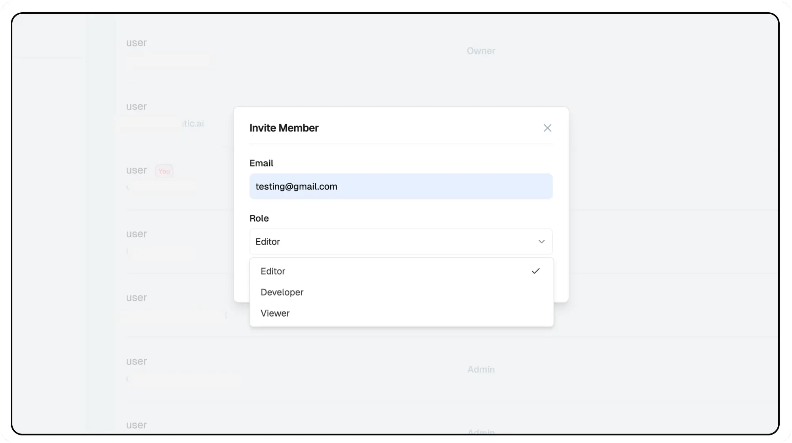

# Role-Based Access Guide

This guide outlines the permissions and capabilities for different user roles within organizations and projects on Lamatic.ai.

## Permission Tables

### 1. Organization Level Permissions

| Permission | Owner | Admin | Editor | Developer | Viewer |
|------------|-------|--------|---------|------------|---------|
| Update organization name | ✅ | ✅ | ❌ | ❌ | ❌ |
| Invite new users | ✅ | ✅ | ❌ | ❌ | ❌ |
| Change user roles | ✅ | ✅ | ❌ | ❌ | ❌ |
| Delete organization | ✅ | ❌ | ❌ | ❌ | ❌ |
| Create Admin | ✅ | ❌ | ❌ | ❌ | ❌ |

<Callout type="info" >
   Note that to handle billing and organization settings, you need to be an Owner.
</Callout>

### 2. Project Level Permissions

| Permission | Admin/Owner | Editor | Developer | Viewer |
|------------|-------------|---------|------------|---------|
| Create new projects | ✅ | ❌ | ❌ | ❌ |
| Update project name | ✅ | ❌ | ❌ | ❌ |
| Pause/resume project | ✅ | ❌ | ❌ | ❌ |
| Delete project | ✅ | ❌ | ❌ | ❌ |
| Create/delete API keys | ✅ | ✅ | ❌ | ❌ |
| Secret | ✅ | ✅ | ❌ | ❌ |
| Secret Keys | ✅ | ✅ | ❌ | ❌ |
| Configure job settings | ✅ | ✅ | ❌ | ❌ |
| Deploy project | ✅ | ✅ | ❌ | ❌ |

### 3. Flows and Agents Level Permissions

| Permission | Admin/Owner | Editor | Developer | Viewer |
|------------|-------------|---------|------------|---------|
| Create new flow | ✅ | ✅ | ✅ | ❌ |
| Update flow | ✅ | ✅ | ✅ | ❌ |
| Delete flow | ✅ | ✅ | ✅ | ❌ |
| Deploy flow | ✅ | ✅ | ❌ | ❌ |
| Test flows | ✅ | ✅ | ✅ | ✅ |
| View flows | ✅ | ✅ | ✅ | ✅ |
| Create new agent | ✅ | ✅ | ✅ | ❌ |
| Update agent | ✅ | ✅ | ✅ | ❌ |
| Delete agent | ✅ | ✅ | ✅ | ❌ |
| Deploy agent | ✅ | ✅ | ❌ | ❌ |
| Test agent | ✅ | ✅ | ✅ | ✅ |
| View agent | ✅ | ✅ | ✅ | ✅ |

### 4. Prompts and Tools Level Permissions

| Permission | Admin/Owner | Editor | Developer | Viewer |
|------------|-------------|---------|------------|---------|
| Create prompt | ✅ | ✅ | ❌ | ❌ |
| Update prompt | ✅ | ✅ | ❌ | ❌ |
| View prompt | ✅ | ✅ | ✅ | ✅ |
| Delete prompt | ✅ | ✅ | ❌ | ❌ |
| Create tool | ✅ | ✅ | ✅ | ❌ |
| Update tool | ✅ | ✅ | ✅ | ❌ |
| View tool | ✅ | ✅ | ✅ | ✅ |
| Delete tool | ✅ | ✅ | ✅ | ❌ |

### 5. Context Level Permissions

| Permission | Admin/Owner | Editor | Developer | Viewer |
|------------|-------------|---------|------------|---------|
| Create new database | ✅ | ✅ | ❌ | ❌ |
| Update database name | ✅ | ✅ | ❌ | ❌ |
| Delete database | ✅ | ✅ | ❌ | ❌ |

### 6. Models and Configuration Level Permissions

| Permission | Admin/Owner | Editor | Developer | Viewer |
|------------|-------------|---------|------------|---------|
| Create new credential | ✅ | ✅ | ❌ | ❌ |
| Update credential | ✅ | ✅ | ❌ | ❌ |
| Delete credential | ✅ | ✅ | ❌ | ❌ |
| Create new configuration | ✅ | ✅ | ❌ | ❌ |
| Update configuration | ✅ | ✅ | ❌ | ❌ |
| Delete configuration | ✅ | ✅ | ❌ | ❌ |
| Update default models | ✅ | ✅ | ✅ | ❌ |

### 7. Integrations Level Permissions

| Permission | Admin/Owner | Editor | Developer | Viewer |
|------------|-------------|---------|------------|---------|
| Create integration | ✅ | ✅ | ❌ | ❌ |
| Update integration name | ✅ | ✅ | ❌ | ❌ |
| Delete integration | ✅ | ✅ | ❌ | ❌ |
| Update default integrations | ✅ | ✅ | ❌ | ❌ |

### 8. Test Suites Permissions

| Permission | Admin/Owner | Editor | Developer | Viewer |
|------------|-------------|---------|------------|---------|
| Create test suite | ✅ | ✅ | ✅ | ❌ |
| Update test suite | ✅ | ✅ | ✅ | ❌ |
| Delete test suite | ✅ | ✅ | ✅ | ❌ |

### 9. Jobs Permissions

| Permission | Admin/Owner | Editor | Developer | Viewer |
|------------|-------------|---------|------------|---------|
| Sync/pause job | ✅ | ✅ | ✅ | ❌ |

## Key Points

1. **Role Hierarchy**
   - Owner has full system access
   - Admin has organizational management rights
   - Editor can manage content and configurations
   - Developer can create and modify flows
   - Viewer has read-only access

2. **Best Practices**
   - Assign minimum necessary permissions
   - Regularly review user roles
   - Document permission changes
   - Audit access periodically

3. **Important Notes**
   - Only Owners can delete organizations
   - Editors can't create new projects
   - Developers can create flows but can't deploy them
   - Viewers can test flows but can't modify them

Need help? Contact [support@lamatic.ai](mailto:support@lamatic.ai) for assistance with roles and permissions.