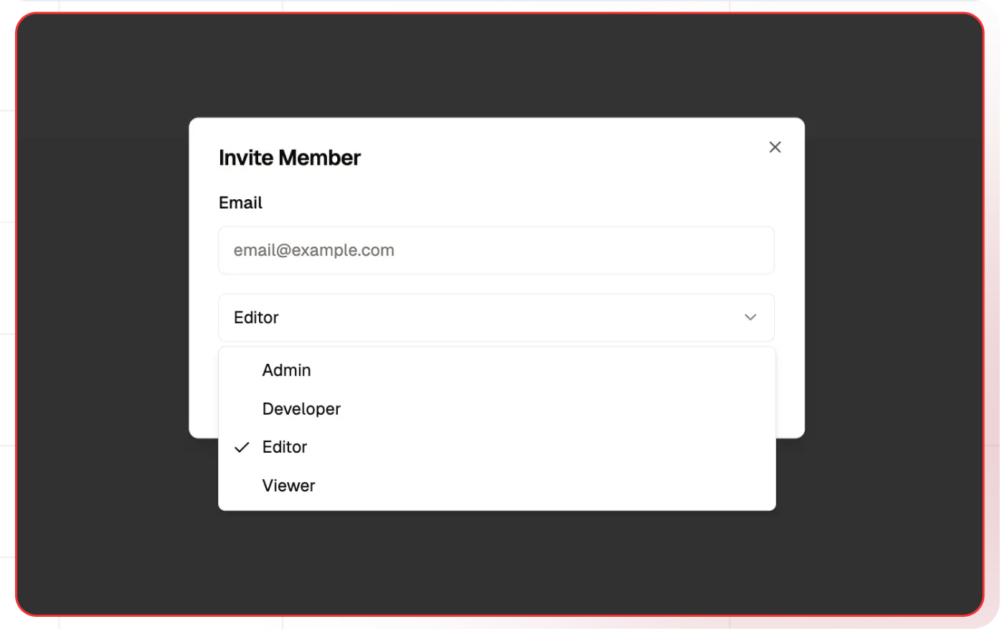

# Role-Based Functionalities
Role-based permissions and functionalities for users in both organization and project contexts. 
This guideline defines access levels and responsibilities for various roles, ensuring efficient and secure management in organizations.

## Organization-Level Permissions

| **Function** | Owner | **Admin** | **Editor** | **Developer** | **Viewer** |
| --- | --- | --- | --- | --- | --- |
| Can update organization name? | ✅ | ✅ | ❌ | ❌ | ❌ |
| Can invite new users? | ✅ | ✅ | ❌ | ❌ | ❌ |
| Can change user roles? | ✅ | ✅ | ❌ | ❌ | ❌ |
| Can delete organization? | ✅ | ❌ | ❌ | ❌ | ❌ |
| Create Admin | ✅ | ❌ | ❌ | ❌ | ❌ |

### Project-Level Permissions

| **Function** | **Admin/Owner** | **Editor** | **Developer** | **Viewer** |
| --- | --- | --- | --- | --- |
| Can create new projects? | ✅ | ❌ | ❌ | ❌ |
| Can update project name? | ✅ | ❌ | ❌ | ❌ |
| Can pause/resume project? | ✅ | ❌ | ❌ | ❌ |
| Can delete project? | ✅ | ❌ | ❌ | ❌ |
| Can create/delete API keys? | ✅ | ✅ | ❌ | ❌ |
| Can configure job settings? | ✅ | ✅ | ❌ | ❌ |
| Can handle all billing? | ✅ | ✅ | ❌ | ❌ |
| Can deploy project? | ✅ | ✅ | ❌ | ❌ |

### Flows-Level Permissions

| **Function** | **Admin/Owner** | **Editor** | **Developer** | **Viewer** |
| --- | --- | --- | --- | --- |
| Can create new flow? | ✅ | ✅ | ✅ | ❌ |
| Can update flow? | ✅ | ✅ | ✅ | ❌ |
| Can delete flow? | ✅ | ✅ | ✅ | ❌ |
| Can deploy flow? | ✅ | ✅ | ❌ | ❌ |
| Test Flows | ✅ | ✅ | ✅ | ✅ |
| View Flows | ✅ | ✅ | ✅ | ✅ |

### Context Level Permissions

| **Function** | **Admin/Owner** | **Editor** | **Developer** | **Viewer** |
| --- | --- | --- | --- | --- |
| Can create new db? | ✅ | ✅ | ❌ | ❌ |
| Can update db name? | ✅ | ✅ | ❌ | ❌ |
| Can delete db? | ✅ | ✅ | ❌ | ❌ |

### Models Level Permissions

| **Function** | **Admin/Owner** | **Editor** | **Developer** | **Viewer** |
| --- | --- | --- | --- | --- |
| Can create new credential? | ✅ | ✅ | ❌ | ❌ |
| Can update credential? | ✅ | ✅ | ❌ | ❌ |
| Can delete credential? | ✅ | ✅ | ❌ | ❌ |
| Can update default models? | ✅ | ✅ | ✅ | ❌ |

### Integrations Level Permissions

| **Function** | **Admin/Owner** | **Editor** | **Developer** | **Viewer** |
| --- | --- | --- | --- | --- |
| Can create integration? | ✅ | ✅ | ❌ | ❌ |
| Can update integration name? | ✅ | ✅ | ❌ | ❌ |
| Can delete integration? | ✅ | ✅ | ❌ | ❌ |
| Can update default integrations? | ✅ | ✅ | ❌ | ❌ |

### Test Suites Permissions

| **Function** | **Admin/Owner** | **Editor** | **Developer** | **Viewer** |
| --- | --- | --- | --- | --- |
| Can create test suite? | ✅ | ✅ | ✅ | ❌ |
| Can update test suite? | ✅ | ✅ | ✅ | ❌ |
| Can delete test suite? | ✅ | ✅ | ✅ | ❌ |

### Jobs Permissions

| **Function** | **Admin/Owner** | **Editor** | **Developer** | **Viewer** |
| --- | --- | --- | --- | --- |
| Can sync/pause a job? | ✅ | ✅ | ✅ | ❌ |