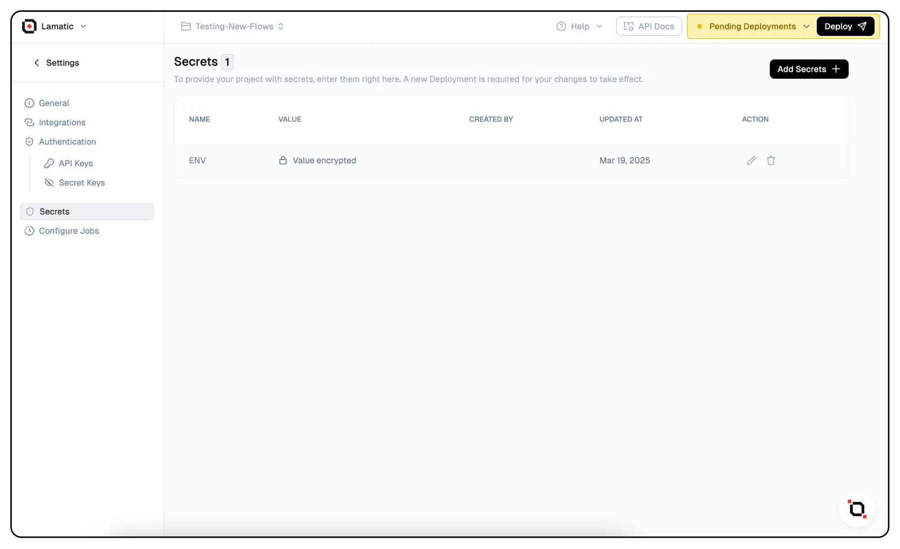

# Variables & Secrets

The **Variables & Secrets** page allows users to securely store API keys, authentication tokens, and other sensitive data for seamless use across their flow. By defining these secrets in the settings, you can reference them within any flow without exposing them directly.

## Why Use Variables & Secrets?
- 🔐 **Security:** Keep sensitive data hidden and reusable without hardcoding values in flows.
- ⚡ **Efficiency:** Quickly integrate API keys and secrets into flow without manual entry.
- 🔄 **Reusability:** Use stored secrets across multiple flows without reconfiguration.

## How to Add Secrets

1. Navigate to **Settings** > **Secrets**.
2. Click on **Add Secrets**.
3. Enter a **Secret Name** and its corresponding **Secret Value**.
4. Click **Create** to save the secret.

> Secrets are encrypted and stored securely, ensuring safe access in your flow.

## Using Stored Secrets in a Flow

Once a secret is stored, you can reference it dynamically in any flow as shown in the example above. 
This ensures that the actual value remains hidden while still being accessible.

## Managing and Updating Secrets
- To **edit** a secret, update its value and redeploy your project.
- To **delete** a secret, remove it from the list and confirm deletion.

By utilizing **Variables & Secrets**, you maintain a secure and scalable approach to handling credentials in your flows. 🚀