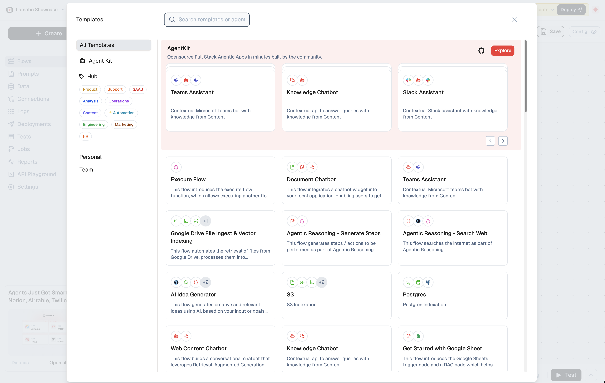

# Templates in Lamatic

Templates in Lamatic provide a streamlined way to create flows using pre-configured node sets, reducing the need for manual setup. This guide covers key processes for using templates effectively.

## Creating a New Flow from a Template

### Within Studio

To create a flow using a template in Lamatic Studio:

- Start a new flow in the Studio interface.
- Navigate to the **Template Selection** menu.
- Choose a template from the available options.
- Complete all required fields within the template.
- Test the flow thoroughly to ensure it works as expected.
- Once verified, deploy your flow.

### From Hub

Alternatively, you can create a flow using templates from the Lamatic Hub:

- Go to the [Lamatic Hub ↗](https://hub.lamatic.ai/templates).
- Browse the template library to find your desired option.
- Click **Add to Lamatic** on the template.
- Select the project to add the template.
- Fill out all required fields in the template.
- Perform comprehensive testing to ensure functionality.
- Deploy your flow once ready.

## Sharing Templates

### Sharing Within Your Team

To share templates with team members:

- Click the **Export** button in the left sidebar.
- Select **Share with Team**.
- Shared templates will appear under **Team Templates** for organization members.

### Publishing Templates to the Lamatic Hub

To contribute to the Lamatic community by publishing templates:

<Callout type="warning" emoji="⚠️">
    **Important:** Avoid sharing sensitive information like API keys or private URLs, especially within code nodes.

</Callout>
 

- Click the **Export** button in the left sidebar.
- Choose **Publish Flow**.
- Complete all required information for your template.
- Submit the template for review by the Lamatic team.
- Once approved, your template will be available on the Hub, credited to you as the creator.

Following these steps enables efficient creation, sharing, and publication of templates, enhancing your workflow and contributing to the Lamatic community.