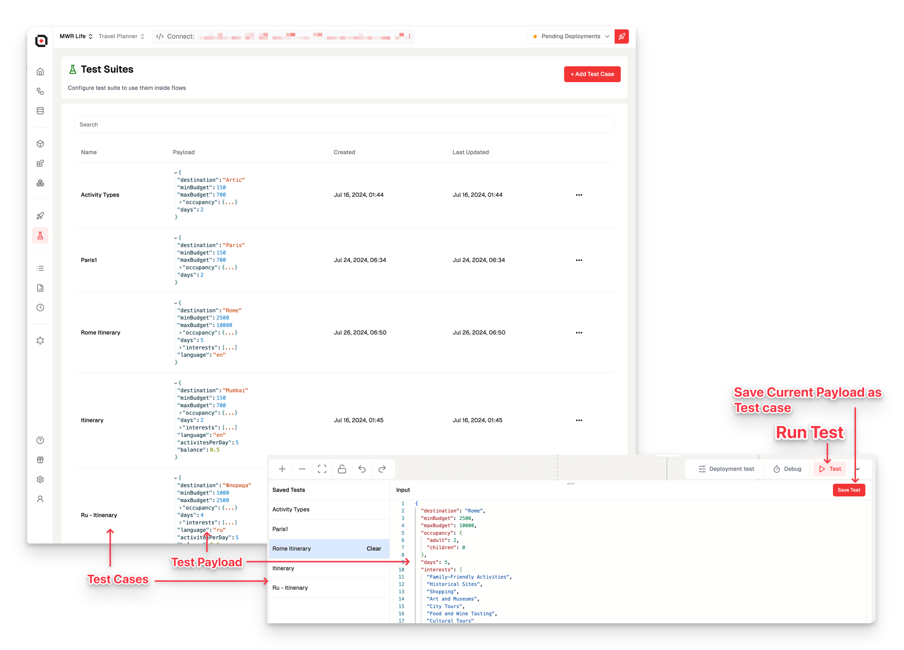
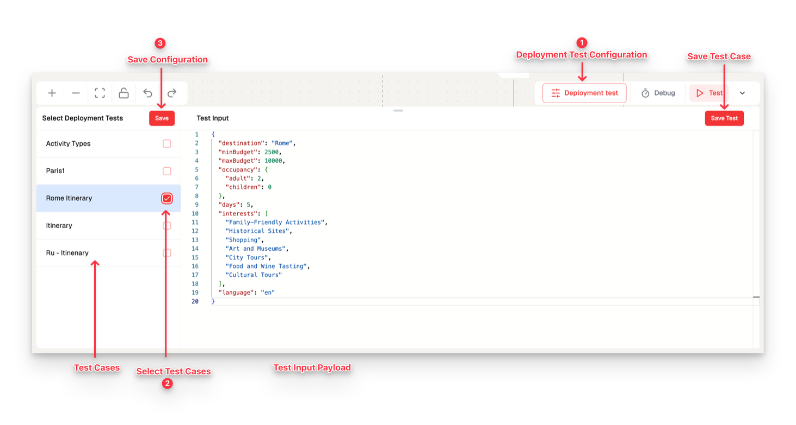

You can create a wide variety of test cases within your project, which can be utilized across different flows and scenarios. This approach significantly simplifies the process of managing JSON structures for diverse use cases, ultimately saving time and reducing potential errors. By creating reusable test cases, you can ensure consistency and efficiency in your testing process.

## **Test Cases**

There are multiple ways to create and manage test cases in our system:

- **From Flow Builder**: You can generate new test cases directly from the flow builder while conducting a test run. This allows you to capture real-world scenarios and save them for future use.
- **Dedicated Test Sections**: Manage all your test cases in a centralized location for easier organization and maintenance.

> ⚙️ **Pro Tip**: Simply add the Input JSON and specify the flows that will utilize them. This flexibility lets you tailor your testing approach to your project’s needs.

---

### **Expected Test Results: (Beta)**

Enhance your testing capabilities by including **Expected Test Results** alongside your test cases. This feature leverages **Language Learning Models (LLMs)** to compare the delta between actual test run results and expected outcomes.

> 🔍 **Beta Feature**: Rapidly verify the structure and quality of your outputs with automated comparisons that help identify discrepancies quickly. This allows for faster iteration and improvement of your flows.

---

## Deployment Testing

Ensure smooth production transitions:

- **Predefined Test Cases:** Set up automatic test cases to run before deployment.
- **Deployment Condition:** The system deploys the project only if all tests pass.
- **Failure Protocol:** In case of test failures, the system reverts to the last stable version.

> 🔒 **Safeguard**: This extra layer of quality assurance helps maintain the integrity of your production environment, ensuring that only thoroughly tested changes are implemented.