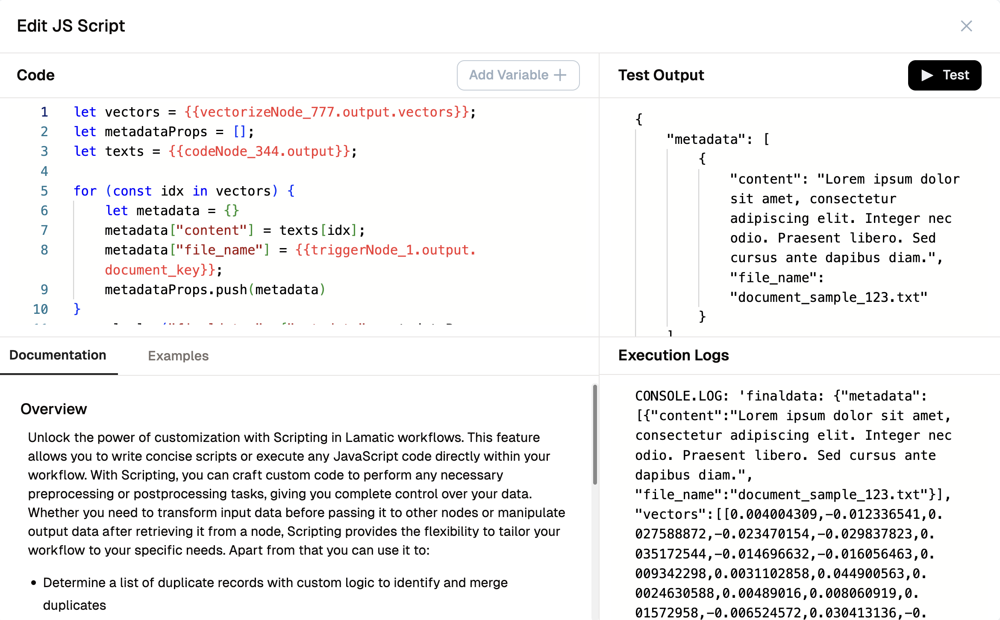

# Testing Custom Code
You can test custom logic written in Code Nodes before running the entire flow.

## How to Test

- Open the Code Node in your flow
- Write or paste your logic
- Provide test inputs if required
- Click **Test** to execute the code and view results

The system will automatically:

- Show output of the code block
- Highlight errors or missing dependencies
- Optionally prompt to run prior nodes for input values

Use this to:

- Validate complex logic
- Debug syntax or runtime errors
- Iterate quickly without triggering full flow execution
