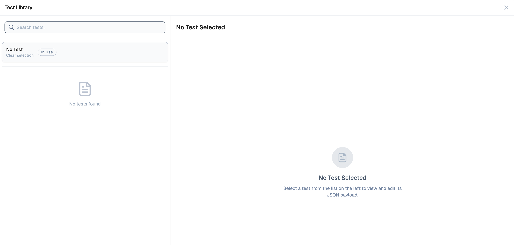

# Flow Debugging

Lamatic Studio provides powerful tools to help developers debug and test their flows efficiently. Use the debug mode to simulate inputs, capture outputs, and iterate quickly.
 
With Flow Debugging you can:
- **Save test cases** to reuse and iterate faster.
- **Inspect input, output, logs, and token usage** for each node in your flow.
- **View estimated token cost** per test run to manage expenses better.
- **Identify and fix issues precisely** — no more guessing what went wrong.

## Running Debug Mode

1. Go to your **Flow Editor**.
2. Click the **Debug** Button in the bottom right.
3. Enter your test input data (as JSON or plain text).
4. Hit **Run Test** to simulate execution.

<Callout emoji="💡">
Each test run executes the full flow using your provided input, showing node-by-node progress and output.
</Callout>

Each test execution visualizes:

- Node-by-node status (✅/❌)
- Real-time inputs & outputs
- Token usage breakdown

## Saving Test Cases

Click the plus (+) icon to add and save new test cases.

### To Save a Test Case:

1. Enter your input data.
2. Click the plus (+) icon
3. Give it a name (e.g., `User sign-up flow test`).

### To Reuse a Test Case:

- Select the saved test case from the **Saved Tests** dropdown and click **Run Test**.

## Debugging Output

After running a test:

- Each node will show a status: ✅ Success, ❌ Error.
- Click on any node to inspect:
  - **Input received**
  - **Output generated**
  - **Execution time**
  - **Error messages** (if any)
