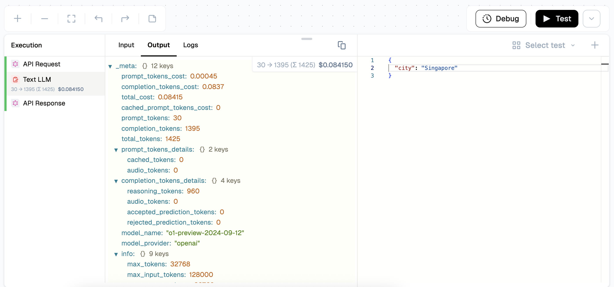

# Flow Testing

Lamatic.ai allows you to validate your entire flow from start to finish before deploying it to production. It ensures all nodes execute in the intended order, inputs and outputs are correctly passed between them, and the final result matches expectations.

## Run a full flow test for end-to-end execution:

- **Execution:** Click the "Test" button and Provide Payload to execute all nodes in sequence.
- **Progress Tracking:** Observe nzode-level progress during execution.
- **Output Review:** View the final output generated at the end of the flow.

<Callout emoji="💡">
Each test run executes the full flow using your provided input, showing node-by-node progress and output.
</Callout>

## Trigger-Specific Testing Approaches

Different triggers require unique testing methods:

| **Trigger Type** | **Input Method**               | **Testing Procedure**                                                               |
|------------------|--------------------------------|-------------------------------------------------------------------------------------|
| **API**          | Sample API request payload     | 1. Enter or choose the payload   2. Run the test                                |
| **Widget**       | Sample payload or interaction  | 1. Interact with the widget or enter/choose payload   2. Run the test           |
| **Webhook**      | Sample or actual webhook data  | 1. Send data to the specified webhook or enter/choose payload   2. Run the test |
| **App**          | Sample payload     | 1. Perform the desired trigger event or enter/choose payload    2. Run the test |

