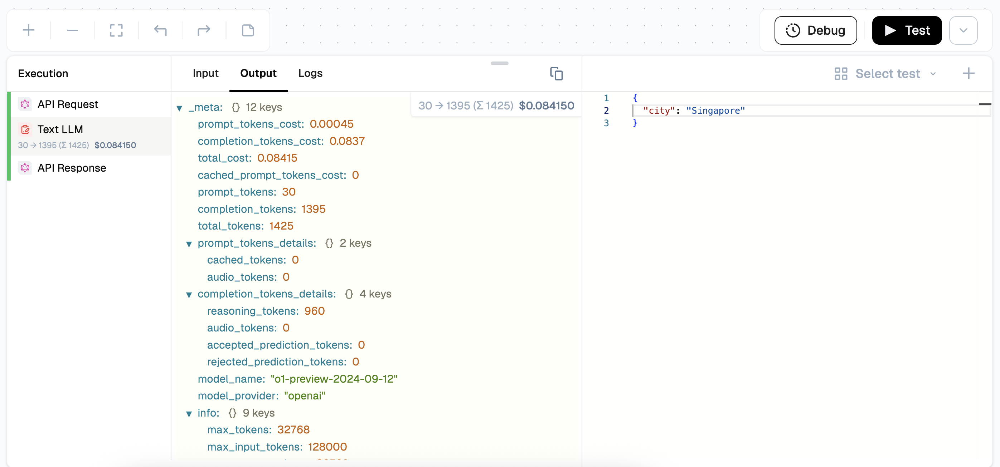

# Testing and Debugging

[Lamatic.ai](http://Lamatic.ai) provides a comprehensive suite of tools to test and debug your flow effectively. This documentation covers essential testing methods to optimize your flow's performance in production.

## Complete Flow Testing

Run a full flow test for end-to-end execution:

- **Execution:** Click the "Test" button to execute all nodes in sequence.
- **Progress Tracking:** Observe node-level progress during execution.
- **Output Review:** View the final output generated at the end of the flow.

## Trigger-Specific Testing Approaches

Different triggers require unique testing methods:

| **Trigger Type** | **Input Method**               | **Testing Procedure**                                                               |
|------------------|--------------------------------|-------------------------------------------------------------------------------------|
| **API**          | Sample API request payload     | 1. Enter or choose the payload   2. Run the test                                |
| **Widget**       | Sample payload or interaction  | 1. Interact with the widget or enter/choose payload   2. Run the test           |
| **Webhook**      | Sample or actual webhook data  | 1. Send data to the specified webhook or enter/choose payload   2. Run the test |
| **App**          | Sample payload or event sim    | 1. Perform the desired trigger event or enter/choose payload    2. Run the test |

### Preview Test
For widget-triggered flows:

- **UI Preview:** Use the preview feature to visualize widget appearance and functionality.
- **Configuration Check:** Ensure interface elements are correctly set before deployment.

## Debug: Node-Level Testing

Lamatic Studio provides powerful tools to help developers debug and test their flows efficiently. Use the debug mode to simulate inputs, capture outputs, and iterate quickly.
 
With Flow Debugging you can:

- **Save test cases** to reuse and iterate faster.
- **Inspect input, output, logs, and token usage** for each node in your flow.
- **View estimated token cost** per test run to manage expenses better.
- **Identify and fix issues precisely** — no more guessing what went wrong.
 
To begin testing your flows:

1. Go to your **Flow Editor**.
2. Click the **Debug** Button in the bottom right.
3. Enter your test input data (as JSON or plain text).
4. Hit **Run Test** to simulate execution.

<Callout emoji="💡">
Each test run executes the full flow using your provided input, showing node-by-node progress and output.
</Callout>
 
Each test execution visualizes:
- Node-by-node status (✅/❌)
- Real-time inputs & outputs
- Token usage breakdown

### Saving Test Cases
Click the plus (+) icon to add and save new test cases.

### To Save a Test Case:
1. Enter your input data.
2. Click the plus (+) icon
3. Give it a name (e.g., `User sign-up flow test`).

### To Reuse a Test Case:
- Select the saved test case from the **Saved Tests** dropdown and click **Run Test**.

### Debugging Output

After running a test:
- Each node will show a status: ✅ Success, ❌ Error.
- Click on any node to inspect:
  - **Input received**
  - **Output generated**
  - **Execution time**
  - **Error messages** (if any)

## Code and Prompt Testing

Test specific components independently:

- **Code & Prompts:** Test code in a code node or prompts in any AI generator node.
- **Testing Button:** Click "Test" in the IDE to run the component. The system will prompt you to run prior nodes if needed to generate the output.

By following these methods and utilizing [Lamatic.ai](http://Lamatic.ai)'s testing tools, you can ensure your flow is robust, efficient, and ready for production deployment.