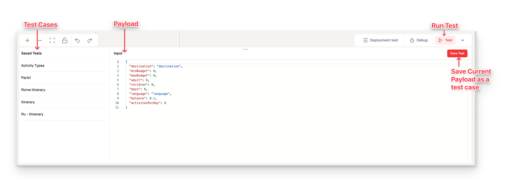
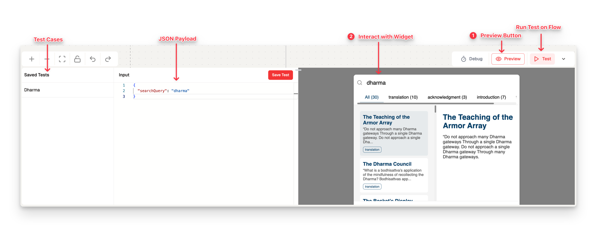
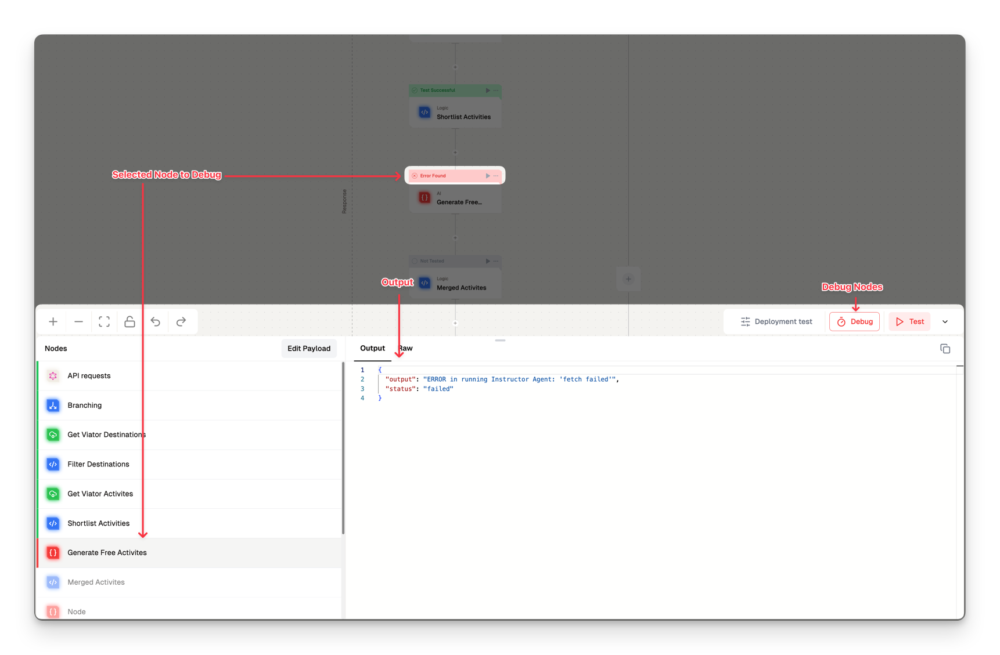

# Testing and Debugging

[Lamatic.ai](http://Lamatic.ai) provides a comprehensive suite of tools to test and debug your flow effectively. This documentation covers essential testing methods to optimize your flow's performance in production.

## Complete Flow Testing

Run a full flow test for end-to-end execution:

- **Execution:** Click the "Test" button to execute all nodes in sequence.
- **Progress Tracking:** Observe node-level progress during execution.
- **Output Review:** View the final output generated at the end of the flow.

## Trigger-Specific Testing Approaches

Different triggers require unique testing methods:

| **Trigger Type** | **Input Method**               | **Testing Procedure**                                                               |
|------------------|--------------------------------|-------------------------------------------------------------------------------------|
| **API**          | Sample API request payload     | 1. Enter or choose the payload   2. Run the test                                |
| **Widget**       | Sample payload or interaction  | 1. Interact with the widget or enter/choose payload   2. Run the test           |
| **Webhook**      | Sample or actual webhook data  | 1. Send data to the specified webhook or enter/choose payload   2. Run the test |
| **App**          | Sample payload or event sim    | 1. Perform the desired trigger event or enter/choose payload    2. Run the test |

### Preview Test

For widget-triggered flows:

- **UI Preview:** Use the preview feature to visualize widget appearance and functionality.
- **Configuration Check:** Ensure interface elements are correctly set before deployment.

## Debug: Node-Level Testing

Test individual nodes iteratively:

- **Execution:** Click the `▶️` button on any node to execute it along with its connected preceding nodes.
- **Output View:** Click on the node bar to access the debugging section and view the output after execution.

## Code and Prompt Testing

Test specific components independently:

- **Code & Prompts:** Test code in a code node or prompts in any AI generator node.
- **Testing Button:** Click "Test" in the IDE to run the component. The system will prompt you to run prior nodes if needed to generate the output.

By following these methods and utilizing [Lamatic.ai](http://Lamatic.ai)'s testing tools, you can ensure your flow is robust, efficient, and ready for production deployment.