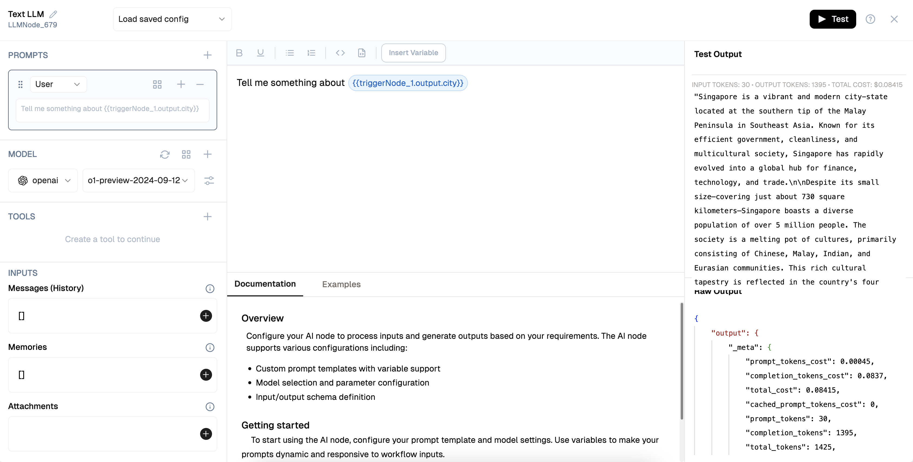

# Prompt Testing

You can test and fine-tune your prompts directly inside the AI nodes in the flow builder.

## How to Test
- **Open the Prompt Node**: Navigate to the node containing your prompt.
- **Enter Test Input**: Provide sample inputs or rely on outputs from previous nodes.
- **Click Test**: Run the prompt and evaluate its output instantly.
- **Iterate**: Update and refine your prompt for better responses.

 
Prompt testing is essential for:

- Validating instructions for AI behavior
- Adjusting context formatting
- Reducing hallucinations or errors before production
