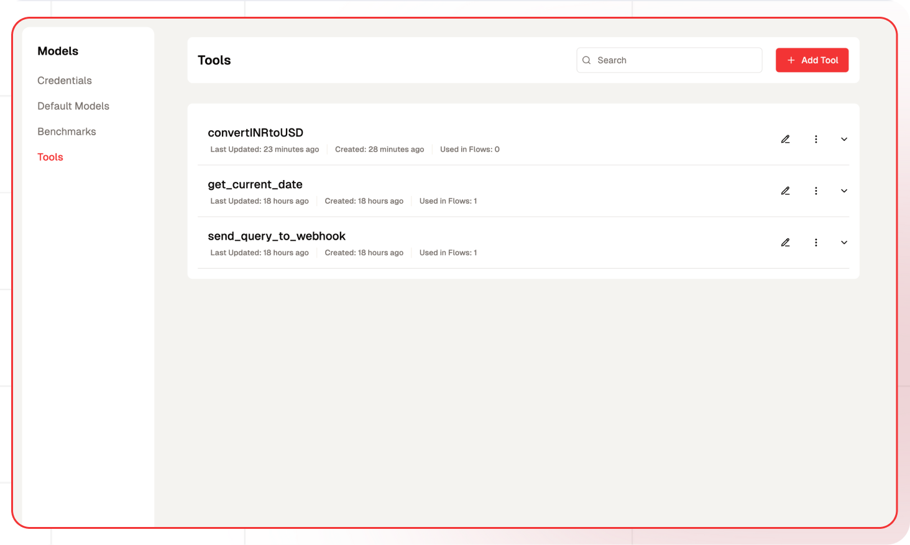
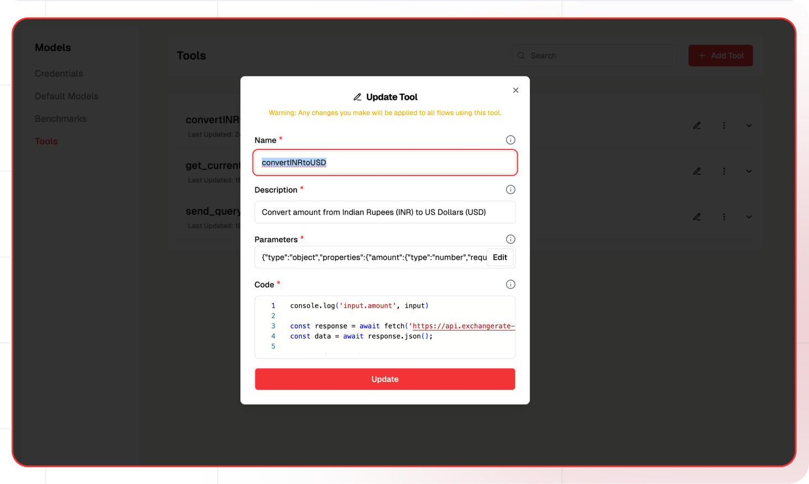
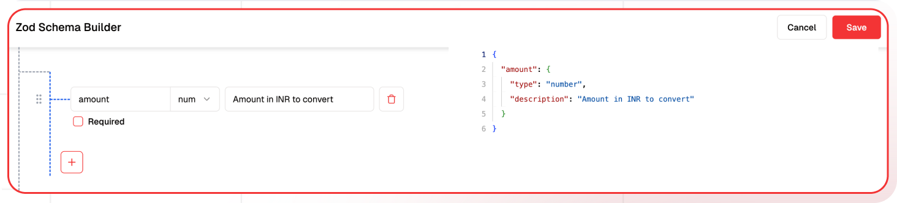
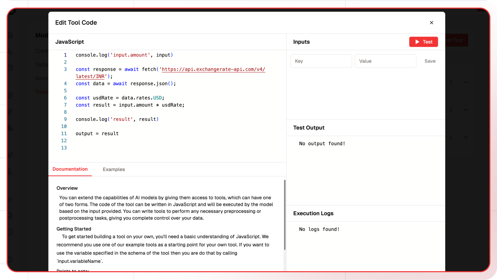
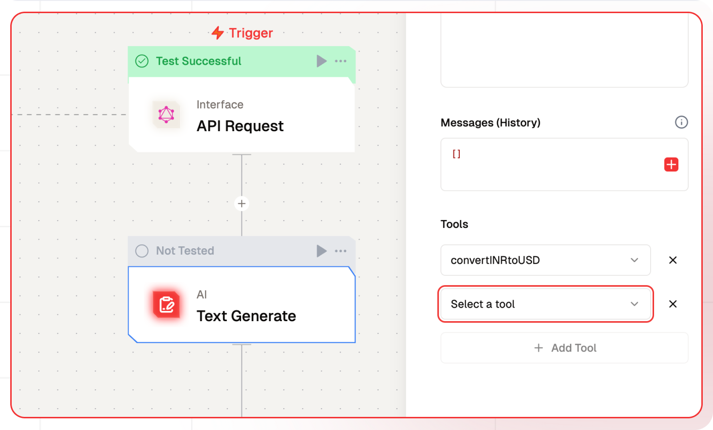

# Tools

A tool is a powerful feature in the Lamatic for modern AI systems that enables seamless interaction with external functions and APIs in a structured manner. It acts as a bridge between natural language processing and programmatic actions, allowing AI models to interpret user requests and execute specific functions accordingly. This capability enhances automation, improves efficiency, and extends the AI’s ability to perform complex tasks beyond simple text-based interactions.



<Callout>
Tools can be added in [**Text-Gen Node**](/docs/nodes/text-generate-node) and [**Multimodel Node**](/docs/nodes/multimodel-text-node)
</Callout>
<br />

**Tools are a mechanism that enables AI models to:** 

1. Comprehend natural language input 

1. Determine when a specific function should be invoked 

1. Extract relevant parameters from user requests 

1. Execute the appropriate function with the correct parameters 

1. Present the results in a clear and meaningful manner

## What you can build

1. **AI-Powered Systems** – Enable seamless interaction with external functions and APIs in a structured manner.
1. **Natural Language Processing (NLP) Integration** – Bridge the gap between NLP and programmatic actions.
1. **Automated Task Execution** – Allow AI models to interpret user requests and execute specific functions.
1. **Enhanced Workflow Automation** – Improve efficiency by automating repetitive processes.
1. **Dynamic API Interaction** – Enable AI to call APIs, extract data, and return meaningful results.

## How to Create Tools



1. Go to Lamatic Studio
1. Navtigate to Models > Tools Sections
1. Click on + Add Tool Button
1. Config Tool by adding Name, Description, Parameters and Code

## Tool Config

### Name
The name of the tool and the name of the function associated with it. This will be used to identify the tool in the flow. The naming constraints are the same as for function names in JavaScript.

Example: `convertINRtoUSD`

### Description
A short description of the tool

Example: Convert amount from Indian Rupees (INR) to US Dollars (USD)

### Parameters

This is a JSON Schema object that describes the parameters that the tool accepts and are the ones that will be passed to the model.
<br/>
Example: 
```JSON
{
  "amount": {
    "type": "number",
    "required": true,
    "description": "Amount in INR to convert"
  }
}
```

### Code
This is the code that will be executed when the tool is called.


<br/>
**Important Notes**  
1. **Reserved Variables**:  
   - `input` and `output` are reserved variables. Avoid overwriting them.  
2. **Using Schema Variables**:  
   - To access variables defined in the schema, use `input.variableName`.  
   - Example: If the schema includes `query`, reference it as `input.query` in the function.  
3. **Returning Output**:  
   - Assign the return value to `output` to pass data from the function.  
<br/>

Example

```js
const response = await fetch('https://api.exchangerate-api.com/v4/latest/INR');
const data = await response.json();

const usdRate = data.rates.USD;
const result = input.amount * usdRate;
output = result
```

## How to use Tools in the Flows

<Callout>
Tools can be added in [**Text-Gen Node**](/docs/nodes/text-generate-node) and [**Multimodel Node**](/docs/nodes/multimodel-text-node)
</Callout>
<br/>
To integrate tools into your flow, follow these steps:  
1. Select the **Flow** where you want to use the tool.  
2. Choose either **Text-Gen Node** or **Multimodel Node**, then navigate to **Additional Properties**.  
3. Select the desired tools. You can add multiple tools as needed.  


## Troubleshooting

### Common Issues

| **Problem**     | **Solution**                                 |
| ---------------- | -------------------------------------------- |
| **Parameter**    | Ensure the parameter is defined correctly.   |
| **Code**         | Ensure the parameter is accessed correctly in the code. |

### Debugging

1. Check the Lamatic Flow logs for error details.
2. Verify the input parameters to ensure proper configuration.
