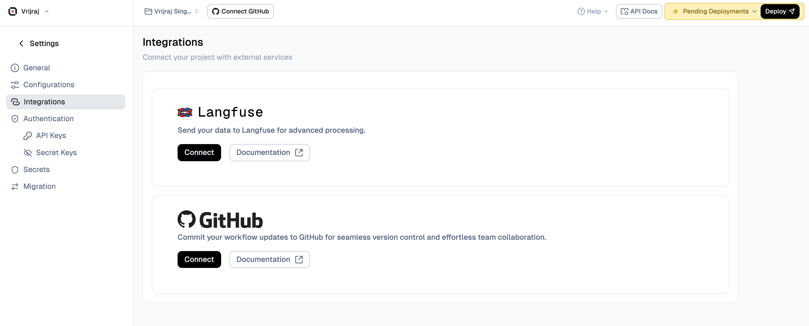
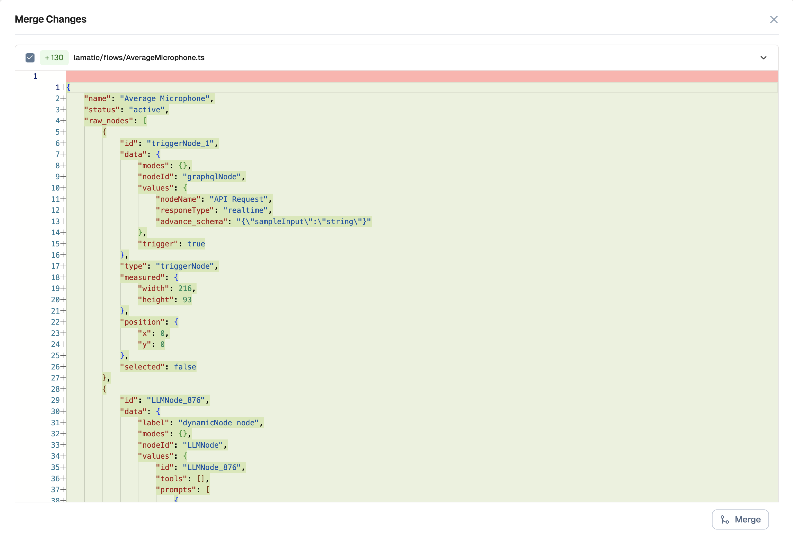

# Version Control in Lamatic AI

Lamatic AI introduces Version Control System (VCS) functionality at the project level, enabling users to efficiently manage, track, and revert to previous iterations of their flows. This project-level VCS feature allows for better organization, debugging, and iteration without losing prior configurations across all flows within a project.

## Setup Version Control with GitHub

1. Navigate to the Flow Editor and click Connect with GitHub.
1. Alternatively, you can go to the Integrations section under your project settings.
1. Authenticate your GitHub account and grant access to the required repositories or organization.
1. Choose an existing repository or create a new one.
1. Select the desired branch, and optionally enable auto-deployment on commit.
1. Click Save to complete the setup.

## How to Use Version Control in Flows

1. Open the desired Flow.
1. From the top navigation bar, click on the Select Branch dropdown, the production branch is selected by default.
1. From here, you can create a new branch, switch between branches, or merge and create pull requests (PRs) as needed.

### Create a new Branch

To create a new branch for your flow:

1. Click on the **Select Branch** dropdown in the top navigation bar.
1. Click on **Create New Branch** or the **+** icon.
1. Enter a descriptive name for your new branch (e.g., `feature/new-integration` or `bugfix/fix-validation`).
1. Optionally, select a base branch to branch from (defaults to the current branch).
1. Click **Create** to create the new branch.

Once created, you can switch to the new branch and make changes without affecting the production branch.

### Merge it into production Branch

To merge your branch changes into the production branch:

1. Ensure you're on the branch you want to merge (not the production branch).
1. Click on the **Select Branch** dropdown in the top navigation bar.
1. Click on **Merge Icon Button** or the merge icon.
1. Review the changes that will be merged.
1. Click **Confirm Merge** to complete the merge.

Your changes will now be available in the production branch. You can continue working on your feature branch or switch back to production.

### Pull Changes from production branch

To pull the latest changes from the production branch into your current branch:

1. Ensure you're on the branch where you want to pull changes (not the production branch).
1. Click on the **Select Branch** dropdown in the top navigation bar.
1. Click on **Pull Icon Button** or the pull icon.
1. Review any potential conflicts that may arise from the merge.
1. If there are conflicts, resolve them in the Flow Editor.
1. Click **Confirm Pull** to complete the pull operation.

This ensures your branch stays up-to-date with the latest changes from production, reducing the likelihood of merge conflicts later.

