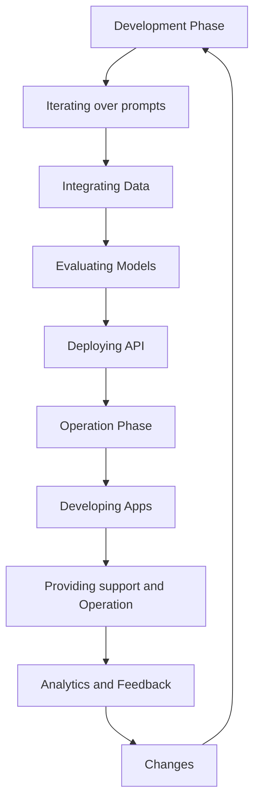
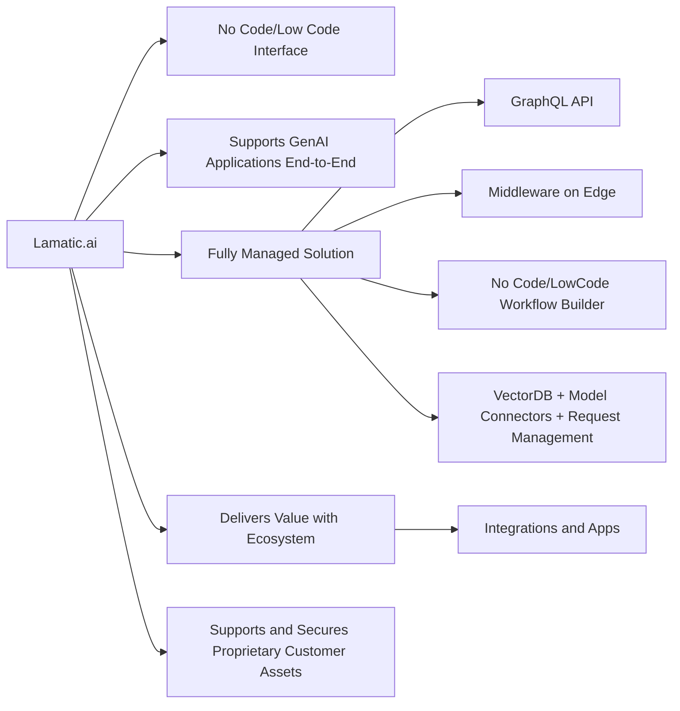

---
description: Why Lamatic.ai is the best choice for your next GenAI project.
---

# Why Lamatic.ai?

> With over 100s of GenAI products out there, its important to use the right tool for the right job. This presentation and accompanying document will help you understand why Lamatic.ai is the best choice for your next GenAI project.

<iframe height="500px" width="100%" allow="clipboard-write" allowfullscreen
        src="https://www.beautiful.ai/embed/-NyzxpAVzdt-6ZYRX2Q8?utm_source=beautiful_player&utm_medium=embed&utm_campaign=-NyzaZbGJMRNp0dqoK3F"></iframe>

## The problem with traditional GenAI development

### The Development Phase
<Steps>
    ### Iterating over prompts
    With teams building different GenAI solutions/features, it becomes hard to manage them all ( AI > Developer
    handoff). Singular

    ### Integrating Data
    The ability of GenAI has increased from an individual perspective to a company perspective. The advancements in
    GenAI are increasing at a steady pace and every company or individual would want to implement GenAI into their
    application, but understanding the recent advancements and investing time to learn and implement them into their
    application, is a very research and time intensive task. Hence the need of having a low-code or no-code solution
    that can help in integrating the amazing abilities of GenAI within few hours, that can scale the ability of a
    company using these new advancements has become a necessity.

    ### Evaluating Models

    ### Deploying API

</Steps>
### The Operation Phase
<Steps>
    ### Developing Apps
    The ability of GenAI has increased from an individual perspective to a company perspective. The advancements in
    GenAI are increasing at a steady pace and every company or individual would want to implement GenAI into their
    application, but understanding the recent advancements and investing time to learn and implement them into their
    application, is a very research and time intensive task. Hence the need of having a low-code or no-code solution
    that can help in integrating the amazing abilities of GenAI within few hours, that can scale the ability of a
    company using these new advancements has become a necessity.

    ### Providing support and Operation
    With teams building different GenAI solutions/features, it becomes hard to manage them all ( AI > Developer
    handoff). Singular

    ### Analytics and Feedback

    ### Changes

</Steps>

## How Lamatic.ai solves it
Lamatic.ai is a fully managed platform built around simplicity and collaboration in mind. It is a platform that abstracts away the complexities of GenAI engineering with a No Code/Low Code interface. It supports GenAI applications end-to-end (Build - Deploy - Observe) and eliminates overhead and complexity with a Fully Managed Solution. It delivers value with an ecosystem of Models, Apps, Templates and Partners and supports and secures proprietary customer assets.

## ✨ Core Technical Features
<Steps>
    ### GraphQL API
    ### Middleware on Edge
    ### No Code/LowCode Workflow Builder
    ### Fully Managed Solution ( VectorDB + Model Connectors + Request Management)
    ### Integrations and Apps
</Steps>

## Development with Lamatic.ai

## Background
Our original mission was to answer one of the world’s most frequently asked questions:
“What’s for dinner?” … so families could have an easier time connecting around the dinner table more often.
<Callout type="error" emoji="❓">
    **Our Motivation** : At our core, we love building things that improve people’s lives.
</Callout>

Our vision was to create something the whole family would have fun using - swiping likes & dislikes to create the perfect dinner “playlist”. Think Tinder meets Spotify. In addition, we wanted to automate the task of creating grocery lists, eliminate the need to go to the grocery store and build a supportive community that shared - recipes, tips, stories and causes.

Under the hood, we knew the only practical way to achieve this vision was to power it all with AI. So today, when you open up [Dinnerfy](https://dinnerfy.com/), everything you see and experience in the app is curated by an assortment of AI-powered systems and models. Every food image is AI-generated. Every recipe was either created or curated by AI. The dinner feed recommendations and sequencing all use AI. In total, Dinnerfy has 3 different AI subsystems and it uses 3 LLMs from 3 different vendors.

While Dinnerfy is a very simple app, it was surprisingly challenging to build. Collectively, our team has been building AI systems for nearly a decade. But as we sprinted to execute our product vision, it remained frustratingly time-consuming for our experienced Dev team to build the plumbing required to make Dinnerfy deliver the right content quickly and reliably.

Much of the work was foundational and would’ve been required regardless of the application we were building on top of it. Things like …

1. Connecting, vectorizing and indexing data sources
2. Connecting and testing different large language models
3. Developing prompt management middleware
4. Developing async request & response middleware
5. Coding the API needed to inject AI results into the app
6. Keeping up with and implementing a steady stream of updates

As we worked to make our application easier to maintain and optimize, an idea began to form.

<Callout>
    > We Wondered …
    > Do other product teams want a managed GenAI platform as much as we do?
</Callout>

## Vision and Mission

GenAI is evolving incredibly quickly and there’s nothing to suggest it will slow down any time soon. Its adoption has been faster than other foundational technologies (like blockchain and VR) because of its broader applicability and faster payback. The volume of AI hype right now illustrates just how strongly the world believes that GenAI will deliver game-changing benefits for businesses across the spectrum of industries.

<Callout emoji="🌟">
    **Our North Star** :
    - To Support Cutting Edge AI Applications with Elegant Simplicity

    - Abstract away GenAI engineering complexities with a No Code interface

    - Support GenAI applications end-to-end (Build - Deploy - Observe)

    - Eliminate overhead and complexity with a Fully Managed Solution

    - Deliver value with an ecosystem of Models, Apps, Templates and Partners

    - Support and secure proprietary customer assets
</Callout>