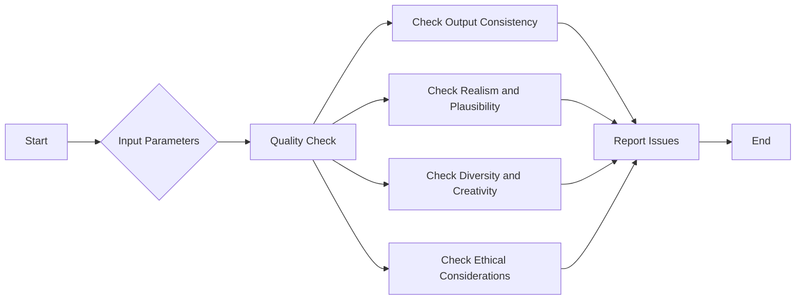

# Quality Check

Quality check plays a crucial role in ensuring the reliability and performance of generative AI applications. It involves evaluating the output generated by the AI model and verifying its adherence to predefined standards and criteria.

In the context of generative AI applications, quality check involves assessing various aspects such as:

1. Output Consistency: The generated content should exhibit consistency in terms of style, tone, and overall coherence. This ensures that the AI model consistently produces high-quality outputs that align with the desired characteristics.
2. Realism and Plausibility: The generated content should be realistic and plausible, mimicking the patterns and characteristics of the training data. This helps in creating outputs that are indistinguishable from human-generated content.
3. Diversity and Creativity: Quality check also involves evaluating the diversity and creativity of the generated outputs. The AI model should be able to produce a wide range of unique and novel outputs, rather than repetitive or predictable results.
4. Ethical Considerations: Quality check should also encompass ethical considerations, ensuring that the generated content adheres to ethical guidelines and avoids generating harmful or biased outputs.
To perform quality check in generative AI applications, Lamatic AI provides a comprehensive set of rules and batching techniques. These include manual evaluation by human experts, automated metrics, user feedback, and comparison with ground truth data.

