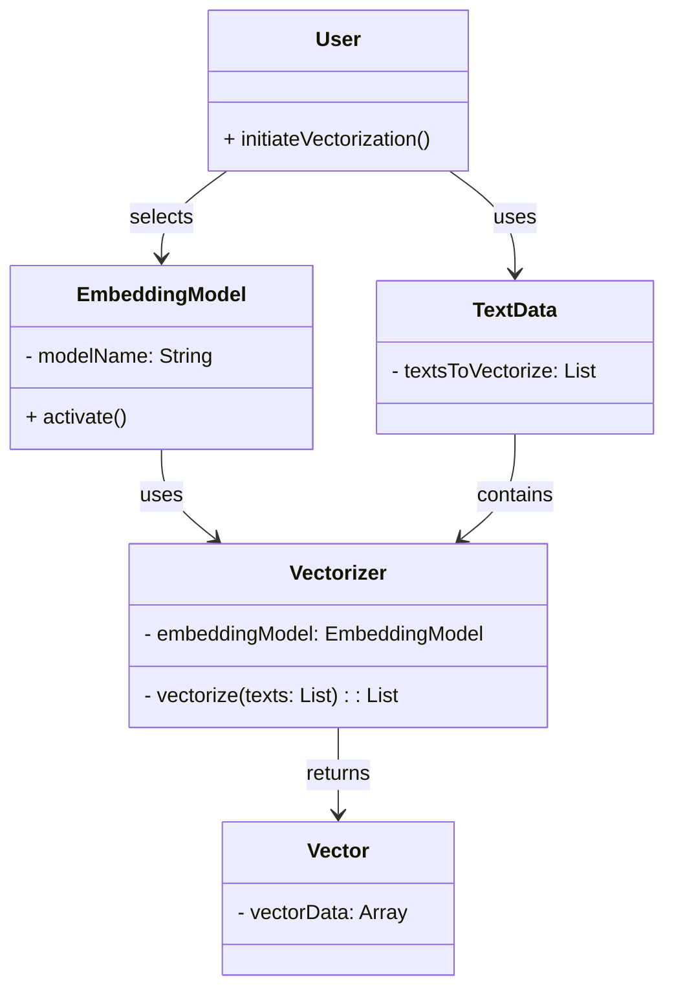

# Vectorize

Transform data into high-dimensional vector representations 
using the latest embedding techniques, enabling complex 
similarity calculations and semantic search capabilities.

<Callout emoji="💡">
    **Learn More about Vectorizing on [Weaviate](https://weaviate.io/developers/academy/py/standalone/chunking/introduction#-chunk-size-selection)**
</Callout>

### Input Parameters

- Input Texts: Define which texts to be vectorized
- Embedding Model Name: Choose a text-embedding model from your activated models

### Expected Output

Variable containing text vectors embedded by the chosen model

**Example Use Case**

In this example, after performing chunking on a series of documents, these 
chunks were saved to a JavaScript variable called "texts" whuch the vectorize 
node take in and vectorizes these chunks using OpenAI's ADA-002 model.

