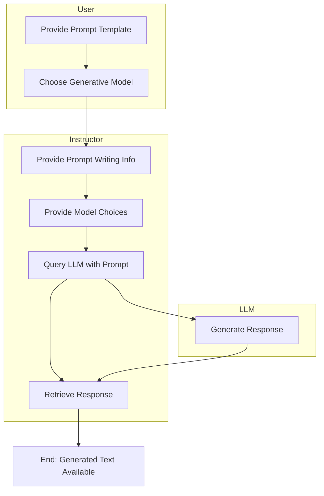

# LLM

Query a chosen LLM with a structured prompt and retrieve its response

### Input Parameters

- Prompt Template: An effective prompt designed to use text and variables from the workflow to achieve the best output
    - Learn more about writing good text prompts on [Medium](https://medium.com/the-modern-scientist/best-prompt-techniques-for-best-llm-responses-24d2ff4f6bca)
- Generative Model Name: Choose LLM from your activated models to use for the query

### Expected Output

Generated text designed by the prompt template

**Example Use Case**

In this sample workflow, a LLM "travel agent" is queried with what the top 5
sights to see in the world. The node queries the LLM using the prompt and returns the response.

