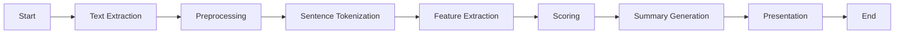

# Summarize

Analyze and synthesize large volumes of text, extracting 
the most salient points and presenting them in a condensed, 
easily digestible format.

## How it works

The `summarize` node utilizes advanced natural language processing techniques to analyze and summarize large volumes of text. It follows these steps:

1. **Text Extraction**: The node takes in a text input, such as a document or article.
2. **Preprocessing**: The text is preprocessed to remove any irrelevant information, such as stop words and punctuation.
3. **Sentence Tokenization**: The text is divided into individual sentences to facilitate further analysis.
4. **Feature Extraction**: The node identifies important features and keywords within each sentence, such as key phrases and entities.
5. **Scoring**: Each sentence is assigned a score based on its relevance and importance within the text.
6. **Summary Generation**: The node selects the top-scoring sentences and combines them to create a concise summary of the original text.
7. **Presentation**: The summarized text is presented in a condensed and easily digestible format.

## Use Cases

The `summarize` node can be used in various applications, including:

- **Document Summarization**: It can automatically generate summaries for long documents, saving time and effort for readers.
- **News Aggregation**: It can extract key points from multiple news articles and present them in a concise format.
- **Content Curation**: It can assist in curating content by summarizing blog posts, research papers, or social media discussions.

## Limitations

While the `summarize` node is a powerful tool for text summarization, it has some limitations:

- **Loss of Context**: The summarized text may lose some context and nuance present in the original document.
- **Subjectivity**: The node's scoring algorithm may not always capture the subjective importance of certain sentences.
- **Domain Specificity**: The node's performance may vary depending on the domain or topic of the text being summarized.

<Callout emoji="🚧">
    This node is currently under construction.
</Callout>