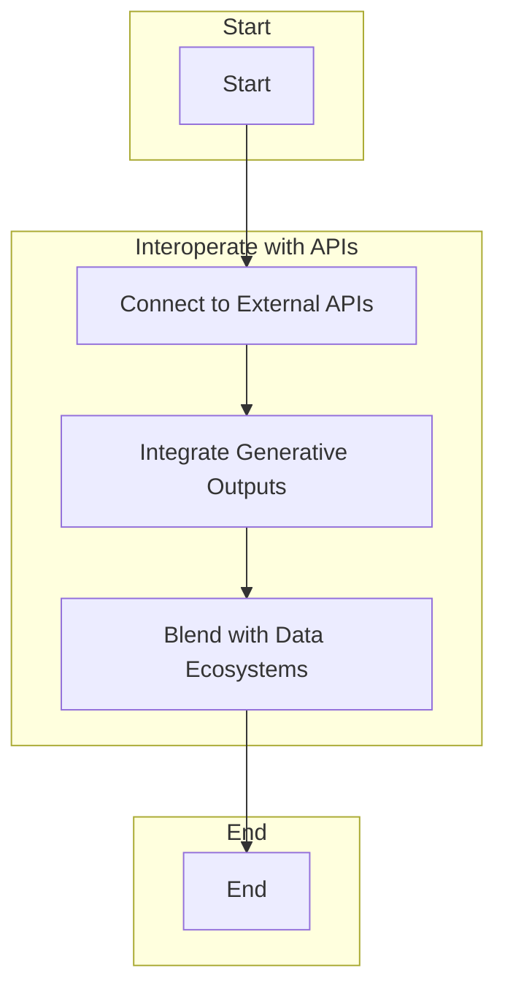

# API

Interoperate with external APIs and services, blending 
generative outputs with broader systems and data ecosystems.

## Lamatic AI Integration

To integrate Lamatic AI with external APIs in your low code workflow, follow these steps:

1. **Create an API Key**: Sign up for a Lamatic AI account and generate an API key. This key will be used to authenticate your requests to Lamatic AI's API.

2. **Define API Endpoints**: Determine the specific endpoints you want to interact with in Lamatic AI. These endpoints could include tasks like generating text, analyzing sentiment, or performing language translation.

3. **Make API Requests**: Use your low code tool to make HTTP requests to Lamatic AI's API endpoints. Include your API key in the request headers for authentication.

4. **Process API Responses**: Handle the responses returned by Lamatic AI's API. Depending on the endpoint, you may receive generated text, sentiment analysis results, or translated language output. Process and utilize this data as needed in your low code workflow.

5. **Error Handling**: Implement error handling mechanisms to handle any errors or exceptions that may occur during the API integration process. This ensures that your low code workflow can gracefully handle any issues that arise.

6. **Customize API Integration**: Customize the API integration according to your specific requirements within your low code tool. This may involve modifying the request parameters, handling different response formats, or implementing additional functionality.

7. **Testing and Debugging**: Test and debug your API integration within your low code tool to ensure that it is working correctly. Use the built-in testing and debugging features to send sample requests and verify the responses. Debug any issues that arise and make necessary adjustments.

8. **Documentation**: Document your API integration process within your low code tool, including the steps, endpoints, request parameters, and response formats. This documentation will be helpful for future reference and for other developers who may need to work with the API within the low code workflow.

9. **Security Considerations**: Ensure that your API integration within the low code workflow follows security best practices. Use secure connections (HTTPS), handle authentication securely, and implement rate limiting and throttling mechanisms to protect against abuse.

10. **Monitoring and Maintenance**: Monitor the API integration within the low code workflow for any errors or performance issues. Utilize the monitoring and maintenance features of your low code tool to track the usage and performance of the integration. Regularly review and update the integration as needed to ensure it remains functional and efficient.

