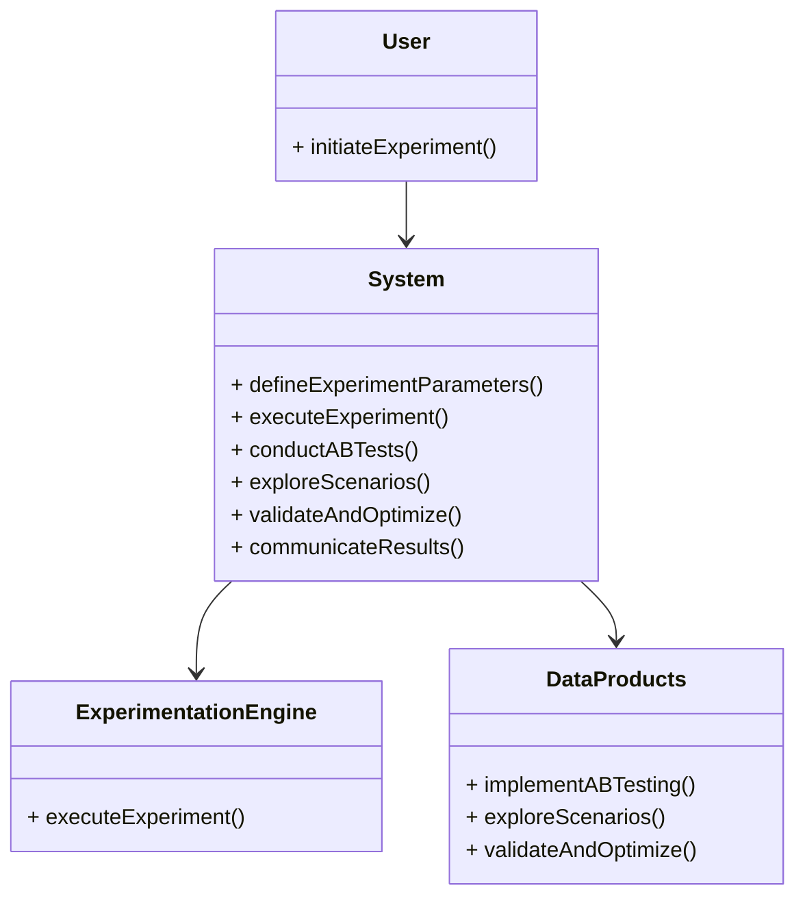

# Experiment

Run A/B tests, explore what-if scenarios, and continuously 
validate and optimize your AI-powered data products.

## Experiment Flow

To ensure the success of your AI-powered data products, it is crucial to run experiments, explore different scenarios, and continuously validate and optimize your models. The experiment flow in your application involves the following steps:

1. **Initiate Experiment**: The user initiates the experiment by triggering the `initiateExperiment()` method.

2. **Define Experiment Parameters**: The system defines the experiment parameters using the `defineExperimentParameters()` method. This includes specifying the variables, metrics, and other relevant details for the experiment.

3. **Execute Experiment**: The system executes the experiment using the `executeExperiment()` method. This involves running the AI models and collecting data for analysis.

4. **Conduct A/B Tests**: The system conducts A/B tests using the `conductABTests()` method. This allows for comparing different versions of the AI models or algorithms to determine the most effective one.

5. **Explore Scenarios**: The system explores what-if scenarios using the `exploreScenarios()` method. This involves simulating different conditions or inputs to understand the impact on the AI models and data products.

6. **Validate and Optimize**: The system validates and optimizes the AI-powered data products using the `validateAndOptimize()` method. This includes analyzing the experiment results, identifying areas for improvement, and making necessary adjustments to enhance the performance of the models.

7. **Communicate Results**: The system communicates the experiment results to the user using the `communicateResults()` method. This may involve generating reports, visualizations, or other means of presenting the findings.

Please note that the above diagram provides an overview of the experiment flow in your application. Each step can be further customized and expanded based on your specific requirements and implementation details.

