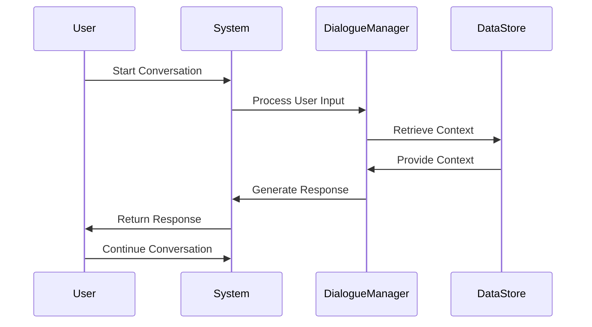

# Followup

For conversational AI, maintain context and dialogue state to 
drive coherent multi-turn interactions and flows.

## Followup Flow

To create the followup flow in your application's workflow, you can use the following steps:

1. Define the necessary variables and context to maintain the conversation state and dialogue context.

2. Implement a mechanism to handle user input and process it accordingly. This can involve natural language understanding (NLU) techniques to extract intents and entities from user messages.

3. Based on the user input, determine the appropriate action or response. This can involve using a dialogue management system or a decision tree to guide the conversation flow.

4. Update the conversation state and context as the conversation progresses. This can involve storing relevant information in a database or using in-memory data structures.

5. Handle any errors or exceptions that may occur during the conversation flow. This can involve providing fallback responses or offering alternative options to the user.

6. Continuously iterate and improve the followup flow based on user feedback and real-world usage. This can involve analyzing conversation logs, conducting user surveys, or using machine learning techniques to enhance the conversational experience.

Remember to test your followup flow thoroughly and consider edge cases to ensure a robust and reliable conversational AI experience.

<Callout emoji="🚧">
    This node is currently under construction.
</Callout>