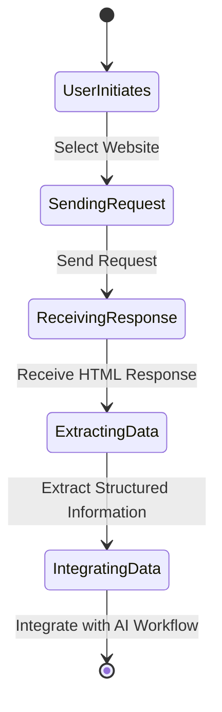

# Read Website

Scrape data from websites, extract structured information, and 
inject it into your AI workflows.

## Read Website Flow

To read a website and extract structured information for your AI workflows, you can follow these steps:

1. **Select Website**: The user initiates the process by selecting the website to scrape data from.

2. **Send Request**: The system sends a request to the website to retrieve the HTML response.

3. **Receive HTML Response**: The system receives the HTML response from the website, which contains the data to be extracted.

4. **Extract Structured Information**: The system extracts structured information from the HTML response, such as text, images, links, and other relevant data.

5. **Integrate with AI Workflow**: The system integrates the extracted data with your AI workflows for further processing, analysis, or visualization.

By reading websites and extracting structured information, you can leverage external data sources to enhance your AI models and applications.

