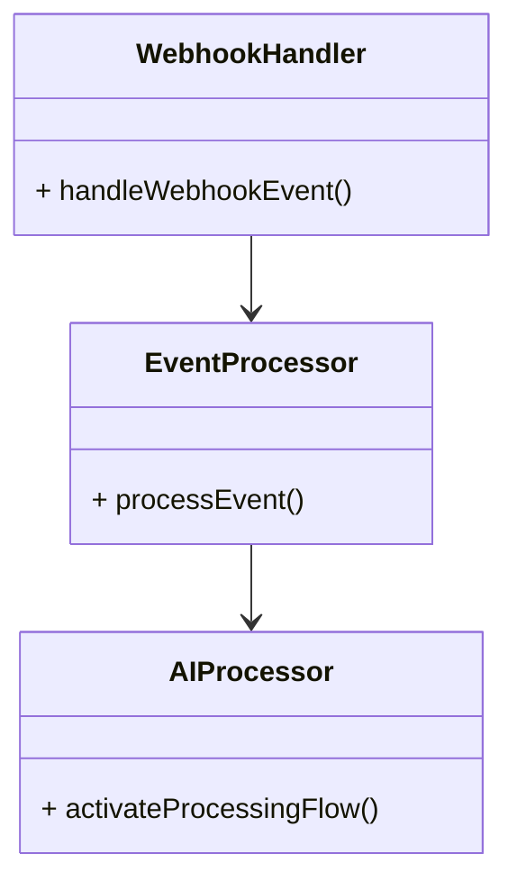

# Webhook

Seamlessly ingest event triggers from webhooks, allowing you to 
activate real-time event-driven AI processing flows.

## Webhook Flow

To ingest event triggers from webhooks and activate real-time event-driven AI processing flows, you can follow these steps:

1. **Handle Webhook Event**: The `WebhookHandler` class handles the incoming webhook event and triggers the event processing flow.

2. **Process Event**: The `EventProcessor` class processes the webhook event and extracts relevant information or data from the event payload.

3. **Activate Processing Flow**: The `AIProcessor` class activates the AI processing flow based on the event data, enabling real-time event-driven AI processing.

By integrating webhooks into your AI workflows, you can create dynamic and responsive systems that react to external events and triggers in real-time.

