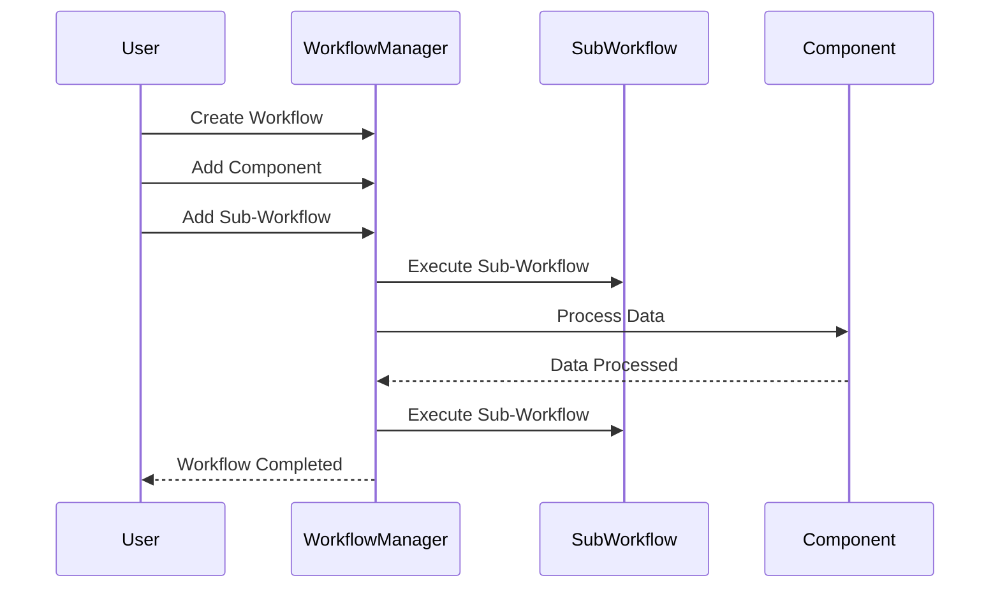

# Workflow

Modularize processing patterns into reusable sub-workflow 
components you can mix, match and templatize.

## Workflow Flow

To modularize processing patterns into reusable sub-workflow components, you can follow these steps:

1. **Create Workflow**: The user creates a new workflow and defines the processing steps.

2. **Add Component**: The user adds a component to the workflow to process data or perform specific tasks.

3. **Add Sub-Workflow**: The user adds a sub-workflow to the main workflow to execute a sequence of processing steps.

4. **Execute Sub-Workflow**: The `WorkflowManager` executes the sub-workflow, which consists of multiple components and processing steps.

5. **Process Data**: The `Component` processes the data according to the defined logic or tasks.

6. **Data Processed**: The `Component` returns the processed data to the `WorkflowManager` for further processing or analysis.

7. **Execute Sub-Workflow**: The `WorkflowManager` executes the sub-workflow again if there are additional processing steps.

8. **Workflow Completed**: Once the workflow is completed, the `WorkflowManager` notifies the user of the completion status.

By modularizing processing patterns into reusable sub-workflow components, you can create flexible and scalable workflows that can be easily customized and extended to suit your specific requirements.
