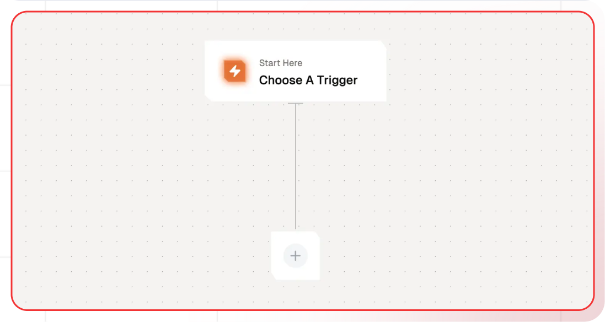
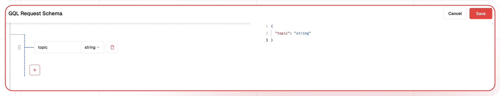
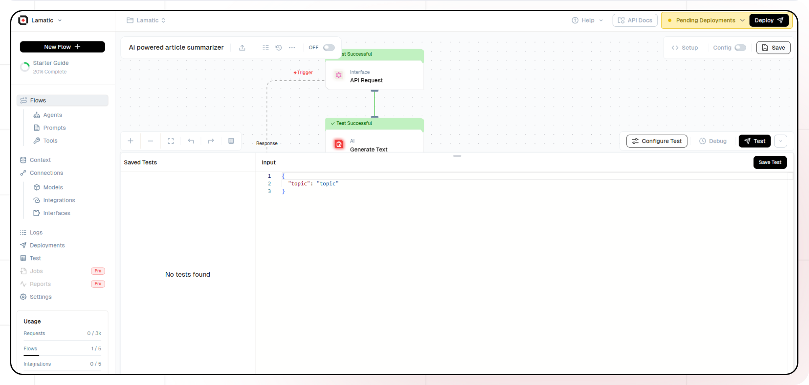
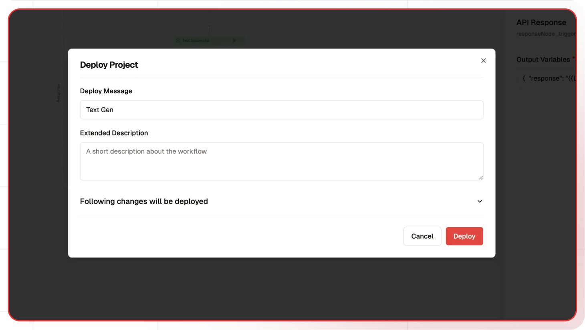

import Image from 'next/image'

# Getting Started with Lamatic.ai

Welcome to Lamatic.ai! This guide will show you how to create your first AI-powered API using the Gemini model. We'll break it down into simple steps.

## What You'll Build
A simple API that generates text based on topics using Gemini's AI model. When you send a topic to your API, it will return AI-generated insights about that topic.

## Getting Started

<Steps>
### 1. Project Setup
1. Visit Lamatic.ai and sign in
2. Create a new organization
3. Create a project within your organization

4. You'll see different sections like Flows, Data, and Models

### 2. Creating a New Flow
1. Navigate to Flows, select New Flow, and choose Create from Scratch as your starting point.

2. Click "New Flow"

3. Select "Create from Scratch"

### 3. Setting Up Your API
1. Click "Choose a Trigger"
2. Select "API Request" under the interface options
   
3. Configure your API:
   - Add your Input Schema
   - Set response type to "Real-time"
   

### 4. Adding AI Text Generation
1. Click the + icon to add a new node
2. Choose "Text Generator"
   
3. Configure the AI model:
   - Select "Gemini" as your Generative Model
   - Choose "gemini-1.5-pro" as your Model
4. Set up your prompt:
   - In the Prompt Template, write: `Give me inside on topic: {{triggerNode_1.output.topic}}`
   - You can add variables using the "Add Variable" button
   

### 5. Configuring the Response
1. Click on the API Response Node

2. Add Output Variables by clicking the + icon
3. Select variables from your Text Generator Node

### 6. Testing
You can develop a wide range of test cases within your project, making them adaptable for various flows and scenarios. This strategy streamlines the management of JSON structures across different use cases, saving time and minimizing errors. By leveraging reusable test cases, you enhance both the consistency and efficiency of your testing process.

1. Click the Test button
2. Enter a test input (e.g., "Goa")
3. Save your test
4. Run the test to see the results

### 7. Deployment
1. Click the Deploy button

2. Your API is now ready to be integrated into Node.js or Python applications
3. Your flow will run on Lamatic's global edge network for fast, scalable performance

### 8. What's Next?
- Experiment with different prompts
- Try other AI models
- Add more processing steps to your flow
- Integrate the API into your applications

### 9. Tips
- Save your tests for reuse across different scenarios
- Use consistent JSON structures for better maintainability
- Test thoroughly before deployment
</Steps>

Now you have a working AI-powered API! You can expand on this foundation to build more complex applications using Lamatic.ai's features.

