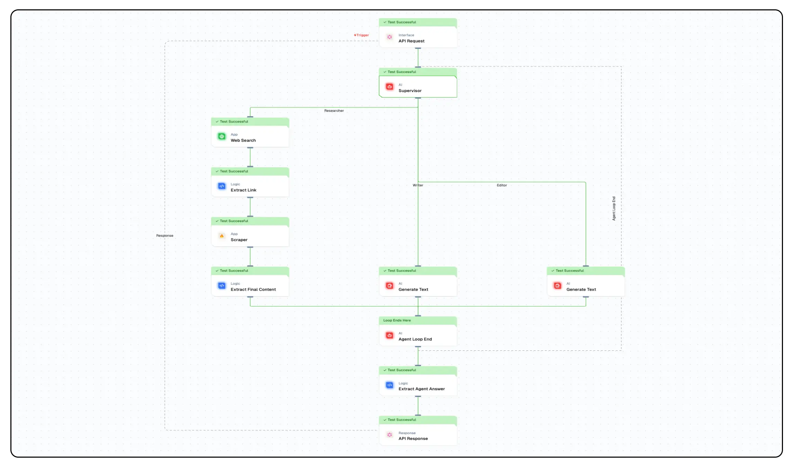

import { Accordion, AccordionItem } from "@nextui-org/react";
import SectionRows from "@/components/SectionRows";
import { Callout } from "nextra-theme-docs";
import { buttonVariants, Button } from "@/components/ui/button";

# Building a Supervisor Agent for Automated Blog Creation

In this tutorial, you'll learn how to build a powerful supervisor agent that orchestrates a complete content creation workflow by managing specialized sub-agents for research, writing, and editing tasks. This system can automatically generate blog content on any topic with your preferred tone.

## What You'll Build

- A supervisor agent that manages research, writing, and editing tasks
- A web search integration for real-time research
- An intelligent workflow that processes and refines content through multiple stages
- An API endpoint that accepts topic and tone parameters to generate custom blog content



## Getting Started

### 1. Account Creation and New Flow Setup

1. Sign up at [Lamatic.ai](https://lamatic.ai/) and log in.
2. Navigate to Projects and click **New Project** or select your desired project.
3. Select "Create from Scratch" to build your own custom flow.
4. You'll need to create 8 nodes for this workflow: API Trigger Node, Supervisor Agent Node, Agent Loop End Node, Web Search Node, Content Generator (LLM Node), Editor (LLM Node), Extract Link (Code Node), and Scraper Node.

### 2. API Trigger Node Setup

1. Add an API Trigger Node to your canvas.
2. Configure the advanced schema to accept two parameters:
   ```json
   {
     "topic": "string",
     "tone": "string"
   }
   ```
3. Set the Response Type to "realtime" for synchronous processing.

### 3. Supervisor Agent Node Configuration

1. Add a Supervisor Agent Node to your canvas.
2. Connect it to the API Trigger Node.
3. Configure the agent with three sub-agents:

   - **Researcher**: Responsible for gathering information on the specified topic
   - **Writer**: Creates a draft blog based on the research
   - **Editor**: Refines the content to match the requested tone

4. Configure each agent's schema as follows:

   For the Researcher agent:

   ```json
   {
     "type": "object",
     "properties": {
       "research": {
         "type": "string",
         "required": true,
         "description": "This implies the final research fetched by the research team, which is supposed to be passed to the writing team"
       }
     }
   }
   ```

   For the Writer agent:

   ```json
   {
     "type": "object",
     "properties": {
       "writeup": {
         "type": "string",
         "required": true,
         "description": "This implies the final writeup based on the research by the research team"
       }
     }
   }
   ```

5. Add system prompts to guide the supervisor:

   - First prompt should include `TOPIC: {{triggerNode_1.output.topic}}` and `TONE: {{triggerNode_1.output.tone}}`
   - Second prompt should describe the workflow:

     ```
     You are the supervisor of a research based blog writer, which customises their content based on the tone preferred by the users. The following is the ideal flow in which you have to get tasks done from your subordinates agent teams:

     1. Once you are given the topic and tone, you first have to use the researcher team to fetch content based on topic.
     2. Next, you are suppose to give the content from the research team to the writer team and they will give you the writer blog.
     3. Finally, you are suppose to send the tone and content given by the writing team to fetch the final output from the editor team

     The ideal order is: Researcher -> Writer -> Editor

     Make sure you do the research first, then write it and only then send it to the edit team, once you get an answer from the editor, you can stop the execution of the flow. Make sure the last node you use is always an Editor and try not to break this chain.
     ```

6. Set the generative model to `gpt-4o` for optimal intelligence.
7. Set maximum iterations to 5 to allow sufficient cycles for completion.

### 4. Agent Loop End Node Setup

1. Add an Agent Loop End Node and connect it to the Supervisor Agent Node.
2. Configure this node to connect back to the Supervisor Agent Node.
3. This creates a feedback loop that allows the supervisor to delegate tasks sequentially.

### 5. Web Search Integration

1. Add a Web Search Node to your canvas.
2. Connect it to the Supervisor Node with a conditional connection from "Researcher."
3. Configure the web search with:
   - Query: `{{triggerNode_1.output.topic}}`
   - Results: Set to enough items to gather sufficient information
   - Connect to your Serper API key in the credentials field

### 6. Extract Link Node

1. Add a Code Node named "Extract Link."
2. Connect it to the Web Search Node.
3. Add the following JavaScript code to extract the first link from search results:

   ```javascript
   let content = {{webSearchNode_790.output.output.organic }}
   let links = []

   for (idx in content) {
     console.log(content[idx]['link'])
     links.push(content[idx]['link'])
   }

   console.log(links)

   let output = links[0]
   return output
   ```

### 7. Scraper Node Setup

1. Add a Scraper Node and connect it to the Extract Link Node.
2. Configure it with:
   - URL: `{{codeNode_231.output}}`
   - Mobile: false
   - Wait For: 250ms
   - Only Main Content: true
   - Connect to your FireCrawl API key

### 8. Extract Final Content

1. Add a Code Node named "Extract Final Content."
2. Connect it to the Scraper Node.
3. Add the following JavaScript code to extract the content:
   ```javascript
   let output = {{ scraperNode_183.output.markdown }}
   return output
   ```
4. Connect this node to the Agent Loop End Node to complete the research flow.

### 9. Writer LLM Node Configuration

1. Add an LLM Node for content generation.
2. Connect it to the Supervisor Node with a conditional connection from "Writer."
3. Configure the prompts:
   - User prompt: `RESEARCH: {{agentNode_549.output}}`
   - System prompt:
     ```
     You are a writer, who is suppose to write a blog of roughly one paragraph which summarises all the information given to you by the supervisor. Make sure you write the blog only from the research as it is.
     ```
4. Set the generative model to `gpt-4o` for high-quality content.
5. Connect this node to the Agent Loop End Node.

### 10. Editor LLM Node Configuration

1. Add an LLM Node for content editing.
2. Connect it to the Supervisor Node with a conditional connection from "Editor."
3. Configure the prompts:
   - User prompt:
     ```
     WRITEUP: {{agentNode_549.output}}
     TONE: {{triggerNode_1.output.tone}}
     ```
   - System prompt:
     ```
     You are an editor, who has to edit any give blog written by the writing team based on the given tone. Make sure that the final blog you give has the tone as requested by the user. In the end, just return the blog, do not give any leading statements. You will be given a writeup on the basis of which you just have to give the blog.
     ```
4. Set the generative model to `gpt-4o` for advanced editing capabilities.
5. Connect this node to the Agent Loop End Node.

### 11. API Response Configuration

1. Add an API Response Node.
2. Connect it to your workflow.
3. Configure the output mapping:
   ```json
   {
     "blog": "{{agentLoopEndNode_600.output.agentOutput}}"
   }
   ```

### 12. Testing Your Workflow

1. Click the "Test" button to test your workflow.
2. Provide sample values for "topic" and "tone" parameters:
   - Topic: "Artificial Intelligence in Healthcare"
   - Tone: "Professional"
3. Monitor the execution to ensure each agent is triggered in the correct sequence.
4. Verify that the final output contains a blog post on your topic with the appropriate tone.

### 13. Deployment

1. Click the "Deploy" button to make your workflow available as an API endpoint.
2. Your agent workflow will now be accessible through an API that accepts "topic" and "tone" parameters.
3. The flow will run on Lamatic's global edge network for fast, scalable performance.

## How It Works

This workflow functions through a sophisticated orchestration of agents:

1. The **Supervisor Agent** receives a topic and tone, then delegates tasks to specialized sub-agents.
2. The **Researcher Agent** triggers a web search, extracts relevant content from the top search result, and returns structured research.
3. The **Writer Agent** generates a concise blog post based solely on the research provided.
4. The **Editor Agent** refines the content to match the requested tone while preserving the core information.

The agent loop mechanism ensures that tasks are executed in the correct sequence, with each stage building upon the previous one to create a complete content creation pipeline.

## Use Cases

This supervisor agent workflow is ideal for:

- Generating company blog posts on various topics with consistent tone
- Creating product descriptions with different emotional appeals
- Producing educational content with adaptable reading levels
- Developing news summaries with various editorial perspectives

## Advanced Customization

You can enhance this workflow by:

- Adding more specialized agents for SEO optimization or fact-checking
- Implementing sentiment analysis to verify tone consistency
- Integrating image generation for complementary visuals
- Adding content categorization for automatic tagging
- Implementing multiple research sources for more comprehensive coverage

By following this tutorial, you've created a powerful, automated content creation system that handles the entire process from research to polished output, all while maintaining your desired tone and focus.
