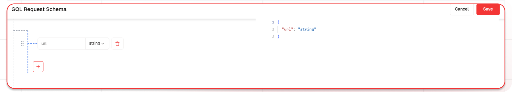

# AI powered Article Summarizer

This guide will help you build an AI-powered article summarization system. The workflow processes article URLs provided by users, extracts content using the Firecrawl scraper node, and generates a concise summary using an LLM node. This system enables efficient data extraction and quick information retrieval, making it easier to digest lengthy articles.

## What You'll Build

A simple API that processes article URLs provided by users, extracts content using the Firecrawl scraper node, and generates a concise summary using an LLM node. This API enables seamless data extraction, making it easier to quickly understand and analyze lengthy articles for a wide range of applications.

## Getting Started

### 1. Project Setup

1. Sign up at [Lamatic.ai](https://lamatic.ai/) and log in.
1. Navigate to the dashboard and click **Create New Flow**.
1. You'll see different sections like Flows, Data, and Models
   

### 2. Creating a New Flow

1. Navigate to Flows, select New Flow, and choose Create from Scratch as your starting point.
2. Click "New Flow"
   
3. Select "Create from Scratch"
   

### 3. Setting Up Your API

1. Click "Choose a Trigger"
2. Select "API Request" under the interface options
   
3. Configure your API:
   - Add your Input Schema
   - Set url as parameter in input schema
   - Set response type to "Real-time"
     

### 4. Scraping the data using Firecrawl

1. Click the + icon to add a new node
2. Select the Scraper node
   
3. Select the credentials
4. Add 'url' as parameter

### 5. Adding AI Text Generation

1. Click the + icon to add a new node
2. Choose "Text LLM"
   
3. Configure the AI model:
   - Select your "Open AI" credentials
   - Choose "gpt-4-turbo" as your Model
4. Set up your prompt:

   ```
   I will provide you with a markdown file containing an article.
   Extract the key points and generate a detailed yet concise summary, capturing the main ideas, arguments, and insights presented in the article.
   Ensure the summary is well-structured and easy to understand.
   Markdown Content: {{scraperNode_520.output.markdown}}

   ```

- You can add variables using the "Add Variable" button
  

### 5. Configuring the reponse

1. Click the API response node
   
2. Add Output Variables by clicking the + icon
3. Select variable from your Text LLM Node

### 7. Test the flow

1. Click on 'API Request' trigger node
2. Click on Configure test
   
3. Fill sample value in 'url' and click on test

### 8. Deployment

1. Click the Deploy button
   
2. Your API is now ready to be integrated into Node.js or Python applications
3. Your flow will run on Lamatic's global edge network for fast, scalable performance

### 9. What's Next?

- Experiment with different prompts
- Try other AI models
- Add more processing steps to your flow
- Integrate the API into your applications

### 10. Tips

- Save your tests for reuse across different scenarios
- Use consistent JSON structures for better maintainability
- Test thoroughly before deployment

Now you have a working AI-powered API! You can expand on this foundation to build more complex applications using Lamatic.ai's features.
