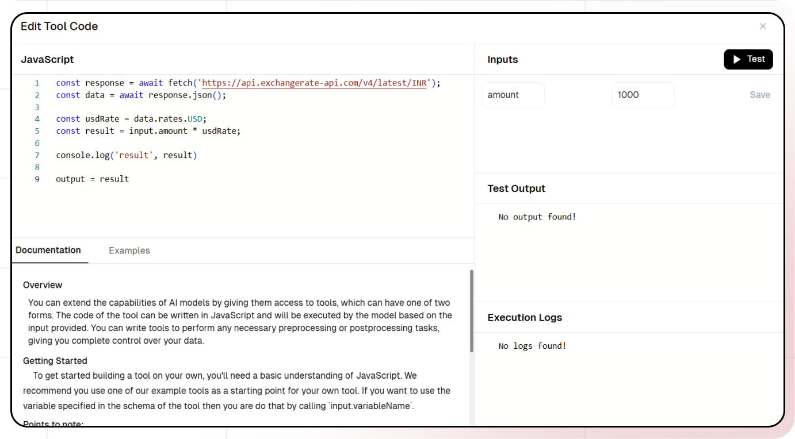
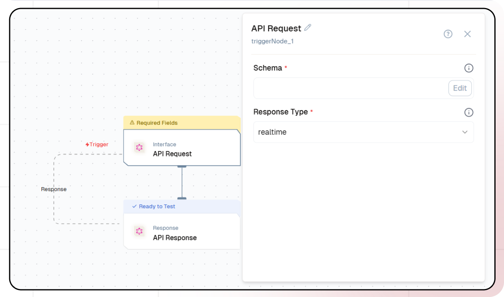
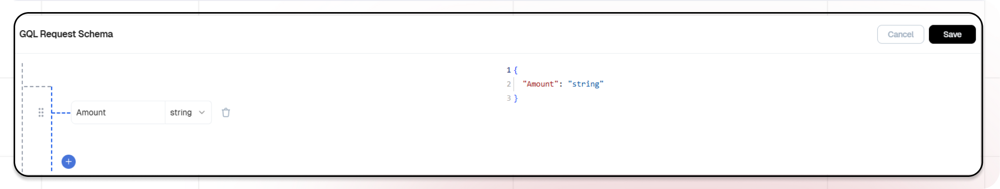
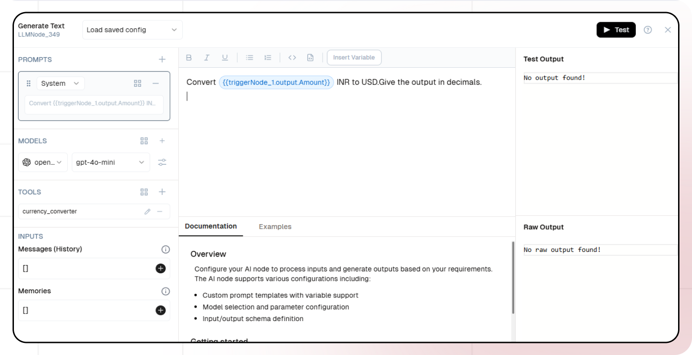
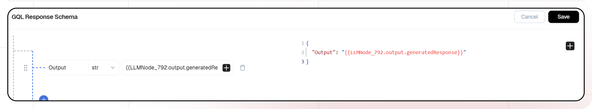
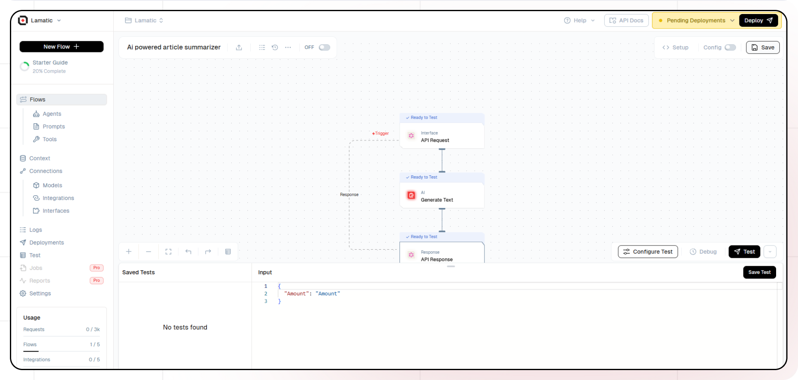

import { Accordion, AccordionItem } from "@nextui-org/react";
import SectionRows  from '@/components/SectionRows'
import { Callout } from 'nextra-theme-docs'
import {buttonVariants, Button} from '@/components/ui/button'


# AI Currency Converter

<div className="grid md:grid-cols-1 gap-2 mb-8">
  <div className="">
    <SectionRows 
      section="Difficulty Level" 
      chips={["Beginner"]} 
    />
    
    <SectionRows 
      section="Nodes" 
      chips={[
        "Text LLM"
      ]} 
    />
    
    <SectionRows 
      section="Tags" 
      chips={[
        "Support",
        "Operations"
      ]} 
    />
  </div>
</div>

<div className="mt-4 mb-4">
  <Callout>
  Try out this flow yourself at Lamatic.ai. Sign up for free and start building your own AI workflows.
  <Button variant="destructive" className="mt-3" href="https://studio.lamatic.ai/_?templateSlug=currency-converter" size="sm" asChild>
    <a href="https://studio.lamatic.ai/_?templateSlug=currency-converter" target="_blank">Add to Lamatic</a>
  </Button>
</Callout>
</div>

This guide will help you build an AI Currency Converter that fetches real-time INR to USD exchange rates. The system processes user input, retrieves live exchange rate data, and provides an accurate conversion. By implementing this tool in Lamatic, you'll learn how to integrate AI with external APIs for seamless and up-to-date currency conversion.

## What You'll Build

A simple API that processes user input, fetches real-time INR to USD exchange rates, and provides accurate currency conversion. This API ensures seamless and up-to-date exchange rate retrieval, enabling efficient and precise currency conversion for various financial applications.

## Getting Started

### 1. Tool Creation

1. Sign up at [Lamatic.ai](https://lamatic.ai/) and log in.
2. Navigate to Flows > Tools.
3. Click on Add Tool.

#### Define Tool Details

1. Add Tool name: convertINRtoUSD
2. Add Description: Convert amount from Indian Rupees (INR) to US Dollars (USD)

#### Configure Parameters

1. Add Parameter name 'amount' and define the datatype as a string

###### This is a JSON Schema object that describes the parameters that the tool accepts and are the ones that will be passed to the model.

```
{
"amount": {
"type": "number",
"required": true,
"description": "Amount in INR to convert"}
}
```

2. In the Code section

```
const response = await fetch('https://api.exchangerate-api.com/v4/latest/INR');
const data = await response.json();

const usdRate = data.rates.USD;
const result = input.amount * usdRate;

console.log('result', result)

output = result
```

- 'input' and 'output' are reserved variables. Avoid overwriting them.

- To access variables defined in the schema, use 'input.variableName'.

- Assign the return value to 'output' pass data from the function.

3. You can test the JavaScript Code by providing parameters and clicking on the Test button.
   
4. Finally, Click on the Create Button.

### 1. Project Setup

1. Sign up at [Lamatic.ai](https://lamatic.ai/) and log in.
1. Navigate to the Projects and click **New Project** or select your desired project.
1. You'll see different sections like Flows, Context, and Connections
   

### 2. Creating a New Flow

1. Navigate to Flows, select New Flow.
2. Click **Create from scratch** as starting point.
   

### 4. Setting Up Your API

1. Click "Choose a Trigger".
2. Select "API Request" under the interface options.
   
3. Configure your API:
   - Add your Input Schema
   - Set amount as parameter in input schema
   - Set response type to "Real-time"
     

### 5. Adding AI Text Generation

1. Click the + icon to add a new node.
2. Choose "Generate text".
   
3. Configure the AI model:
   - Select your "Open AI" credentials
   - Choose "gpt-4-turbo" as your Model
4. Click on "+" under Prompts section.
5. Set up your prompt:


```

Convert {{triggerNode_1.output.Amount}} INR to USD.
Give the output in decimals.

```

- You can add variables using the "Add Variable" button
  

5. Add the tool you created under Tools section
6. Select the desired tools. You can add multiple tools as needed.

### 6. Configuring the reponse

1. Click the API response node.
   
2. Add Output Variables by clicking the + icon.
3. Select variable from your Generate Text Node.

### 7. Test the flow

1. Click on 'API Request' trigger node.
2. Click on Configure test.
   
3. Fill sample value in 'Amount' and click on test.

### 8. Deployment

1. Click the Deploy button.
   
2. Your API is now ready to be integrated into Node.js or Python applications.
3. Your flow will run on Lamatic's global edge network for fast, scalable performance.

### 9. What's Next?

- Experiment with different prompts
- Try other AI models
- Add more processing steps to your flow
- Integrate the API into your applications

### 10. Tips

- Save your tests for reuse across different scenarios
- Use consistent JSON structures for better maintainability
- Test thoroughly before deployment

Now you have a working AI-powered API! You can expand on this foundation to build more complex applications using Lamatic.ai's features.
