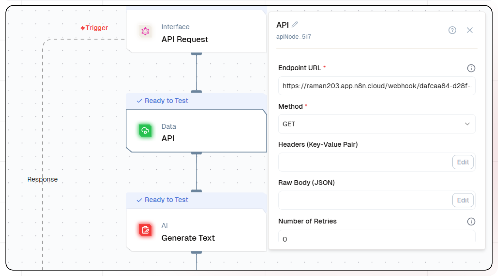
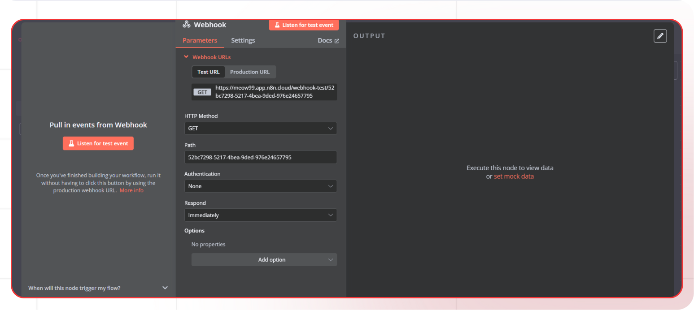
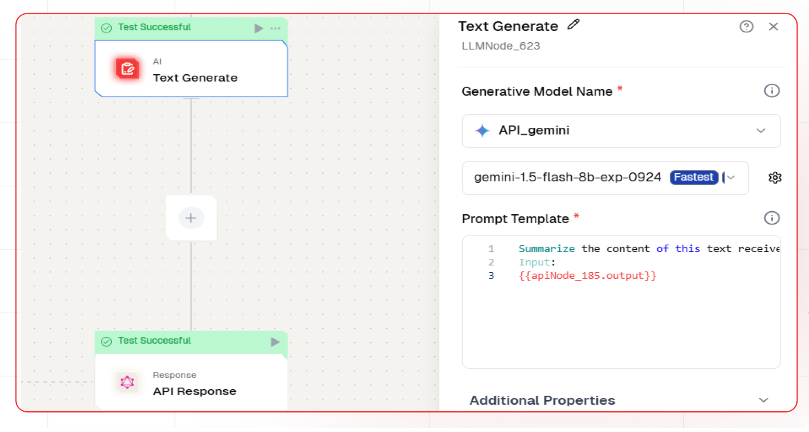
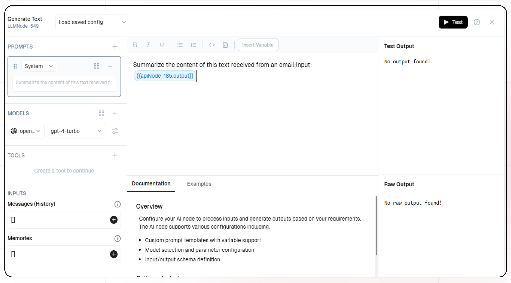
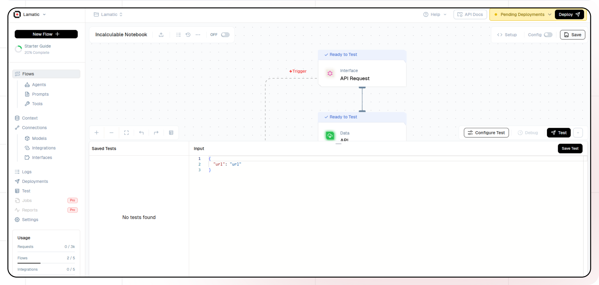

# AI Email Summarizer

This guide will walk you through building an AI-powered email summarization tool using N8N. The system automatically processes incoming emails, extracts key insights, and generates concise summaries, allowing users to quickly understand important information. By creating this tool, you'll gain hands-on experience integrating AI for smarter email management and enhanced productivity.

## What You'll Build

A simple API that processes email content, extracts key information, and generates concise summaries. This API enables efficient email management by allowing users to quickly understand important details without reading lengthy messages, improving productivity and workflow automation.

## Getting Started

### 1. Creating a New Flow

1. Navigate to Flows, select New Flow, and choose Create from Scratch as your starting point.
2. Click "New Flow".
   
3. Select "Create from Scratch".
   

### 2. Setting Up Your API

1. Click "Choose a Trigger".
2. Select "API Request" under the interface options.
   
3. Configure your API:
   - Add your Input Schema
   - Set url as parameter in input schema
   - Set response type to "Real-time"

### 3. API Node Addition



1. In the Next Node, select **API Node**
   1. Enter the Endpoint URL(Email text extracted using n8n).
   1. Select GET Method.

#### Email Text Extraction Using n8n

##### 1. Workflow Setup

1. Sign up at [n8n.io](https://n8n.io/) and log in.
2. Navigate to the **overview** and click **Workflows**.
3. Click **Create Workflow**.
   

##### 2. Webhook Node Addition

1. Click on **+**.
2. Search **Webhook** in the search box and click on **Webhook**.
3. Select the HTTP Method as **Get**.
   

##### 3. Gmail Node addition

1. Click on **+**.
2. Search **Gmail** in the search box, click on **Gmail** and select **Get many messages**.
   

3. In parameters set the credentials and set other parameters according to your needs.
4. Turn off **Simplify**.
5. In options add **Download Attachments** option and turn it on.
   

##### 4. Respond to Webhook

1. Click on **+**.
2. Search **Respond to Webhook** in the search box, click on **Respond to Webhook**.
3. Select the parameters according to your needs.
   

##### 5. Testing the workflow

1. Click on **Webhook** node and copy **Test URL**.
2. Go back and click **Test workflow**.
3. Call the Test URL to get the response.
   

### 4. Adding AI Text Generation

1. Click the + icon to add a new node.
2. Choose "Text LLM".
   
3. Configure the AI model:
   - Select your "Gemini" credentials
   - Choose "gemini-1.5-flash-8b-exp-0934" as your Model
4. Set up your prompt:

```

Summarize the content of this text received from an email:
Input:
{{apiNode_185.output}}

```

- You can add variables using the "Add Variable" button
  

5. Navigate to Additional Properties.
6. Select the desired tools. You can add multiple tools as needed.

### 5. Configuring the reponse

1. Click the API response node.
2. Add Output Variables by clicking the + icon.
3. Select variable from your Code Node.

### 6. Test the flow

1. Click on 'API Request' trigger node.
2. Click on Configure test.
   
3. Fill sample value in 'url' and click on test.

### 7. Deployment

1. Click the Deploy button.
   
2. Your API is now ready to be integrated into Node.js or Python applications.
3. Your flow will run on Lamatic's global edge network for fast, scalable performance.

### 8. What's Next?

- Experiment with different prompts
- Try other AI models
- Add more processing steps to your flow
- Integrate the API into your applications

### 9. Tips

- Save your tests for reuse across different scenarios
- Use consistent JSON structures for better maintainability
- Test thoroughly before deployment

Now you have a working AI-powered API! You can expand on this foundation to build more complex applications using Lamatic.ai's features.
